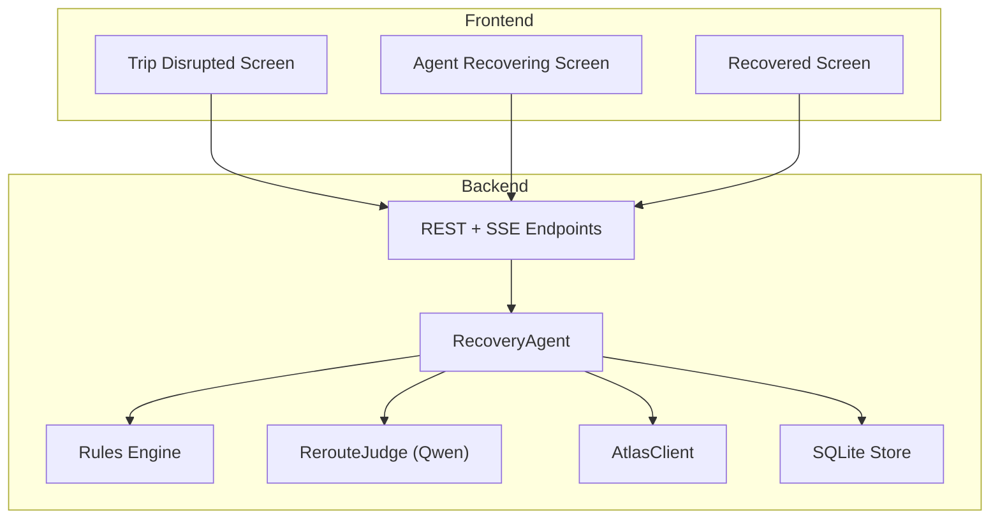
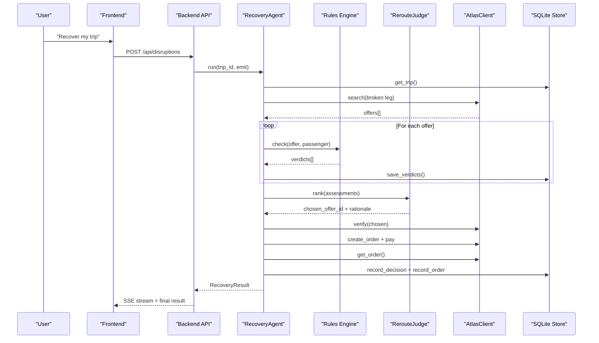
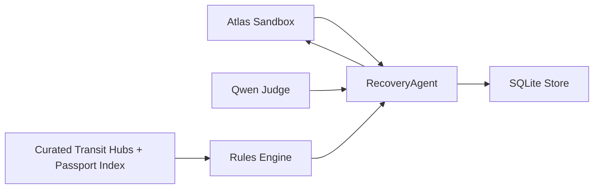
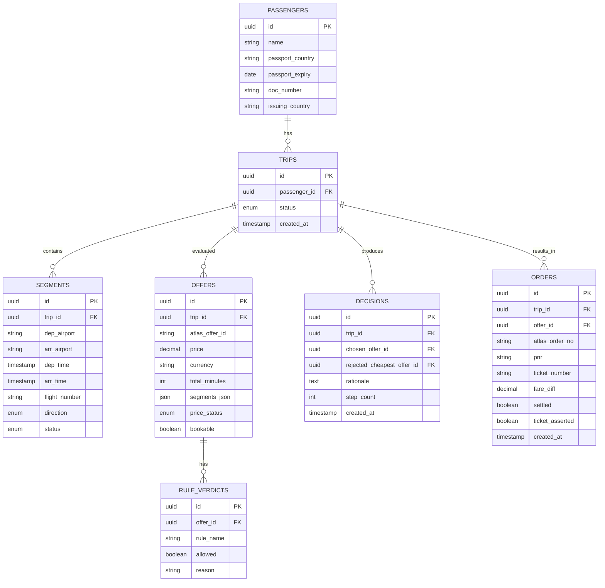

# Success Metrics & Evaluation Criteria

<cite>
**Referenced Files in This Document**
- [01-product.md](file://docs/plans/waypoint/01-product.md)
- [02-architecture.md](file://docs/plans/waypoint/02-architecture.md)
- [03-program-design.md](file://docs/plans/waypoint/03-program-design.md)
- [04-slices.md](file://docs/plans/waypoint/04-slices.md)
- [00-status.md](file://docs/plans/waypoint/00-status.md)
- [0001-fork-atlas-skill-sandbox-auto-approve.md](file://docs/adr/0001-fork-atlas-skill-sandbox-auto-approve.md)
- [0002-visa-rules-curated-approximation.md](file://docs/adr/0002-visa-rules-curated-approximation.md)
- [0003-advise-execute-two-gate-split.md](file://docs/adr/0003-advise-execute-two-gate-split.md)
- [01-trip-disrupted.html](file://docs/plans/waypoint/mockups/01-trip-disrupted.html)
- [02-agent-recovering.html](file://docs/plans/waypoint/mockups/02-agent-recovering.html)
- [03-recovery-confirmed.html](file://docs/plans/waypoint/mockups/03-recovery-confirmed.html)
</cite>

## Table of Contents
1. [Introduction](#introduction)
2. [Project Structure](#project-structure)
3. [Core Components](#core-components)
4. [Architecture Overview](#architecture-overview)
5. [Detailed Component Analysis](#detailed-component-analysis)
6. [Dependency Analysis](#dependency-analysis)
7. [Performance Considerations](#performance-considerations)
8. [Troubleshooting Guide](#troubleshooting-guide)
9. [Conclusion](#conclusion)
10. [Appendices](#appendices)

## Introduction
This document defines the success metrics and evaluation criteria for measuring the effectiveness of Waypoint’s autonomous rebooking system. It focuses on:
- The primary metric: share of disrupted trips recovered to confirmed, rule-legal, boardable options with zero gate-denial traps booked, compared against a naive cheapest-first baseline.
- The demo target: 100% boardable recovery across seeded disruption sets while ensuring no forbidden options are booked.
- Secondary metrics: time-to-recovery and honest price gap analysis across boardability, time, and price dimensions.
- The evaluation methodology using the project’s 40-point judging rubric.
- Performance benchmarks, accuracy measurements, and user satisfaction indicators.
- Testing strategy across passport types, route combinations, and disruption scenarios to ensure robustness and fairness.

## Project Structure
The evaluation is grounded in the product plan, architecture, program design, slices, and ADRs that define how the system behaves, what it records, and how it is demonstrated.

**Diagram sources**
- [02-architecture.md:13-19](file://docs/plans/waypoint/02-architecture.md#L13-L19)
- [03-program-design.md:126-149](file://docs/plans/waypoint/03-program-design.md#L126-L149)

**Section sources**
- [02-architecture.md:1-56](file://docs/plans/waypoint/02-architecture.md#L1-L56)
- [03-program-design.md:1-186](file://docs/plans/waypoint/03-program-design.md#L1-L186)

## Core Components
Waypoint’s evaluation hinges on three core components:
- RecoveryAgent: orchestrates search, rules checks, ranking, execution, and outcome assertion with guards (step budget, re-read/verify, assert ticket).
- Rules Engine: applies transit-visa and passport validity rules; returns allowed/blocked/unknown verdicts per offer; fail-closed by default.
- RerouteJudge (Qwen): ranks legal options under price × time × layover and narrates rationale; cannot override execute wall.

These components produce auditable evidence (verdicts, decisions, orders) used to compute success metrics.

**Section sources**
- [03-program-design.md:57-149](file://docs/plans/waypoint/03-program-design.md#L57-L149)
- [02-architecture.md:21-30](file://docs/plans/waypoint/02-architecture.md#L21-L30)

## Architecture Overview
The end-to-end flow from disruption to recovery is designed to be measurable and auditable.

**Diagram sources**
- [02-architecture.md:13-19](file://docs/plans/waypoint/02-architecture.md#L13-L19)
- [03-program-design.md:126-149](file://docs/plans/waypoint/03-program-design.md#L126-L149)

## Detailed Component Analysis

### Primary Metric: Share of Recovered Trips That Are Rule-Legal and Boardable With Zero Gate-Denial Traps
Definition:
- Numerator: number of disrupted trips where the agent books a confirmed option that is allowed by all active rules (transit-visa, passport validity), and which the passenger can legally board at every connection.
- Denominator: total number of disrupted trips evaluated.
- Constraint: zero bookings of any option that would cause a gate denial due to rule violations.
- Baseline comparison: naive cheapest-first selection without rule checks.

How it is measured:
- Use persisted `rule_verdicts` to confirm all rules returned allowed for the chosen offer.
- Use `decisions` to capture rejected_cheapest_offer_id and chosen_offer_id.
- Use `orders` to confirm ticket issuance via outcome assertion.
- Compare against baseline by replaying the same disruption set with a cheapest-first policy and counting illegal bookings or gate-denial risk.

Target:
- Demo target: 100% boardable recovery across seeded disruption sets (N routes × hero passport), with zero forbidden bookings.

**Section sources**
- [01-product.md:20-23](file://docs/plans/waypoint/01-product.md#L20-L23)
- [03-program-design.md:151-169](file://docs/plans/waypoint/03-program-design.md#L151-L169)
- [02-architecture.md:21-30](file://docs/plans/waypoint/02-architecture.md#L21-L30)

### Secondary Metric: Time-to-Recovery
Definition:
- Time from disruption trigger to confirmed recovery (seconds vs. hours on hold).
- Measured by timestamps around agent steps emitted via SSE and order completion.

Measurement approach:
- Record start time at disruption injection or webhook receipt.
- Record end time when order is asserted (PNR/ticket issued).
- Report median and p95 across runs.

Expected behavior:
- Sub-minute to few minutes for automated recovery versus typical hours on hold.

**Section sources**
- [01-product.md:23](file://docs/plans/waypoint/01-product.md#L23)
- [02-architecture.md:13-19](file://docs/plans/waypoint/02-architecture.md#L13-L19)
- [03-program-design.md:126-149](file://docs/plans/waypoint/03-program-design.md#L126-L149)

### Honest Price Gap Analysis
Definition:
- Compare agent’s chosen offer to baseline’s cheapest-first offer across three dimensions:
  - Boardability: whether the baseline option is allowed by rules.
  - Time: total travel time difference.
  - Price: fare difference paid by the passenger (auto-settled).

Measurement approach:
- Extract baseline cheapest offer and agent-chosen offer from `decisions`.
- Compute delta in price and time.
- Flag if baseline was blocked/unknown (illegal) and quantify premium paid for legality.

Interpretation:
- Transparent reporting of cost of compliance with rules.
- Demonstrates value beyond price minimization.

**Section sources**
- [01-product.md:23](file://docs/plans/waypoint/01-product.md#L23)
- [03-program-design.md:151-169](file://docs/plans/waypoint/03-program-design.md#L151-L169)

### Evaluation Methodology Using the 40-Point Judging Rubric
Rubric categories and targets:
- Innovation (30% / 12 points): Business-form, scenario-experience, ops-cost; target x2 multiplier on reroute judgment.
- Feasibility (30% / 12 points): Operating scale, compliance & safety, cost controllability; must not be demo-only.
- Use of Qoder (20% / 8 points): 80%+ of core built in Qoder.
- Demo (20% / 8 points): Completeness and presentation; full loop in 3 minutes.

Evaluation procedures:
- Demonstrate full loop end-to-end with injected disruption and real sandbox search.
- Show two-gate split: open advise (all options visible) and walled execute (only allowed auto-booked).
- Surface three guards: step budget/give-up, re-read/verify before writes, assert real ticket outcome.
- Present audit trail: verdicts, decisions, orders.

Scoring anchors:
- L4 target: dependency-graph re-plan + settle fare difference; visa constraint lifts above L1 floor.

**Section sources**
- [00-status.md:33-43](file://docs/plans/waypoint/00-status.md#L33-L43)
- [03-program-design.md:3-7](file://docs/plans/waypoint/03-program-design.md#L3-L7)
- [0003-advise-execute-two-gate-split.md:1-19](file://docs/adr/0003-advise-execute-two-gate-split.md#L1-L19)

### Performance Benchmarks
- Recovery latency: measure seconds from trigger to ticket assertion; report median and p95.
- Search throughput: number of alternatives found and processed per disruption.
- Rule evaluation latency: time to evaluate all rules per offer.
- Execution reliability: percentage of recoveries resulting in confirmed tickets after verification.

Data sources:
- SSE event timestamps for timing.
- SQLite tables for counts and outcomes.

**Section sources**
- [02-architecture.md:13-19](file://docs/plans/waypoint/02-architecture.md#L13-L19)
- [03-program-design.md:126-149](file://docs/plans/waypoint/03-program-design.md#L126-L149)

### Accuracy Measurements
- Rule accuracy: proportion of offers correctly classified as allowed/blocked/unknown based on curated data and freshness windows.
- Judge accuracy: alignment between judge’s rationale and rule verdicts; consistency in selecting executable offers.
- Outcome accuracy: confirmation that asserted PNR/ticket matches actual booking state.

Validation:
- Unit tests for rules (visa blocked/allowed/unknown, freshness window).
- Integration test hitting sandbox once ticketing is active.
- Audit logs in `rule_verdicts`, `decisions`, `orders`.

**Section sources**
- [03-program-design.md:151-169](file://docs/plans/waypoint/03-program-design.md#L151-L169)
- [0002-visa-rules-curated-approximation.md:1-25](file://docs/adr/0002-visa-rules-curated-approximation.md#L1-L25)

### User Satisfaction Metrics
- Perceived clarity: UI shows rejected cheapest vs chosen legal, fare difference settled, PNR/ticket.
- Trust signals: explicit “checked” provenance and freshness; fail-closed transparency.
- Experience: minimal hold time, clear reasoning stream, confident resolution.

Evidence:
- Screens demonstrate before/after contrast and settlement details.
- Stream provides live visibility into agent steps.

**Section sources**
- [01-trip-disrupted.html:28-48](file://docs/plans/waypoint/mockups/01-trip-disrupted.html#L28-L48)
- [02-agent-recovering.html:33-60](file://docs/plans/waypoint/mockups/02-agent-recovering.html#L33-L60)
- [03-recovery-confirmed.html:35-56](file://docs/plans/waypoint/mockups/03-recovery-confirmed.html#L35-L56)

### Testing Strategy Across Passport Types, Routes, and Disruption Scenarios
- Passport diversity: test multiple nationalities against curated hubs to validate visa rule correctness and unknown handling.
- Route combinations: include routes with airside and landside connections; ensure both trap and legal picks appear.
- Disruption scenarios: inject cancellations on various legs; verify give-up path when no legal option exists.
- Fairness: ensure no demographic bias in rule application; fail-closed protects against unknowns.

Test coverage:
- Visa blocked when airside no.
- Visa allowed when airside yes within hours.
- Visa unknown when hub not curated.
- Freshness window transitions to unknown.
- Execute wall rejects blocked/unknown.
- Agent picks cheapest executable, not cheapest overall.
- Judge sees all and narrates rejected.
- Agent gives up when no executable option.
- Reverification before booking and ticket assertion.

**Section sources**
- [03-program-design.md:151-169](file://docs/plans/waypoint/03-program-design.md#L151-L169)
- [0002-visa-rules-curated-approximation.md:10-18](file://docs/adr/0002-visa-rules-curated-approximation.md#L10-L18)

## Dependency Analysis
Key dependencies influencing evaluation:
- Atlas sandbox: provides real alternatives; ticketing activation required for full execution.
- Qwen judge: ranks legal options and narrates rationale.
- Curated data: transit hubs matrix and passport index; freshness windows govern trust.
- Two-gate split: ensures AI advises freely but execution remains fail-closed.

**Diagram sources**
- [02-architecture.md:1-11](file://docs/plans/waypoint/02-architecture.md#L1-L11)
- [03-program-design.md:126-149](file://docs/plans/waypoint/03-program-design.md#L126-L149)

**Section sources**
- [02-architecture.md:1-56](file://docs/plans/waypoint/02-architecture.md#L1-L56)
- [03-program-design.md:1-186](file://docs/plans/waypoint/03-program-design.md#L1-L186)

## Performance Considerations
- Step budget: bounded agent loop prevents infinite retries; improves predictability.
- Live re-read/verify: reduces stale offers; increases accuracy of pricing and availability.
- Fail-closed execution: avoids risky bookings; may increase recovery time if many options are unknown.
- Curated data freshness: older cells become unknown; trade-off between coverage and safety.

Optimization opportunities:
- Expand curated hubs to reduce unknowns.
- Tune step budget based on observed performance.
- Cache verified offers within short windows to reduce repeated searches.

[No sources needed since this section provides general guidance]

## Troubleshooting Guide
Common issues and resolutions:
- No legal option: agent returns graceful give-up; surface reason and next steps.
- Stale data: re-read/verify fails; log old/new prices; retry or abort.
- Ticket assertion failure: no PNR/ticket back; do not mark success; investigate order status.
- Unknown visa rule: fail-closed blocks auto-execution; require human override or expand curation.

Operational safeguards:
- Three guards visible on screen: step budget/give-up, re-read/verify, assert outcome.
- Audit trail in SQLite for post-mortem analysis.

**Section sources**
- [00-status.md:40-43](file://docs/plans/waypoint/00-status.md#L40-L43)
- [03-program-design.md:151-169](file://docs/plans/waypoint/03-program-design.md#L151-L169)

## Conclusion
Waypoint’s success is measured primarily by the share of disrupted trips recovered to confirmed, rule-legal, boardable options with zero gate-denial traps booked, compared against a naive cheapest-first baseline. The demo targets 100% boardable recovery across seeded disruption sets while ensuring no forbidden options are booked. Secondary metrics include time-to-recovery and honest price gap analysis across boardability, time, and price. Evaluation follows the 40-point rubric emphasizing innovation, feasibility, use of Qoder, and demo quality. Robust testing across passports, routes, and disruptions ensures fairness and reliability.

[No sources needed since this section summarizes without analyzing specific files]

## Appendices

### Appendix A: Data Model for Evaluation

**Diagram sources**
- [02-architecture.md:21-29](file://docs/plans/waypoint/02-architecture.md#L21-L29)

### Appendix B: Demo Screens Reference
- Trip disrupted screen: shows cancelled leg and traveler passport context.
- Agent recovering screen: streams live steps, lists options with passport verdicts.
- Recovered screen: contrasts rejected cheapest vs chosen legal, shows fare difference and ticket assertion.

**Section sources**
- [01-trip-disrupted.html:28-48](file://docs/plans/waypoint/mockups/01-trip-disrupted.html#L28-L48)
- [02-agent-recovering.html:33-60](file://docs/plans/waypoint/mockups/02-agent-recovering.html#L33-L60)
- [03-recovery-confirmed.html:35-56](file://docs/plans/waypoint/mockups/03-recovery-confirmed.html#L35-L56)