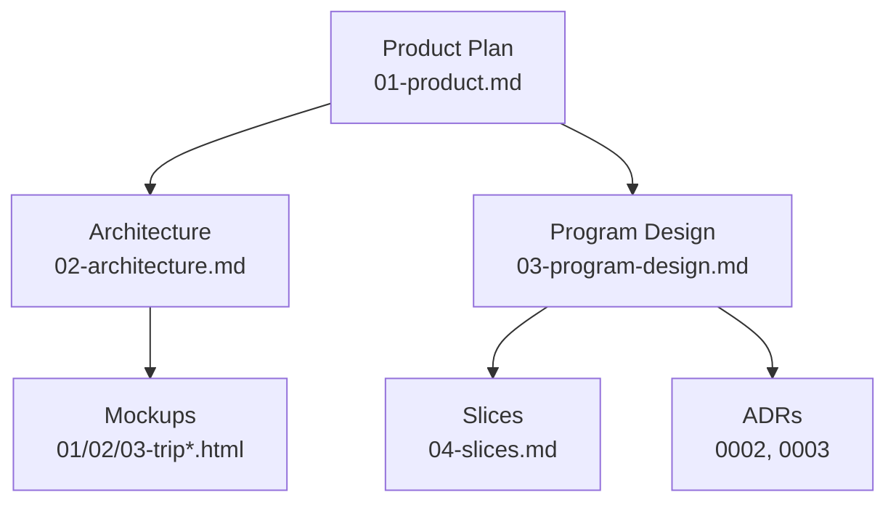
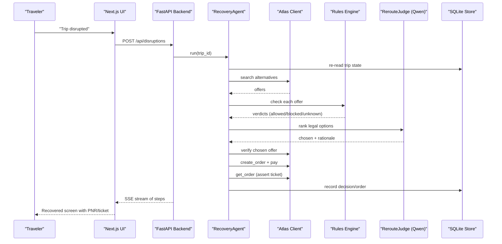
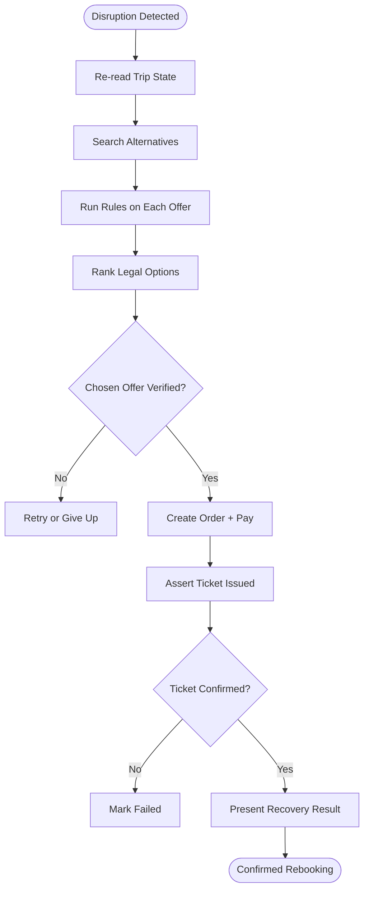
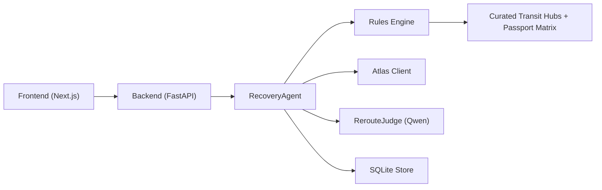

# Target Audience & Use Cases

<cite>
**Referenced Files in This Document**
- [01-product.md](file://docs/plans/waypoint/01-product.md)
- [02-architecture.md](file://docs/plans/waypoint/02-architecture.md)
- [03-program-design.md](file://docs/plans/waypoint/03-program-design.md)
- [04-slices.md](file://docs/plans/waypoint/04-slices.md)
- [QODER-HANDOFF.md](file://docs/plans/waypoint/QODER-HANDOFF.md)
- [0002-visa-rules-curated-approximation.md](file://docs/adr/0002-visa-rules-curated-approximation.md)
- [0003-advise-execute-two-gate-split.md](file://docs/adr/0003-advise-execute-two-gate-split.md)
- [01-trip-disrupted.html](file://docs/plans/waypoint/mockups/01-trip-disrupted.html)
- [02-agent-recovering.html](file://docs/plans/waypoint/mockups/02-agent-recovering.html)
- [03-recovery-confirmed.html](file://docs/plans/waypoint/mockups/03-recovery-confirmed.html)
</cite>

## Table of Contents
1. Introduction
2. Project Structure
3. Core Components
4. Architecture Overview
5. Detailed Component Analysis
6. Dependency Analysis
7. Performance Considerations
8. Troubleshooting Guide
9. Conclusion
10. Appendices

## Introduction
Waypoint is a rules-aware rebooking agent that protects travelers whose passports carry limited transit rights from being booked onto connections they cannot legally take. The primary audience includes passengers holding passports with restricted transit privileges—particularly those from India, China, Africa, and Southeast Asia—who face significant restrictions on international connections. When flights are disrupted, mainstream tools often rebook to the cheapest alternative without checking visa or transit eligibility, leaving passengers stranded at gates. Waypoint solves this by evaluating every candidate itinerary against the passenger’s passport and relevant rules before booking, ensuring only legal, boardable options are selected.

This section focuses on who benefits most, when it matters most, and how the system handles disruption scenarios end-to-end—from detection through autonomous recovery to confirmed rebooking. It also covers edge cases and both individual and enterprise use cases.

**Section sources**
- [01-product.md:3-18](file://docs/plans/waypoint/01-product.md#L3-L18)
- [01-product.md:25-31](file://docs/plans/waypoint/01-product.md#L25-L31)

## Project Structure
The project is organized around a product plan, architecture, program design, slices, and mockups that together define the user journey and system behavior for disruptions and recovery.

**Diagram sources**
- [01-product.md:1-31](file://docs/plans/waypoint/01-product.md#L1-L31)
- [02-architecture.md:1-56](file://docs/plans/waypoint/02-architecture.md#L1-L56)
- [03-program-design.md:1-186](file://docs/plans/waypoint/03-program-design.md#L1-L186)
- [04-slices.md:1-37](file://docs/plans/waypoint/04-slices.md#L1-L37)
- [01-trip-disrupted.html:1-51](file://docs/plans/waypoint/mockups/01-trip-disrupted.html#L1-L51)
- [02-agent-recovering.html:1-64](file://docs/plans/waypoint/mockups/02-agent-recovering.html#L1-L64)
- [03-recovery-confirmed.html:1-63](file://docs/plans/waypoint/mockups/03-recovery-confirmed.html#L1-L63)

**Section sources**
- [01-product.md:1-31](file://docs/plans/waypoint/01-product.md#L1-L31)
- [02-architecture.md:1-56](file://docs/plans/waypoint/02-architecture.md#L1-L56)
- [03-program-design.md:1-186](file://docs/plans/waypoint/03-program-design.md#L1-L186)
- [04-slices.md:1-37](file://docs/plans/waypoint/04-slices.md#L1-L37)

## Core Components
- Rules engine: Pluggable checks (e.g., transit-visa eligibility, passport validity) that evaluate each candidate offer against the passenger profile and curated data.
- Recovery agent loop: Orchestrates search, rule evaluation, ranking, verification, ordering, payment, and outcome assertion with strict guards.
- Two-gate model: Open advise gate where all options are visible and reasoned over; fail-closed execute gate where only fully allowed offers can be auto-booked.
- Data layers: Curated transit-hub table, tourist-visa base matrix, and IATA-to-country mapping used by rules.

These components collectively enable automated, compliant rebooking tailored to diverse passport holders.

**Section sources**
- [02-architecture.md:6-11](file://docs/plans/waypoint/02-architecture.md#L6-L11)
- [03-program-design.md:3-7](file://docs/plans/waypoint/03-program-design.md#L3-L7)
- [03-program-design.md:16-23](file://docs/plans/waypoint/03-program-design.md#L16-L23)
- [03-program-design.md:50-55](file://docs/plans/waypoint/03-program-design.md#L50-L55)

## Architecture Overview
At a high level, a disruption triggers an agent loop that searches alternatives, evaluates them against rules, ranks legal options, verifies availability and price, books and settles fare differences, and asserts ticket issuance. The UI streams live reasoning steps and presents before/after outcomes.

**Diagram sources**
- [02-architecture.md:13-47](file://docs/plans/waypoint/02-architecture.md#L13-L47)
- [03-program-design.md:125-149](file://docs/plans/waypoint/03-program-design.md#L125-L149)

## Detailed Component Analysis

### Primary Audience
- Travelers with limited transit rights: Passengers from India, China, Africa, and Southeast Asia frequently encounter restrictions on airside vs. landside transit and self-transfer requirements.
- Business travelers: Corporate policy constraints may require specific routing, alliances, or minimum connection times; Waypoint’s rules framework can accommodate such policies as additional checks.
- Leisure travelers: Often unfamiliar with complex visa/transit rules; Waypoint surfaces clear, rule-based guidance and avoids costly mistakes at the gate.

Evidence and context:
- The product explicitly centers on passports with limited transit rights and highlights the hero rule of transit-visa eligibility alongside passport validity checks.
- Mockups demonstrate a traveler with an Indian passport facing a cancellation and recovering via a legal airside transit option.

**Section sources**
- [01-product.md:3-18](file://docs/plans/waypoint/01-product.md#L3-L18)
- [01-trip-disrupted.html:32-47](file://docs/plans/waypoint/mockups/01-trip-disrupted.html#L32-L47)
- [02-agent-recovering.html:37-58](file://docs/plans/waypoint/mockups/02-agent-recovering.html#L37-L58)

### Common Use Cases
- Flight cancellations requiring immediate rebooking: The system detects a cancelled leg and autonomously searches and books a legal alternative.
- Multi-leg journeys with tight connections: The agent considers layover hours and hub-specific transit rules to avoid risky connections.
- Business travelers with corporate policy constraints: Additional rules (e.g., alliance protection, budget caps) can be added to the pluggable rules engine to enforce corporate policies during recovery.
- Leisure travelers unfamiliar with complex visa requirements: The UI clearly shows why certain options are blocked and why a pricier but legal option was chosen.

Evidence and context:
- The recovery flow includes searching alternatives, running rules, ranking legal options, verifying availability, and asserting ticket issuance.
- The two-gate model ensures AI advises freely while execution remains fail-closed, protecting users from illegal bookings.

**Section sources**
- [02-architecture.md:34-47](file://docs/plans/waypoint/02-architecture.md#L34-L47)
- [03-program-design.md:3-7](file://docs/plans/waypoint/03-program-design.md#L3-L7)
- [03-program-design.md:16-23](file://docs/plans/waypoint/03-program-design.md#L16-L23)

### Disruption Scenarios Handled
- Cancelled flights: Triggered via webhook or injected endpoint; the agent marks the segment cancelled and begins recovery.
- Long delays: While not explicitly modeled here, the same recovery pipeline applies if a delay renders the original itinerary untenable; the agent would search alternatives and apply rules accordingly.
- Operational issues: Any event that breaks a leg can initiate the recovery loop; the agent’s guards (step budget, re-read/verify, outcome assertion) ensure safe operation.

Evidence and context:
- Endpoints include disruption injection and Atlas webhooks as triggers.
- The agent loop enforces re-reads, verification, and outcome assertions to maintain correctness under operational variability.

**Section sources**
- [02-architecture.md:13-19](file://docs/plans/waypoint/02-architecture.md#L13-L19)
- [02-architecture.md:34-47](file://docs/plans/waypoint/02-architecture.md#L34-L47)

### User Journey: From Disruption to Confirmed Rebooking
1. Detection: A cancelled leg is detected (via webhook or injection), marking the segment as cancelled.
2. Search: Alternatives are searched across real inventory.
3. Rule evaluation: Each offer is checked against transit-visa and passport validity rules; results are labeled allowed, blocked, or unknown.
4. Ranking: Legal options are ranked considering price, time, and layover; the best executable option is selected.
5. Verification: Live re-verification ensures price and availability are current.
6. Booking and settlement: Order is created and payment settled; sandbox auto-approve enables end-to-end demo flows.
7. Assertion: Ticket issuance is asserted before marking success.
8. Presentation: The UI streams live reasoning and displays before/after outcomes, including fare difference and PNR/ticket.

**Diagram sources**
- [02-architecture.md:34-47](file://docs/plans/waypoint/02-architecture.md#L34-L47)
- [03-program-design.md:125-149](file://docs/plans/waypoint/03-program-design.md#L125-L149)

**Section sources**
- [02-architecture.md:34-47](file://docs/plans/waypoint/02-architecture.md#L34-L47)
- [03-program-design.md:125-149](file://docs/plans/waypoint/03-program-design.md#L125-L149)

### Edge Cases
- Passport expiration issues: The passport validity rule blocks offers where the passport expires too soon for entry, preventing boarding denials due to expiry.
- Changing visa regulations: Curated transit-hub data includes freshness windows; beyond these windows, cells become unknown and block autonomous execution until refreshed or overridden.
- Complex multi-airline itineraries: The agent preserves all layover airports and countries, applying rules per leg and hub to ensure full compliance across carriers.

Evidence and context:
- Passport validity rule is part of v1 rules; curated tables include freshness windows and provenance.
- The agent loop preserves layovers and applies rules per hub/nationality.

**Section sources**
- [01-product.md:13-18](file://docs/plans/waypoint/01-product.md#L13-L18)
- [03-program-design.md:34-48](file://docs/plans/waypoint/03-program-design.md#L34-L48)
- [03-program-design.md:167-168](file://docs/plans/waypoint/03-program-design.md#L167-L168)

### Individual Traveler Scenarios
- A traveler with an Indian passport faces a cancellation and is rerouted via a legal airside transit hub instead of a cheaper but visa-required self-transfer.
- The UI clearly shows rejected options, reasons, and the chosen legal route, along with fare difference settlement and ticket confirmation.

Evidence and context:
- Mockups illustrate a canceled nonstop flight and recovery via a legal airside transit option, with explicit passport context and rule labels.

**Section sources**
- [01-trip-disrupted.html:32-47](file://docs/plans/waypoint/mockups/01-trip-disrupted.html#L32-L47)
- [02-agent-recovering.html:42-60](file://docs/plans/waypoint/mockups/02-agent-recovering.html#L42-L60)
- [03-recovery-confirmed.html:35-56](file://docs/plans/waypoint/mockups/03-recovery-confirmed.html#L35-L56)

### Enterprise Use Cases
- Airlines: Integrate Waypoint to reduce gate denials and improve customer experience by ensuring rebooked itineraries comply with passenger passport rules.
- Travel agencies: Serve diverse passport holders by embedding rules-aware recovery into booking and disruption workflows, minimizing liability and improving satisfaction.
- Corporate travel programs: Enforce policy constraints (budget, alliance, connection times) via additional rules in the pluggable engine.

Evidence and context:
- The architecture supports external integrations (Atlas, Qwen) and a pluggable rules interface suitable for enterprise customization.
- The two-gate model provides safety guarantees critical for enterprise-grade operations.

**Section sources**
- [02-architecture.md:6-11](file://docs/plans/waypoint/02-architecture.md#L6-L11)
- [03-program-design.md:3-7](file://docs/plans/waypoint/03-program-design.md#L3-L7)

## Dependency Analysis
Waypoint depends on:
- Atlas integration for search, verification, ordering, payment, and outcome assertion.
- Qwen for ranking legal options and narrating decisions.
- Curated data files for transit rules and passport matrices.
- SQLite for persistence of trips, offers, verdicts, decisions, and orders.

**Diagram sources**
- [02-architecture.md:6-11](file://docs/plans/waypoint/02-architecture.md#L6-L11)
- [02-architecture.md:21-32](file://docs/plans/waypoint/02-architecture.md#L21-L32)
- [03-program-design.md:16-23](file://docs/plans/waypoint/03-program-design.md#L16-L23)

**Section sources**
- [02-architecture.md:6-11](file://docs/plans/waypoint/02-architecture.md#L6-L11)
- [02-architecture.md:21-32](file://docs/plans/waypoint/02-architecture.md#L21-L32)
- [03-program-design.md:16-23](file://docs/plans/waypoint/03-program-design.md#L16-L23)

## Performance Considerations
- Step budget: The agent loop is bounded to prevent runaway processing; exceeding the budget triggers a graceful give-up path.
- Re-read/verify: Price and availability are re-verified immediately before booking to avoid stale offers.
- Outcome assertion: Ticket issuance is asserted before marking success, ensuring reliability even under operational variability.
- Curated data freshness: Freshness windows ensure rules remain trustworthy; past-window cells become unknown and block execution.

These characteristics help maintain responsiveness and correctness during high-volume disruption events.

**Section sources**
- [02-architecture.md:34-47](file://docs/plans/waypoint/02-architecture.md#L34-L47)
- [03-program-design.md:50-55](file://docs/plans/waypoint/03-program-design.md#L50-L55)
- [03-program-design.md:159-166](file://docs/plans/waypoint/03-program-design.md#L159-L166)

## Troubleshooting Guide
Common failure modes and mitigations:
- No legal option found: The agent returns a “no legal option” status and surfaces why; human override may be required.
- Unknown rules: Missing or expired curated data leads to “unknown” verdicts; execution is blocked until refreshed or overridden.
- Stale offers: Re-verification catches price or availability changes; the agent logs old/new values and proceeds safely.
- Ticket assertion failure: If no ticket is returned, the agent marks the process failed rather than assuming success.

Operational safeguards:
- Two-gate split prevents AI from overriding rules at execution time.
- Audit persistence records verdicts, decisions, and orders for compliance and debugging.

**Section sources**
- [03-program-design.md:3-7](file://docs/plans/waypoint/03-program-design.md#L3-L7)
- [03-program-design.md:50-55](file://docs/plans/waypoint/03-program-design.md#L50-L55)
- [03-program-design.md:159-166](file://docs/plans/waypoint/03-program-design.md#L159-L166)

## Conclusion
Waypoint serves travelers with limited transit rights—especially from India, China, Africa, and Southeast Asia—by ensuring rebooked itineraries are legally boardable. It addresses critical scenarios like cancellations, tight connections, corporate constraints, and unfamiliarity with visa rules. The system’s rules engine, two-gate model, and guarded agent loop provide safe, transparent, and reliable recovery from disruptions. For enterprises, Waypoint reduces risk and improves outcomes for diverse passport holders across airlines and travel agencies.

[No sources needed since this section summarizes without analyzing specific files]

## Appendices

### Appendix A: Screens and Visual Context
- Trip disrupted screen shows the canceled leg and traveler passport context.
- Recovering screen streams agent reasoning and displays rule verdicts per option.
- Recovered screen compares rejected cheapest vs chosen legal option, showing fare difference and ticket details.

**Section sources**
- [01-trip-disrupted.html:28-47](file://docs/plans/waypoint/mockups/01-trip-disrupted.html#L28-L47)
- [02-agent-recovering.html:30-60](file://docs/plans/waypoint/mockups/02-agent-recovering.html#L30-L60)
- [03-recovery-confirmed.html:31-56](file://docs/plans/waypoint/mockups/03-recovery-confirmed.html#L31-L56)

### Appendix B: Build Slices Relevant to Use Cases
- Slice 1 proves the end-to-end pipe with canned data.
- Slice 2 integrates real search to surface actual alternatives.
- Slice 3 adds live rules and fail-closed execution.
- Slice 4 introduces AI ranking and narration.
- Slice 5 enables autonomous booking and settlement.
- Slice 6 adds guards and audit persistence.
- Slice 7 wires triggers and polishes the demo choreography.

**Section sources**
- [04-slices.md:7-33](file://docs/plans/waypoint/04-slices.md#L7-L33)