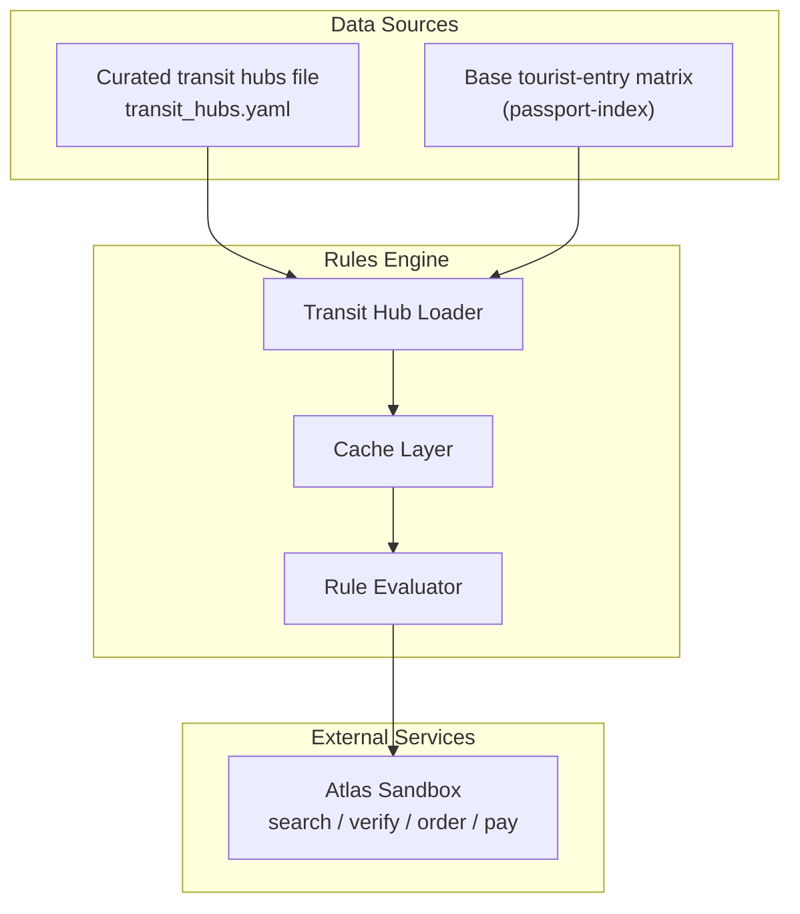
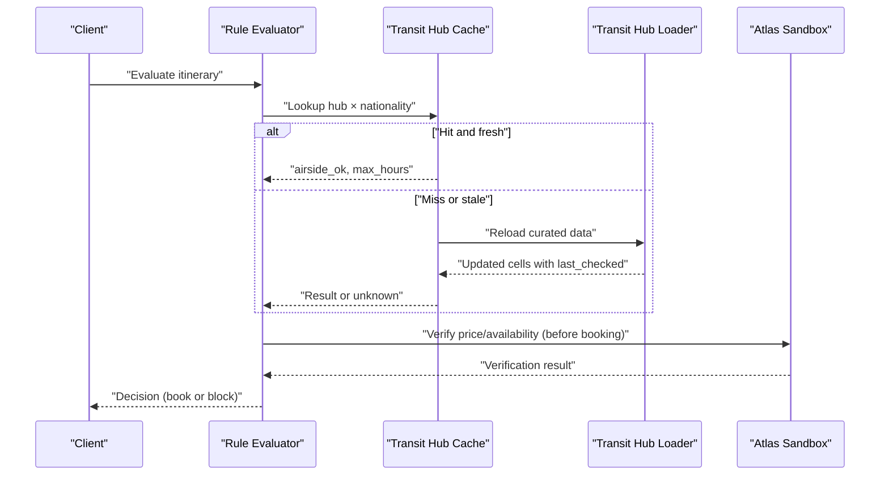
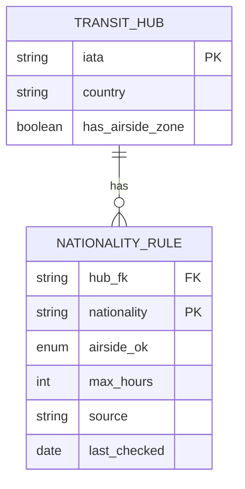
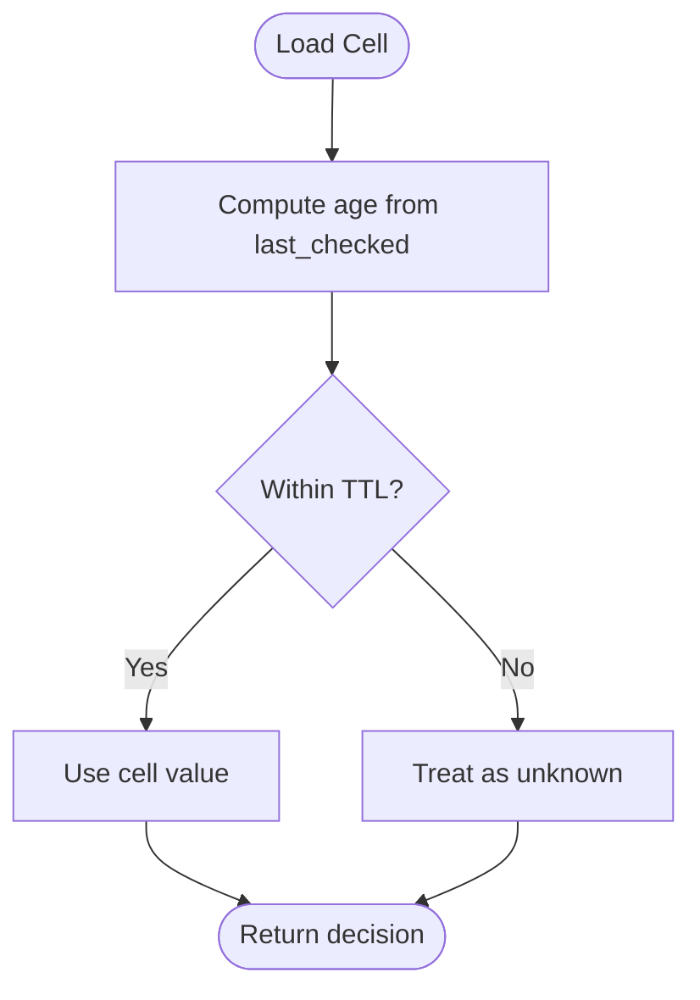
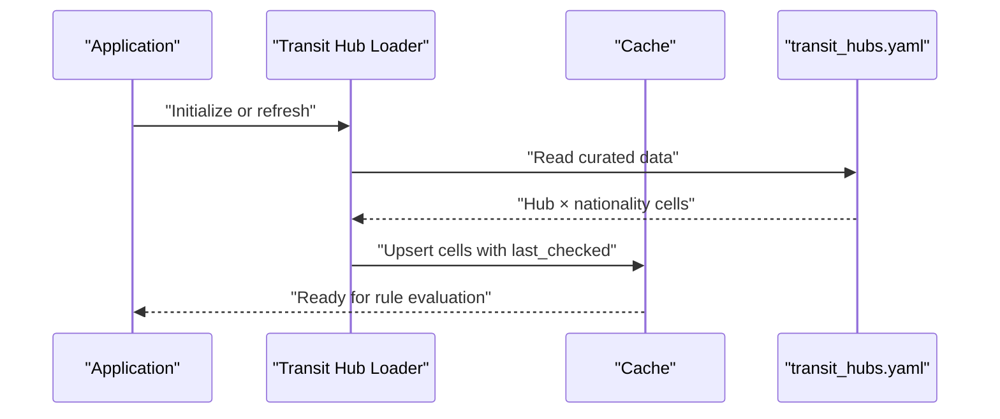
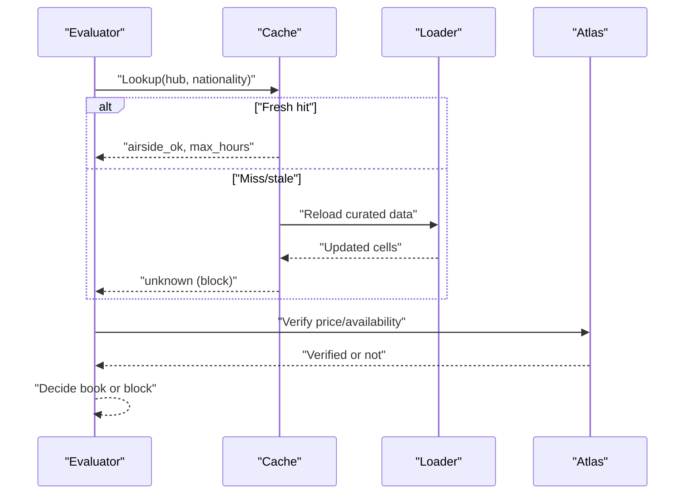
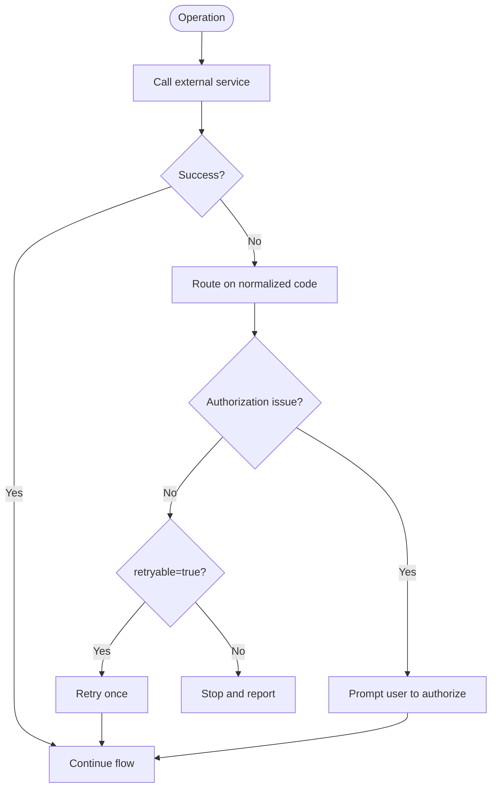
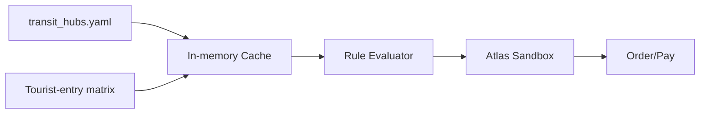

# Data Management & Caching

<cite>
**Referenced Files in This Document**
- [0002-visa-rules-curated-approximation.md](file://docs/adr/0002-visa-rules-curated-approximation.md)
- [03-program-design.md](file://docs/plans/waypoint/03-program-design.md)
- [02-architecture.md](file://docs/plans/waypoint/02-architecture.md)
- [atlas-integration.md](file://docs/external/atlas-integration.md)
- [error-handling.md](file://.agents/skills/atlas-flight-booking/references/error-handling.md)
</cite>

## Table of Contents
1. [Introduction](#introduction)
2. [Project Structure](#project-structure)
3. [Core Components](#core-components)
4. [Architecture Overview](#architecture-overview)
5. [Detailed Component Analysis](#detailed-component-analysis)
6. [Dependency Analysis](#dependency-analysis)
7. [Performance Considerations](#performance-considerations)
8. [Troubleshooting Guide](#troubleshooting-guide)
9. [Conclusion](#conclusion)
10. [Appendices](#appendices)

## Introduction
This document explains how Waypoint’s rules engine manages and caches transit hub data to validate flight itineraries safely and accurately. It covers:
- How curated transit hub information is loaded, cached, and refreshed for rule evaluation
- The data source architecture (file-based curated table plus external sources)
- Caching strategies including TTL policies and invalidation triggers
- Data loading patterns, error handling, and fallback mechanisms
- Data versioning and migration approaches for schema changes
- Monitoring for data freshness and accuracy

The goal is to ensure that rule decisions are based on current, trustworthy information while maintaining performance and resilience.

## Project Structure
Waypoint’s data management strategy is defined in design and integration documents rather than code files in this repository snapshot. The relevant artifacts include:
- An Architectural Decision Record describing the curated approximation approach for transit-visa rules
- A program design document defining the curated data schema and freshness policy
- Architecture notes identifying external integrations (Atlas sandbox) and local data bundling
- Integration notes detailing Atlas API usage and constraints
- Error handling references for robust behavior with external services

**Diagram sources**
- [0002-visa-rules-curated-approximation.md:6-18](file://docs/adr/0002-visa-rules-curated-approximation.md#L6-L18)
- [03-program-design.md:34-53](file://docs/plans/waypoint/03-program-design.md#L34-L53)
- [02-architecture.md:51-54](file://docs/plans/waypoint/02-architecture.md#L51-L54)
- [atlas-integration.md:15-21](file://docs/external/atlas-integration.md#L15-L21)

**Section sources**
- [0002-visa-rules-curated-approximation.md:6-18](file://docs/adr/0002-visa-rules-curated-approximation.md#L6-L18)
- [03-program-design.md:34-53](file://docs/plans/waypoint/03-program-design.md#L34-L53)
- [02-architecture.md:51-54](file://docs/plans/waypoint/02-architecture.md#L51-L54)
- [atlas-integration.md:15-21](file://docs/external/atlas-integration.md#L15-L21)

## Core Components
- Curated Transit Hub Data Store
  - File-based YAML structure keyed by hub IATA and passport nationality
  - Fields include airside eligibility, time thresholds, provenance, and last-checked timestamps
  - Lookup misses default to unknown, blocking autonomous execution (fail-closed)
- Base Tourist-Entry Matrix
  - Used as a fallback when a hub lacks an airside zone
  - Treated as less reliable; shorter freshness window
- Cache Layer
  - In-memory cache for fast rule evaluation
  - Enforces per-cell freshness windows (TTL) based on last_checked
  - Supports invalidation on reload or explicit refresh triggers
- Rule Evaluator
  - Reads from cache to determine if a connecting airport is legal for the passenger’s passport
  - Applies fail-closed semantics for unknown or stale entries
- External Service Integrations
  - Atlas sandbox used for search/verify/order/pay flows
  - Not a source for live transit-visa rules; used for price/availability verification

**Section sources**
- [0002-visa-rules-curated-approximation.md:9-18](file://docs/adr/0002-visa-rules-curated-approximation.md#L9-L18)
- [03-program-design.md:34-53](file://docs/plans/waypoint/03-program-design.md#L34-L53)
- [02-architecture.md:51-54](file://docs/plans/waypoint/02-architecture.md#L51-L54)
- [atlas-integration.md:15-21](file://docs/external/atlas-integration.md#L15-L21)

## Architecture Overview
The system loads curated transit hub data into memory, enforces freshness via TTLs, and serves rule evaluations quickly. When evaluating a route, the engine checks each connecting airport against the cache. If data is missing or stale, it defaults to unknown and blocks autonomous booking. Price and availability are verified live via Atlas before booking, but transit-visa rules rely on curated data plus freshness windows.

**Diagram sources**
- [03-program-design.md:34-53](file://docs/plans/waypoint/03-program-design.md#L34-L53)
- [atlas-integration.md:15-21](file://docs/external/atlas-integration.md#L15-L21)

## Detailed Component Analysis

### Curated Transit Hub Data Model
- Keyed by hub IATA and passport nationality
- Includes:
  - Airside eligibility (yes/no/unknown)
  - Time threshold (max_hours)
  - Provenance (source URL)
  - Last checked timestamp
- Lookup miss resolves to unknown, blocking autonomous execution

**Diagram sources**
- [03-program-design.md:34-48](file://docs/plans/waypoint/03-program-design.md#L34-L48)

**Section sources**
- [03-program-design.md:34-48](file://docs/plans/waypoint/03-program-design.md#L34-L48)

### Freshness Policy and TTL
- Two freshness windows:
  - Airside cell trusted up to 6 months since last_checked
  - Entry-fallback cell trusted up to 3 months since last_checked
- Past the window → treated as unknown → fail-closed
- This acts as a proxy for “re-read before write” where no live transit-visa API exists

**Diagram sources**
- [03-program-design.md:45-53](file://docs/plans/waypoint/03-program-design.md#L45-L53)
- [0002-visa-rules-curated-approximation.md:16-18](file://docs/adr/0002-visa-rules-curated-approximation.md#L16-L18)

**Section sources**
- [03-program-design.md:45-53](file://docs/plans/waypoint/03-program-design.md#L45-L53)
- [0002-visa-rules-curated-approximation.md:16-18](file://docs/adr/0002-visa-rules-curated-approximation.md#L16-L18)

### Data Loading Patterns
- Load curated YAML at startup or on demand
- Populate in-memory cache keyed by (hub, nationality)
- On cache miss or TTL expiry, reload curated data and update cells
- Apply fail-closed semantics for missing hubs or nationalities

**Diagram sources**
- [03-program-design.md:34-48](file://docs/plans/waypoint/03-program-design.md#L34-L48)

**Section sources**
- [03-program-design.md:34-48](file://docs/plans/waypoint/03-program-design.md#L34-L48)

### Rule Evaluation Flow
- For each connecting airport:
  - Look up (hub, nationality) in cache
  - If hit and fresh → use airside_ok and max_hours
  - If miss or stale → treat as unknown → block autonomous execution
- Before booking:
  - Verify price/availability via Atlas
  - Proceed only if verification succeeds

**Diagram sources**
- [03-program-design.md:34-53](file://docs/plans/waypoint/03-program-design.md#L34-L53)
- [atlas-integration.md:15-21](file://docs/external/atlas-integration.md#L15-L21)

**Section sources**
- [03-program-design.md:34-53](file://docs/plans/waypoint/03-program-design.md#L34-L53)
- [atlas-integration.md:15-21](file://docs/external/atlas-integration.md#L15-L21)

### Error Handling and Fallbacks
- External service errors are handled by routing on normalized codes
- Retry limited to read-only operations when retryable=true
- Authorization and subscription states are surfaced to users without exposing internal codes
- For data issues:
  - Missing hub/nationality → unknown → fail-closed
  - Stale data beyond TTL → unknown → fail-closed
  - No live transit-visa API → rely on curated data + freshness

**Diagram sources**
- [error-handling.md:1-17](file://.agents/skills/atlas-flight-booking/references/error-handling.md#L1-L17)
- [error-handling.md:65-72](file://.agents/skills/atlas-flight-booking/references/error-handling.md#L65-L72)

**Section sources**
- [error-handling.md:1-17](file://.agents/skills/atlas-flight-booking/references/error-handling.md#L1-L17)
- [error-handling.md:65-72](file://.agents/skills/atlas-flight-booking/references/error-handling.md#L65-L72)

### Data Versioning and Migration Strategy
- Schema fields include source and last_checked to support provenance tracking
- Changes to curated data should:
  - Update last_checked to reflect recency
  - Preserve historical source references for auditability
  - Ensure backward compatibility with existing cache keys (hub × nationality)
- Migration steps:
  - Validate new schema against fixtures
  - Roll out curated updates incrementally
  - Monitor for lookup misses and staleness spikes

[No sources needed since this section provides general guidance derived from referenced schema and policies]

### Monitoring Approaches for Freshness and Accuracy
- Track cache hit rates and TTL expiry events
- Alert on increased unknown outcomes due to missing or stale data
- Log provenance (source) and last_checked for auditing
- Correlate rule decisions with Atlas verification results to ensure alignment between curated data and live pricing/availability

[No sources needed since this section provides general guidance derived from referenced policies]

## Dependency Analysis
- Curated data file is the authoritative source for transit rules
- Base tourist-entry matrix is a secondary fallback for hubs without airside zones
- Atlas sandbox is integrated for price/availability verification, not for transit-visa rules
- Error handling relies on normalized codes to maintain consistent behavior across failures

**Diagram sources**
- [03-program-design.md:34-53](file://docs/plans/waypoint/03-program-design.md#L34-L53)
- [02-architecture.md:51-54](file://docs/plans/waypoint/02-architecture.md#L51-L54)
- [atlas-integration.md:15-21](file://docs/external/atlas-integration.md#L15-L21)

**Section sources**
- [03-program-design.md:34-53](file://docs/plans/waypoint/03-program-design.md#L34-L53)
- [02-architecture.md:51-54](file://docs/plans/waypoint/02-architecture.md#L51-L54)
- [atlas-integration.md:15-21](file://docs/external/atlas-integration.md#L15-L21)

## Performance Considerations
- In-memory caching minimizes latency during rule evaluation
- TTL-based invalidation ensures freshness without frequent disk reads
- Fail-closed semantics reduce risk of incorrect auto-execution
- Atlas verification is invoked only before booking to balance accuracy and cost

[No sources needed since this section provides general guidance]

## Troubleshooting Guide
- If rule evaluation returns unknown:
  - Check whether the hub or nationality exists in curated data
  - Verify last_checked timestamps against TTL windows
  - Reload curated data if necessary
- If Atlas verification fails:
  - Route on normalized error codes
  - Retry read-only operations when retryable=true
  - Prompt user for authorization or subscription actions as needed

**Section sources**
- [03-program-design.md:45-53](file://docs/plans/waypoint/03-program-design.md#L45-L53)
- [error-handling.md:1-17](file://.agents/skills/atlas-flight-booking/references/error-handling.md#L1-L17)
- [error-handling.md:65-72](file://.agents/skills/atlas-flight-booking/references/error-handling.md#L65-L72)

## Conclusion
Waypoint’s rules engine uses a curated, file-based dataset for transit-visa rules, augmented by a base tourist-entry matrix as a fallback. A cache layer enforces freshness windows to ensure decisions are based on recent information, while Atlas provides live verification for price and availability. Fail-closed semantics protect against unsafe autonomous actions when data is missing or stale. This approach balances safety, accuracy, and performance, with clear paths for monitoring, error handling, and future schema evolution.

[No sources needed since this section summarizes without analyzing specific files]

## Appendices
- References to key design decisions and integration points are provided throughout this document
- For implementation details, consult the cited sections in the referenced files

[No sources needed since this section lists references already cited above]