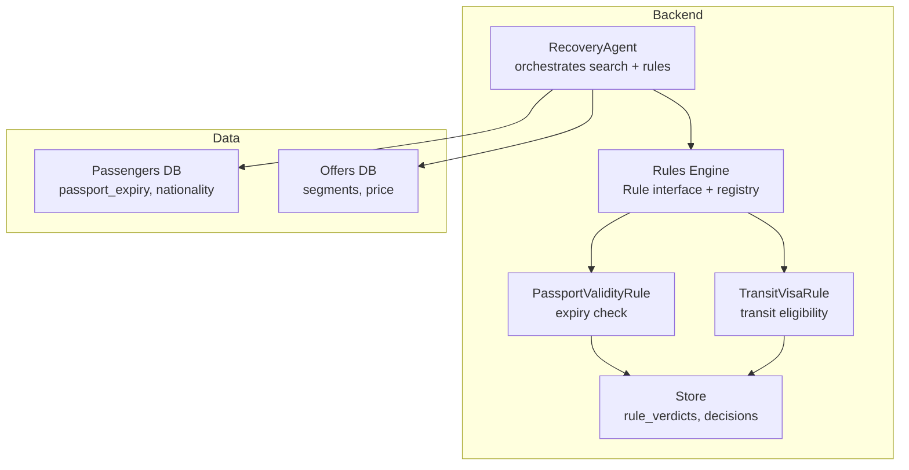
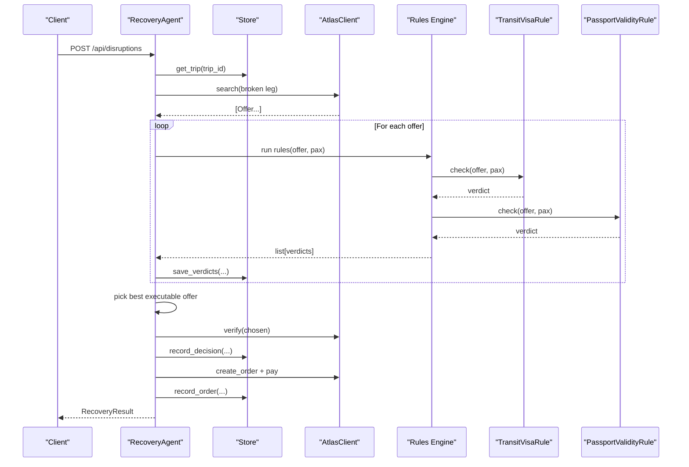
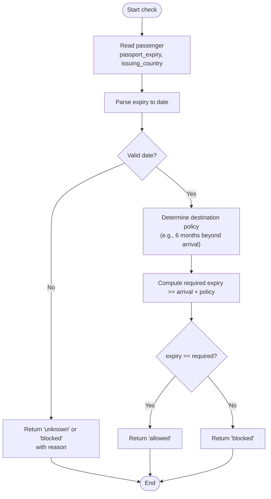
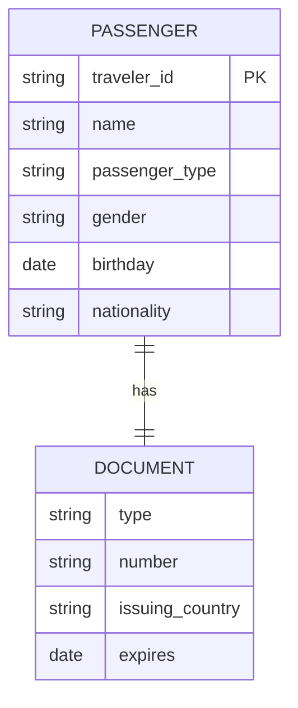
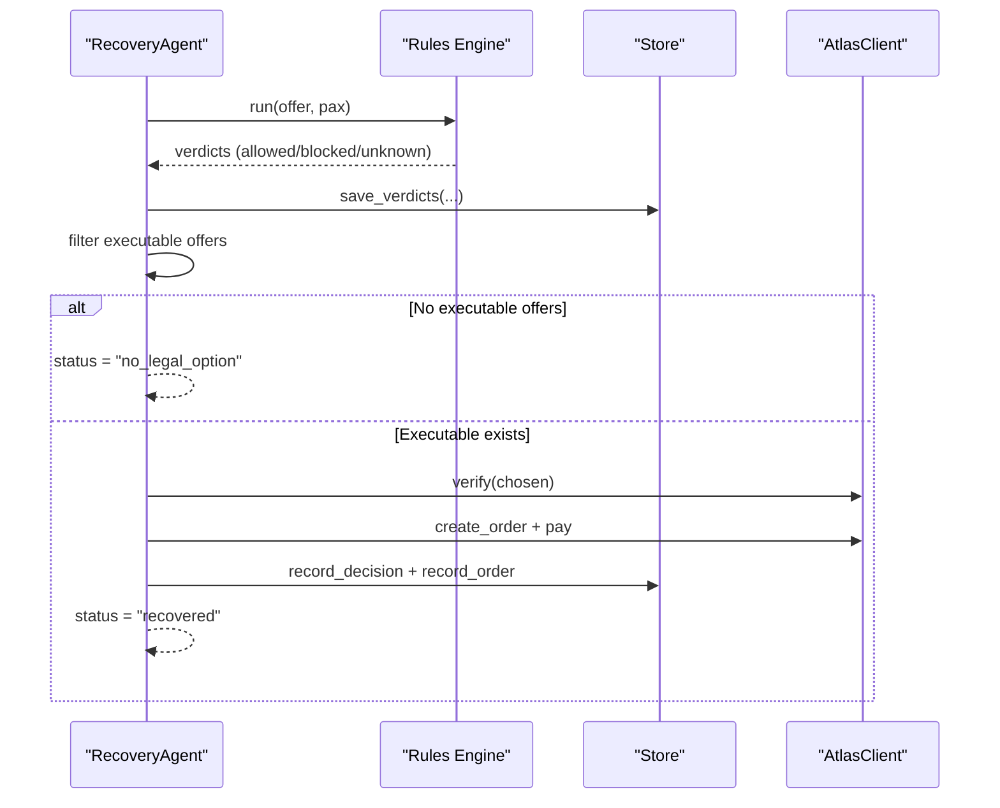
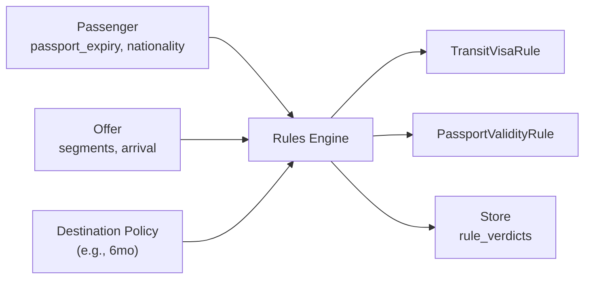

# Passport Validity Rules

<cite>
**Referenced Files in This Document**
- [02-architecture.md](file://docs/plans/waypoint/02-architecture.md)
- [03-program-design.md](file://docs/plans/waypoint/03-program-design.md)
- [passenger-input.md](file://.agents/skills/atlas-flight-booking/references/passenger-input.md)
</cite>

## Table of Contents
1. Introduction
2. Project Structure
3. Core Components
4. Architecture Overview
5. Detailed Component Analysis
6. Dependency Analysis
7. Performance Considerations
8. Troubleshooting Guide
9. Conclusion

## Introduction
This document explains how Waypoint’s rules engine validates passport validity, focusing on the commonly required “passport must be valid for at least 6 months beyond travel” rule used by many countries for international entry. It covers how passport expiry dates are parsed from passenger data, validated against current dates and destination requirements, and integrated into the booking eligibility pipeline. It also addresses timezone considerations, robust date parsing, error handling for malformed data, and how validity checks influence whether an offer can be auto-booked.

## Project Structure
Waypoint implements a pluggable rules engine with two live rules: transit-visa eligibility and passport validity. The backend orchestrates recovery after disruptions, runs each rule per candidate offer, persists verdicts, and enforces an execute gate that only books offers where every rule is allowed.

**Diagram sources**
- [02-architecture.md:9-11](file://docs/plans/waypoint/02-architecture.md#L9-L11)
- [03-program-design.md:10-31](file://docs/plans/waypoint/03-program-design.md#L10-L31)

**Section sources**
- [02-architecture.md:9-11](file://docs/plans/waypoint/02-architecture.md#L9-L11)
- [03-program-design.md:10-31](file://docs/plans/waypoint/03-program-design.md#L10-L31)

## Core Components
- Rule protocol and verdict model:
  - Each rule exposes a name and a check method returning a three-state verdict: allowed, blocked, or unknown, with reason and optional provenance/freshness metadata.
- PassportValidityRule:
  - Reads passenger passport expiry and compares it to the trip’s arrival time (and optionally destination-specific policy). If the remaining validity is less than the required threshold (e.g., 6 months), the rule returns blocked; otherwise allowed.
- Integration points:
  - Passenger data includes passport expiry and issuing country.
  - Offers include segments with departure/arrival times used to compute layover durations and final arrival at destination.
  - Verdicts are persisted so the agent can filter to executable offers (all allowed) before any booking.

Key behaviors:
- Fail-closed: blocked or unknown prevents autonomous execution.
- Auditability: every rule check is recorded with reason and source/freshness when applicable.
- Extensibility: new rules plug into the same interface without changing the agent loop.

**Section sources**
- [03-program-design.md:57-95](file://docs/plans/waypoint/03-program-design.md#L57-L95)
- [02-architecture.md:21-30](file://docs/plans/waypoint/02-architecture.md#L21-L30)

## Architecture Overview
The recovery flow runs rules against each candidate offer and enforces an execute wall that only allows booking when all rules are allowed.

**Diagram sources**
- [03-program-design.md:125-149](file://docs/plans/waypoint/03-program-design.md#L125-L149)
- [02-architecture.md:13-30](file://docs/plans/waypoint/02-architecture.md#L13-L30)

## Detailed Component Analysis

### PassportValidityRule: Expiry Check Logic
- Inputs:
  - Passenger passport expiry date and issuing country.
  - Offer segments to derive destination arrival time and any intermediate destinations.
- Validation logic:
  - Parse passport expiry as a date.
  - Compute the required minimum remaining validity based on destination policy (commonly 6 months beyond arrival).
  - Compare current date/time or arrival date against expiry to determine if the passport meets the requirement.
  - Return:
    - allowed: expiry is sufficiently far in the future.
    - blocked: expiry is too soon or already past.
    - unknown: if destination policy cannot be determined or required data is missing.
- Edge cases:
  - Expired passports: blocked.
  - Expiring within required window (e.g., <6 months): blocked.
  - Missing or malformed expiry: treated conservatively (blocked or unknown depending on implementation), with clear reasons recorded.
- Timezone considerations:
  - Use consistent UTC-based comparisons or explicitly convert local times to UTC before comparing to avoid off-by-one-day errors across timezones.
- Data model integration:
  - Passenger model stores passport_expiry and issuing_country.
  - Offer segments provide dep_time and arr_time for computing arrival at destination.

**Diagram sources**
- [03-program-design.md:57-95](file://docs/plans/waypoint/03-program-design.md#L57-L95)
- [02-architecture.md:21-30](file://docs/plans/waypoint/02-architecture.md#L21-L30)

**Section sources**
- [03-program-design.md:57-95](file://docs/plans/waypoint/03-program-design.md#L57-L95)
- [02-architecture.md:21-30](file://docs/plans/waypoint/02-architecture.md#L21-L30)

### Passenger Data Model and Passport Fields
- Passenger payload includes:
  - traveler_id, name, passenger_type, gender, birthday, nationality.
  - document.type, document.number, document.issuing_country, document.expires.
- These fields feed both TransitVisaRule and PassportValidityRule:
  - Nationality drives transit-visa lookup.
  - Issuing country and expiry drive passport validity checks.

**Diagram sources**
- [passenger-input.md:17-52](file://.agents/skills/atlas-flight-booking/references/passenger-input.md#L17-L52)

**Section sources**
- [passenger-input.md:17-52](file://.agents/skills/atlas-flight-booking/references/passenger-input.md#L17-L52)

### Integration with Booking Eligibility
- The agent runs all rules per offer and records verdicts.
- Only offers where every rule is allowed are considered executable for auto-booking.
- If no executable option exists, the agent reports no legal option; otherwise it picks the best executable offer and proceeds to verify, order, and ticket assertion.

**Diagram sources**
- [03-program-design.md:125-149](file://docs/plans/waypoint/03-program-design.md#L125-L149)
- [02-architecture.md:21-30](file://docs/plans/waypoint/02-architecture.md#L21-L30)

**Section sources**
- [03-program-design.md:125-149](file://docs/plans/waypoint/03-program-design.md#L125-L149)
- [02-architecture.md:21-30](file://docs/plans/waypoint/02-architecture.md#L21-L30)

### Example Scenarios and Edge Cases
- Scenario: Passport expiring in 4 months for a destination requiring 6 months validity.
  - Expected: blocked; reason cites insufficient remaining validity.
- Scenario: Passport expiring in 9 months for a destination requiring 6 months validity.
  - Expected: allowed.
- Scenario: Already expired passport.
  - Expected: blocked; reason cites expired document.
- Scenario: Malformed or missing expiry.
  - Expected: blocked or unknown; reason indicates invalid/expiry missing; fail-closed prevents auto-execution.
- Scenario: Destination policy unknown.
  - Expected: unknown; fail-closed blocks auto-execution until policy is known or overridden.

These scenarios align with the three-state verdict model and the execute gate that requires all rules to be allowed.

**Section sources**
- [03-program-design.md:57-95](file://docs/plans/waypoint/03-program-design.md#L57-L95)
- [03-program-design.md:151-167](file://docs/plans/waypoint/03-program-design.md#L151-L167)

## Dependency Analysis
- PassportValidityRule depends on:
  - Passenger model fields (passport_expiry, issuing_country).
  - Offer segments to compute destination arrival time.
  - Destination policy mapping (e.g., 6-month rule) which may be configurable or derived from destination country.
- The rules engine depends on:
  - Rule registry to execute ordered active rules.
  - Store to persist verdicts and decisions.
- External data:
  - Transit-visa curated tables and passport-index matrix are separate from passport validity but coexist in the same engine.

**Diagram sources**
- [03-program-design.md:10-31](file://docs/plans/waypoint/03-program-design.md#L10-L31)
- [02-architecture.md:21-30](file://docs/plans/waypoint/02-architecture.md#L21-L30)

**Section sources**
- [03-program-design.md:10-31](file://docs/plans/waypoint/03-program-design.md#L10-L31)
- [02-architecture.md:21-30](file://docs/plans/waypoint/02-architecture.md#L21-L30)

## Performance Considerations
- Date parsing and comparison should be O(1) per rule per offer; with N offers and M rules, total complexity is O(N*M).
- Avoid repeated timezone conversions by normalizing to UTC once per offer/pax pair.
- Cache destination policy lookups per country during a single recovery run to minimize redundant computations.
- Persisting verdicts is lightweight and enables quick filtering of executable offers.

## Troubleshooting Guide
Common issues and resolutions:
- Malformed passport expiry:
  - Symptom: rule returns blocked or unknown with reason indicating invalid date format.
  - Resolution: validate input format (YYYY-MM-DD) and reject or request correction before proceeding.
- Missing passport expiry:
  - Symptom: rule returns unknown or blocked due to missing data.
  - Resolution: require expiry before running rules; prompt user to supply missing fields.
- Timezone mismatches causing off-by-one-day errors:
  - Symptom: borderline cases flip between allowed/blocked near midnight.
  - Resolution: normalize all times to UTC before comparing to expiry; ensure arrival times are correctly converted.
- Destination policy unknown:
  - Symptom: rule returns unknown; offer not executable.
  - Resolution: add or update policy mapping; fail-closed prevents auto-execution until resolved.

**Section sources**
- [03-program-design.md:57-95](file://docs/plans/waypoint/03-program-design.md#L57-L95)
- [03-program-design.md:151-167](file://docs/plans/waypoint/03-program-design.md#L151-L167)

## Conclusion
Waypoint’s rules engine provides a robust, extensible foundation for enforcing passport validity rules such as the 6-month post-travel requirement. By parsing passport expiry from passenger data, comparing it against destination policies and arrival times, and integrating verdicts into the booking eligibility pipeline, the system ensures that only legally boardable options are auto-booked. The three-state verdict model and fail-closed execute gate maintain safety and compliance, while persistent verdicts enable auditability and transparent decision-making.