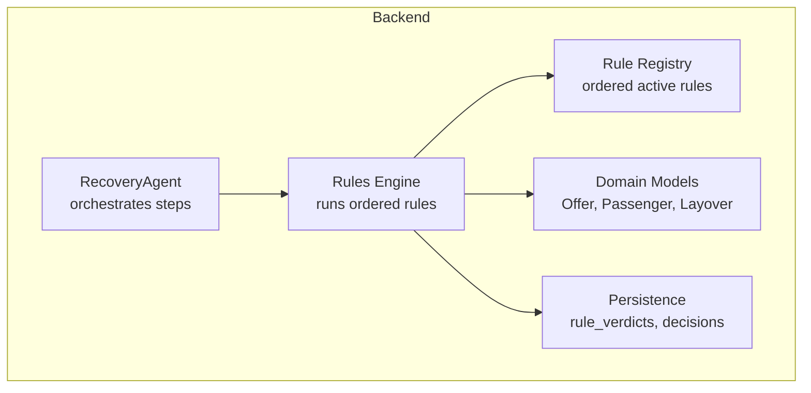
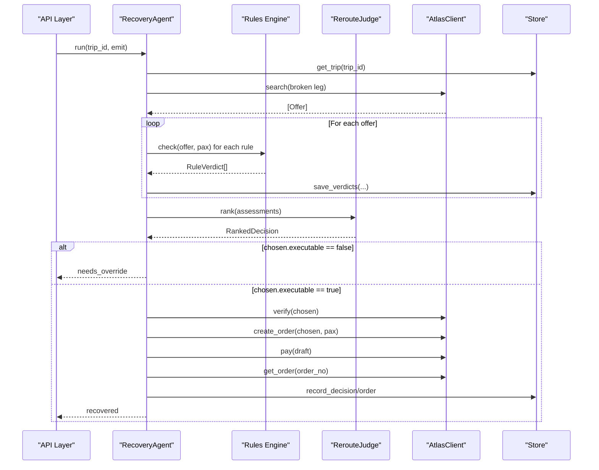
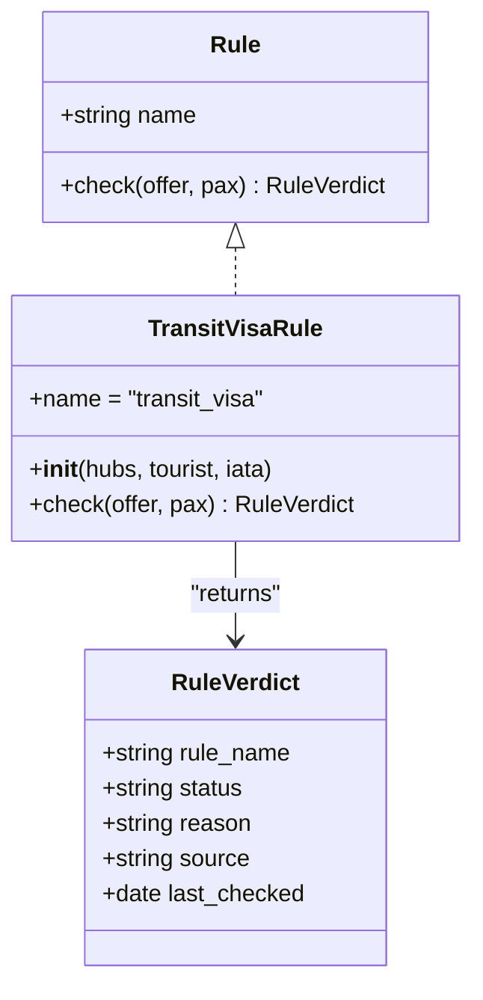
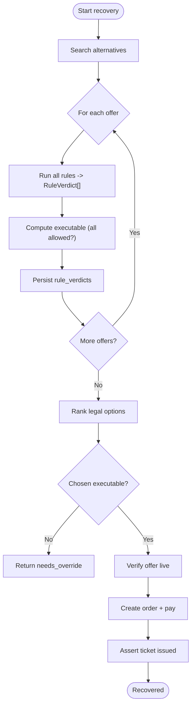
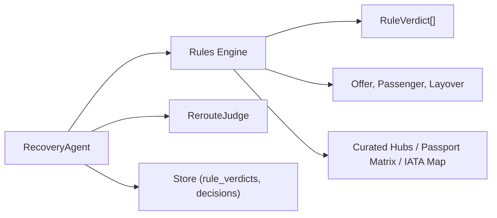

# Rule Framework & Interface

<cite>
**Referenced Files in This Document**
- [03-program-design.md](file://docs/plans/waypoint/03-program-design.md)
- [02-architecture.md](file://docs/plans/waypoint/02-architecture.md)
- [01-product.md](file://docs/plans/waypoint/01-product.md)
- [0002-visa-rules-curated-approximation.md](file://docs/adr/0002-visa-rules-curated-approximation.md)
- [0003-advise-execute-two-gate-split.md](file://docs/adr/0003-advise-execute-two-gate-split.md)
</cite>

## Table of Contents
1. Introduction
2. Project Structure
3. Core Components
4. Architecture Overview
5. Detailed Component Analysis
6. Dependency Analysis
7. Performance Considerations
8. Troubleshooting Guide
9. Conclusion

## Introduction
This document explains the Waypoint rule framework and interface system that enables pluggable validation rules for flight offers. It focuses on:
- The Rule interface design and how it standardizes checks across different policy domains (transit visa, passport validity, and future rules).
- How new rules are registered and loaded dynamically at runtime.
- The rule execution lifecycle from invocation to result processing.
- The RuleVerdict data structure and how it communicates validation results to the broader system.
- Rule composition patterns, dependency injection for rule dependencies, and testing strategies for custom rules.

The goal is to make the rule engine extensible, auditable, and safe under autonomous execution by enforcing a strict separation between advice and execution.

**Section sources**
- [01-product.md:13-18](file://docs/plans/waypoint/01-product.md#L13-L18)
- [02-architecture.md:8-11](file://docs/plans/waypoint/02-architecture.md#L8-L11)

## Project Structure
At a high level, the rule framework lives in the backend’s rules module and integrates with the recovery agent loop, the judge (for ranking), and persistence for auditability. Key elements include:
- A protocol-based Rule interface that any rule must implement.
- A standardized RuleVerdict type used to communicate outcomes.
- A registry of active rules that can be extended without changing core logic.
- Integration points with domain models (Offer, Passenger, Layover) and external data sources (curated transit hubs, passport matrices).

**Diagram sources**
- [03-program-design.md:125-149](file://docs/plans/waypoint/03-program-design.md#L125-L149)
- [02-architecture.md:21-32](file://docs/plans/waypoint/02-architecture.md#L21-L32)

**Section sources**
- [02-architecture.md:8-11](file://docs/plans/waypoint/02-architecture.md#L8-L11)
- [03-program-design.md:125-149](file://docs/plans/waypoint/03-program-design.md#L125-L149)

## Core Components
- Rule interface: A minimal contract that every rule implements, enabling uniform invocation and consistent return types.
- RuleVerdict: A three-state outcome model carrying status, reason, source, and last_checked fields for transparency and compliance.
- OfferAssessment: Aggregates per-offer verdicts and computes executability (all allowed).
- RecoveryAgent: Orchestrates search, rule evaluation, judgment, and execution with guards and step budgeting.
- RerouteJudge: Ranks legal options and provides rationale while respecting the execute wall.

Key behaviors:
- Rules receive an Offer and Passenger context and return a single RuleVerdict.
- The engine runs all active rules per offer and records each verdict for auditability.
- Executability requires every rule to return allowed; blocked or unknown prevents auto-execution.

**Section sources**
- [03-program-design.md:57-86](file://docs/plans/waypoint/03-program-design.md#L57-L86)
- [03-program-design.md:97-114](file://docs/plans/waypoint/03-program-design.md#L97-L114)

## Architecture Overview
The rule framework sits between discovery (search) and decision (judge), with a hard boundary around execution.

**Diagram sources**
- [03-program-design.md:125-149](file://docs/plans/waypoint/03-program-design.md#L125-L149)
- [02-architecture.md:34-47](file://docs/plans/waypoint/02-architecture.md#L34-L47)

**Section sources**
- [03-program-design.md:125-149](file://docs/plans/waypoint/03-program-design.md#L125-L149)
- [02-architecture.md:34-47](file://docs/plans/waypoint/02-architecture.md#L34-L47)

## Detailed Component Analysis

### Rule Interface Design
- Contract: Each rule exposes a name and a check method that accepts an Offer and a Passenger and returns a RuleVerdict.
- Return semantics: The three-state status allows explicit handling of uncertainty (unknown), which is critical for fail-closed execution.
- Error handling pattern: Rules should not raise unhandled exceptions; instead, they should encode issues into RuleVerdict.status and RuleVerdict.reason, optionally including source and last_checked for provenance.

**Diagram sources**
- [03-program-design.md:57-95](file://docs/plans/waypoint/03-program-design.md#L57-L95)

**Section sources**
- [03-program-design.md:57-95](file://docs/plans/waypoint/03-program-design.md#L57-L95)

### RuleVerdict Data Structure
- Fields:
  - rule_name: identifies the rule that produced the verdict.
  - status: one of allowed, blocked, unknown.
  - reason: human-readable explanation of the decision.
  - source: optional provenance URL or dataset reference.
  - last_checked: optional timestamp indicating when the underlying data was last validated.
- Usage:
  - Per-offer aggregation produces OfferAssessment.verdicts.
  - Executability is computed as “all verdicts allowed.”
  - Persistence stores rule_verdicts for auditability and UI display.

**Section sources**
- [03-program-design.md:57-86](file://docs/plans/waypoint/03-program-design.md#L57-L86)
- [02-architecture.md:21-32](file://docs/plans/waypoint/02-architecture.md#L21-L32)

### Dynamic Registration and Loading of Rules
- Active rules are maintained as an ordered list so that precedence and ordering are deterministic.
- New rules are added by implementing the Rule interface and registering them in the active rules collection used by the rules engine.
- The recovery agent receives the rules list via dependency injection, enabling test doubles and environment-specific configurations.

Practical guidance:
- Keep rule registration centralized to ensure a single source of truth for the execution order.
- Use configuration or feature flags to enable/disable rules per environment.
- Ensure each rule has a stable name to support consistent auditing and UI labeling.

**Section sources**
- [03-program-design.md:112-114](file://docs/plans/waypoint/03-program-design.md#L112-L114)
- [02-architecture.md:8-11](file://docs/plans/waypoint/02-architecture.md#L8-L11)

### Rule Execution Lifecycle
The lifecycle ensures safety and traceability:
1. Search alternatives for the broken leg.
2. For each offer, run all active rules and collect RuleVerdict instances.
3. Build OfferAssessment with executable flag based on verdicts.
4. Persist verdicts for auditability.
5. Pass assessments to the judge for ranking among legal options.
6. Enforce the execute wall: only allow auto-execution if all verdicts are allowed.
7. Re-verify offer before booking and assert ticket issuance.

**Diagram sources**
- [03-program-design.md:125-149](file://docs/plans/waypoint/03-program-design.md#L125-L149)

**Section sources**
- [03-program-design.md:125-149](file://docs/plans/waypoint/03-program-design.md#L125-L149)

### Built-in Rules: Transit Visa and Passport Validity
- Transit visa rule:
  - Reads curated hub data and passenger nationality to determine airside vs. landside requirements.
  - Applies freshness windows and fail-closed defaults for missing or stale data.
  - Produces RuleVerdict with status and reason reflecting legality and risk.
- Passport validity rule:
  - Checks passport expiry against entry requirements (e.g., six-month validity).
  - Returns blocked when insufficient validity remains.

These rules demonstrate how domain knowledge is encapsulated behind the same interface, enabling extension without changing core flows.

**Section sources**
- [03-program-design.md:88-95](file://docs/plans/waypoint/03-program-design.md#L88-L95)
- [01-product.md:13-18](file://docs/plans/waypoint/01-product.md#L13-L18)
- [0002-visa-rules-curated-approximation.md:9-18](file://docs/adr/0002-visa-rules-curated-approximation.md#L9-L18)

### Implementing Custom Rules (Beyond Transit Visa and Passport Validity)
Examples of future rules designed into the engine:
- Onward-ticket / proof-of-return requirement.
- Health or vaccination entry requirements.
- Airline minimum connection time enforcement.
- Loyalty or alliance protection policies.
- Corporate policy or budget constraints.
- Carbon budget limits.

Implementation checklist:
- Implement the Rule interface with a stable name.
- In check(), read Offer and Passenger context plus any injected dependencies.
- Return RuleVerdict with clear status, reason, and optional source/last_checked.
- Register the rule in the active rules list with appropriate ordering.
- Add tests covering allowed/blocked/unknown paths and edge cases.

**Section sources**
- [01-product.md:13-18](file://docs/plans/waypoint/01-product.md#L13-L18)
- [03-program-design.md:57-95](file://docs/plans/waypoint/03-program-design.md#L57-L95)

### Rule Composition Patterns
- Sequential composition: Run multiple rules in a fixed order to build a composite assessment per offer.
- Short-circuiting: While the engine collects all verdicts for auditability, higher-level logic can short-circuit execution decisions based on any blocked or unknown verdict.
- Composable data: Use Offer.layovers() and passenger attributes to derive inputs for multiple rules without duplicating parsing logic.

Best practices:
- Keep each rule focused on a single concern.
- Prefer pure functions where possible to simplify testing and reasoning.
- Centralize shared lookups (e.g., IATA mapping) via dependency injection.

**Section sources**
- [03-program-design.md:71-86](file://docs/plans/waypoint/03-program-design.md#L71-L86)

### Dependency Injection for Rule Dependencies
Rules may depend on:
- Curated transit hub tables.
- Passport matrix datasets.
- IATA-to-country mappings.
- External clients (e.g., for additional validations).

Injection approach:
- Provide dependencies through the rule constructor.
- Configure the rules list in the recovery agent initialization.
- Use test doubles for data sources during unit and integration tests.

**Section sources**
- [03-program-design.md:88-95](file://docs/plans/waypoint/03-program-design.md#L88-L95)
- [03-program-design.md:112-114](file://docs/plans/waypoint/03-program-design.md#L112-L114)

### Testing Strategies for Custom Rules
- Unit tests:
  - Validate allowed/blocked/unknown outcomes for representative inputs.
  - Confirm that ticket structure affects messaging but never flips verdict status.
  - Verify freshness window behavior (stale data becomes unknown).
- Integration tests:
  - Exercise the full recovery flow with mocked services.
  - Assert that the execute wall prevents booking non-executable offers.
  - Confirm persistence of rule_verdicts and decisions.

Coverage targets:
- All three statuses per rule.
- Edge cases like missing data, stale cells, and ambiguous layovers.
- End-to-end scenarios where the cheapest option is blocked and the agent selects the cheapest executable alternative.

**Section sources**
- [03-program-design.md:151-171](file://docs/plans/waypoint/03-program-design.md#L151-L171)

## Dependency Analysis
The rule framework depends on domain models and external data, and is consumed by the recovery agent and judge.

**Diagram sources**
- [03-program-design.md:125-149](file://docs/plans/waypoint/03-program-design.md#L125-L149)
- [02-architecture.md:21-32](file://docs/plans/waypoint/02-architecture.md#L21-L32)

**Section sources**
- [02-architecture.md:21-32](file://docs/plans/waypoint/02-architecture.md#L21-L32)
- [03-program-design.md:125-149](file://docs/plans/waypoint/03-program-design.md#L125-L149)

## Performance Considerations
- Rule evaluation is per-offer and per-rule; keep checks efficient and avoid heavy I/O inside hot loops.
- Cache immutable lookups (e.g., IATA maps) in memory for the duration of a recovery run.
- Defer expensive operations until necessary (e.g., only validate connectivity after filtering by basic constraints).
- Persist verdicts incrementally to avoid large in-memory structures.

[No sources needed since this section provides general guidance]

## Troubleshooting Guide
Common issues and resolutions:
- Unexpected blocked verdicts:
  - Inspect RuleVerdict.reason and source for clarity.
  - Check curated data coverage and freshness windows; missing or stale entries resolve to unknown and block execution.
- Unknown posture causing no legal option:
  - Expand curation for key hubs or adjust freshness thresholds carefully.
  - Ensure the judge sees all options and narrates rejections for transparency.
- Stale data risks:
  - Treat past-the-window entries as unknown to maintain fail-closed behavior.
  - Show provenance and last_checked in the UI to inform users.

Operational safeguards:
- Two-gate split: advise is open; execute is walled and fail-closed.
- Step budget: stop gracefully if the loop exceeds the configured limit.
- Re-verify before booking to guard against staleness in price and availability.

**Section sources**
- [0002-visa-rules-curated-approximation.md:9-18](file://docs/adr/0002-visa-rules-curated-approximation.md#L9-L18)
- [0003-advise-execute-two-gate-split.md:1-12](file://docs/adr/0003-advise-execute-two-gate-split.md#L1-L12)
- [03-program-design.md:125-149](file://docs/plans/waypoint/03-program-design.md#L125-L149)

## Conclusion
The Waypoint rule framework provides a clean, extensible interface for validating travel offers against diverse policies. By standardizing the Rule interface, using a three-state RuleVerdict, and enforcing a strict execute wall, the system ensures both flexibility and safety. The recovery agent orchestrates search, rule evaluation, judgment, and execution with robust guards, while persistence captures full audit trails. With dependency injection and comprehensive testing strategies, teams can confidently add new rules and scale the system beyond the initial transit visa and passport validity checks.

[No sources needed since this section summarizes without analyzing specific files]