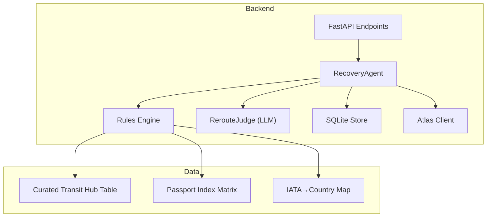
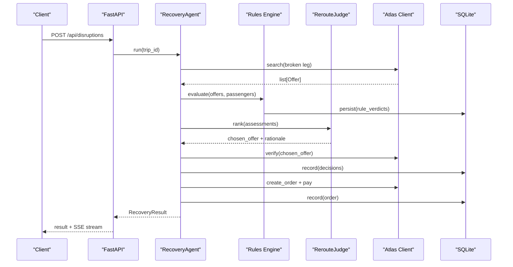
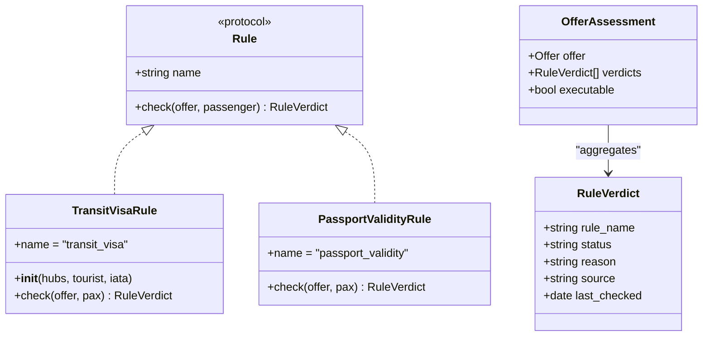
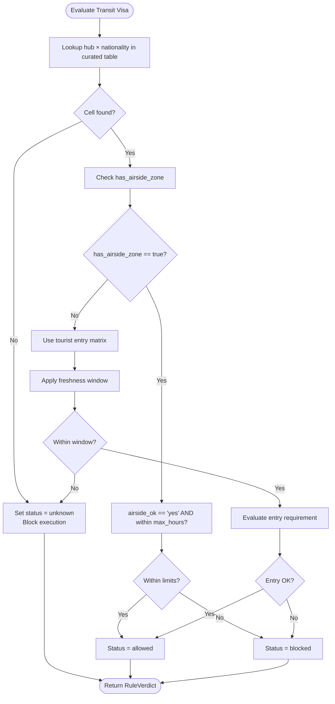
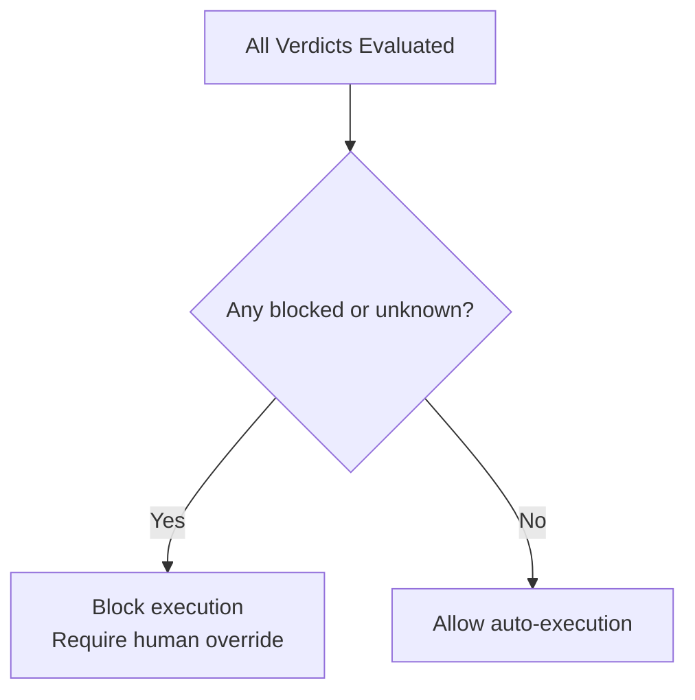
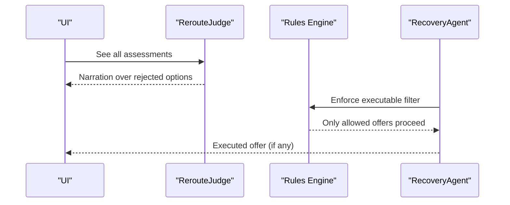
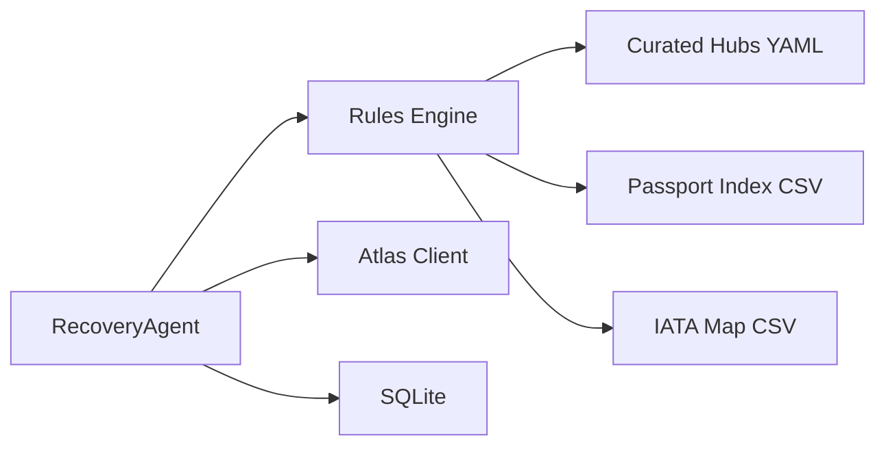

# Rules Engine

<cite>
**Referenced Files in This Document**
- [02-architecture.md](file://docs/plans/waypoint/02-architecture.md)
- [03-program-design.md](file://docs/plans/waypoint/03-program-design.md)
- [04-slices.md](file://docs/plans/waypoint/04-slices.md)
- [0002-visa-rules-curated-approximation.md](file://docs/adr/0002-visa-rules-curated-approximation.md)
- [0003-advise-execute-two-gate-split.md](file://docs/adr/0003-advise-execute-two-gate-split.md)
</cite>

## Table of Contents
1. [Introduction](#introduction)
2. [Project Structure](#project-structure)
3. [Core Components](#core-components)
4. [Architecture Overview](#architecture-overview)
5. [Detailed Component Analysis](#detailed-component-analysis)
6. [Dependency Analysis](#dependency-analysis)
7. [Performance Considerations](#performance-considerations)
8. [Troubleshooting Guide](#troubleshooting-guide)
9. [Conclusion](#conclusion)
10. [Appendices](#appendices)

## Introduction
This document specifies the Waypoint rules engine for passenger eligibility validation, with a focus on an extensible framework that supports adding new rules beyond the two built-in ones: transit visa eligibility and passport validity. The engine is designed around a pluggable Rule interface, a curated transit hub dataset keyed by (hub × passport-nationality), and a fail-closed safety principle where missing or unknown data blocks automatic execution. It also explains how the rules engine integrates with the two-gate architecture to inform AI judgment while enforcing deterministic, safe gate decisions.

## Project Structure
The project is organized as documentation-only at this stage, describing the backend’s rules engine and its integration points:
- Architecture overview and endpoints are defined in the architecture plan.
- Program design defines types, signatures, and rule behaviors.
- ADRs codify key decisions about curated data and the advise/execute split.
- Slices describe build order and test expectations.

**Diagram sources**
- [02-architecture.md:1-56](file://docs/plans/waypoint/02-architecture.md#L1-L56)
- [03-program-design.md:57-123](file://docs/plans/waypoint/03-program-design.md#L57-L123)

**Section sources**
- [02-architecture.md:1-56](file://docs/plans/waypoint/02-architecture.md#L1-L56)

## Core Components
- Rule interface and verdict model define the contract for all rules. Each rule implements a check method returning a three-state verdict: allowed, blocked, or unknown, with reason and optional provenance fields.
- Two built-in rules:
  - TransitVisaRule: evaluates whether a passport can legally transit each connecting airport using curated hub data and tourist-entry fallback when needed.
  - PassportValidityRule: checks passport expiry against policy thresholds.
- OfferAssessment aggregates per-offer rule verdicts and computes executable status (true only if every verdict is allowed).
- RerouteJudge ranks legal options under price/time/layover and narrates rejections; it sees all offers but cannot override the execute wall.
- RecoveryAgent orchestrates search, rule evaluation, judge ranking, verification, booking, and persistence.

Key responsibilities:
- Deterministic code owns rule checks, fare math, and order/pay execution.
- LLM owns reroute judgment only.

**Section sources**
- [03-program-design.md:57-123](file://docs/plans/waypoint/03-program-design.md#L57-L123)
- [02-architecture.md:1-56](file://docs/plans/waypoint/02-architecture.md#L1-L56)

## Architecture Overview
The rules engine sits between offer generation and agent decision-making:
- Offers are generated from Atlas search and mapped into internal models including layovers.
- The rules engine runs each rule against each offer and persists verdicts.
- The judge ranks executable offers and provides rationale.
- The execute gate enforces fail-closed behavior: only offers with all allowed verdicts proceed to booking.

**Diagram sources**
- [02-architecture.md:13-49](file://docs/plans/waypoint/02-architecture.md#L13-L49)
- [03-program-design.md:97-123](file://docs/plans/waypoint/03-program-design.md#L97-L123)

**Section sources**
- [02-architecture.md:13-49](file://docs/plans/waypoint/02-architecture.md#L13-L49)
- [03-program-design.md:97-123](file://docs/plans/waypoint/03-program-design.md#L97-L123)

## Detailed Component Analysis

### Rule Interface and Framework
- RuleVerdict carries rule_name, status (allowed/blocked/unknown), reason, and optional source/last_checked.
- Rule protocol exposes name and check(offer, passenger) returning RuleVerdict.
- OfferAssessment bundles offer, list of RuleVerdicts, and executable flag (true iff all verdicts are allowed).
- Built-in rules:
  - TransitVisaRule: uses curated hub table and tourist matrix; considers airside_ok, max_hours, has_airside_zone, and ticket structure as secondary messaging hint only.
  - PassportValidityRule: checks passport expiry against policy.

Adding a new rule:
- Implement a class with name and check method returning RuleVerdict.
- Integrate via the rules engine pipeline; no changes to judge or execute gates required.

**Diagram sources**
- [03-program-design.md:57-95](file://docs/plans/waypoint/03-program-design.md#L57-L95)

**Section sources**
- [03-program-design.md:57-95](file://docs/plans/waypoint/03-program-design.md#L57-L95)

### Curated Transit Hub Data Structure
- Keyed by hub IATA and nationality (ISO-2).
- Per cell fields:
  - airside_ok: yes | no | unknown
  - max_hours: hours threshold for airside allowance (null if not applicable)
  - source: provenance URL or reference
  - last_checked: date of last curation update
- Hub-level field:
  - has_airside_zone: boolean indicating whether airside transit exists at the hub
- Lookup miss (missing hub or nationality) resolves to unknown, which blocks autonomous execution.

Freshness windows:
- Airside cells trusted within 6 months since last_checked.
- Entry-fallback cells trusted within 3 months since last_checked.
- Past window → treated as unknown → fail-closed.

**Diagram sources**
- [03-program-design.md:34-48](file://docs/plans/waypoint/03-program-design.md#L34-L48)
- [0002-visa-rules-curated-approximation.md:9-18](file://docs/adr/0002-visa-rules-curated-approximation.md#L9-L18)

**Section sources**
- [03-program-design.md:34-48](file://docs/plans/waypoint/03-program-design.md#L34-L48)
- [0002-visa-rules-curated-approximation.md:9-18](file://docs/adr/0002-visa-rules-curated-approximation.md#L9-L18)

### Fail-Closed Safety Principle
- Missing or unknown data results in blocking automatic execution.
- Ticket structure (same-ticket vs self-transfer) is a secondary messaging hint only and never flips a verdict.
- The execute gate enforces that only offers with all allowed verdicts are auto-booked; blocked or unknown require explicit human override.

**Diagram sources**
- [0003-advise-execute-two-gate-split.md:9-18](file://docs/adr/0003-advise-execute-two-gate-split.md#L9-L18)
- [03-program-design.md:3-6](file://docs/plans/waypoint/03-program-design.md#L3-L6)

**Section sources**
- [0003-advise-execute-two-gate-split.md:9-18](file://docs/adr/0003-advise-execute-two-gate-split.md#L9-L18)
- [03-program-design.md:3-6](file://docs/plans/waypoint/03-program-design.md#L3-L6)

### Relationship Between Rules Engine and Two-Gate Architecture
- Advise gate (open):
  - All offers are visible to the AI and UI, labeled allowed/blocked/unknown with reasons and provenance.
  - The judge narrates why rejected options are not chosen.
- Execute gate (walled, fail-closed):
  - Auto-book and settle only if every rule verdict is allowed.
  - Code re-checks executability after the LLM picks; the LLM cannot override the wall.

**Diagram sources**
- [0003-advise-execute-two-gate-split.md:9-18](file://docs/adr/0003-advise-execute-two-gate-split.md#L9-L18)
- [03-program-design.md:97-104](file://docs/plans/waypoint/03-program-design.md#L97-L104)

**Section sources**
- [0003-advise-execute-two-gate-split.md:9-18](file://docs/adr/0003-advise-execute-two-gate-split.md#L9-L18)
- [03-program-design.md:97-104](file://docs/plans/waypoint/03-program-design.md#L97-L104)

### Concrete Examples of Rule Implementation
- TransitVisaRule:
  - For each layover, lookup curated hub × nationality.
  - If has_airside_zone is false, fall back to tourist entry matrix.
  - If airside_ok is yes and within max_hours, return allowed; otherwise blocked; if missing, unknown.
  - Ticket structure influences messaging only, never verdict.
- PassportValidityRule:
  - Check passport expiry against policy; block if too soon.

These examples illustrate the pattern for adding new rules: implement a class with name and check, return a three-state verdict with reason, and rely on the engine to aggregate and enforce executability.

**Section sources**
- [03-program-design.md:57-95](file://docs/plans/waypoint/03-program-design.md#L57-L95)

### Data Loading Patterns and Freshness Validation
- Data sources:
  - Curated transit hubs YAML with per-cell provenance and last_checked dates.
  - Passport-index tourist matrix CSV used as entry fallback when airside zone is absent.
  - IATA→country map CSV for mapping airports to countries.
- Freshness validation:
  - Airside cells trusted within 6 months since last_checked.
  - Entry-fallback cells trusted within 3 months since last_checked.
  - Past window → treat as unknown → fail-closed.

Loading pattern:
- Load curated hubs into memory at startup.
- Load tourist matrix and IATA map into memory.
- On each rule evaluation, apply freshness windows to determine trustworthiness.

**Section sources**
- [03-program-design.md:34-55](file://docs/plans/waypoint/03-program-design.md#L34-L55)
- [0002-visa-rules-curated-approximation.md:9-18](file://docs/adr/0002-visa-rules-curated-approximation.md#L9-L18)

## Dependency Analysis
- Rules engine depends on:
  - Curated transit hub table (YAML)
  - Passport index matrix (CSV)
  - IATA→country map (CSV)
- Integration points:
  - Atlas client for search, verify, order, pay, and order details.
  - SQLite store for verdicts, decisions, and orders.
- Coupling:
  - High cohesion within rules module; low coupling to external services through well-defined interfaces.
- External dependencies:
  - Atlas sandbox skill forked for sandbox-only auto-approve.
  - Qwen via DashScope for reasoning.

**Diagram sources**
- [02-architecture.md:1-56](file://docs/plans/waypoint/02-architecture.md#L1-L56)
- [03-program-design.md:57-123](file://docs/plans/waypoint/03-program-design.md#L57-L123)

**Section sources**
- [02-architecture.md:1-56](file://docs/plans/waypoint/02-architecture.md#L1-L56)
- [03-program-design.md:57-123](file://docs/plans/waypoint/03-program-design.md#L57-L123)

## Performance Considerations
- Caching strategies:
  - In-memory caching of curated hubs, tourist matrix, and IATA map at startup to avoid repeated file reads.
  - Freshness checks are lightweight date comparisons; cache results per evaluation cycle to avoid redundant computations.
- Data source management:
  - Keep bundled data files small and versioned; reload only on deployment updates.
  - Use SQLite for persistent audit trails; ensure indexes on offer_id and rule_name for fast queries.
- Execution efficiency:
  - Run rules in parallel per offer if feasible; aggregate verdicts before judge ranking.
  - Limit LLM calls to judge ranking only; keep deterministic steps fast.

[No sources needed since this section provides general guidance]

## Troubleshooting Guide
Common issues and resolutions:
- Unknown verdicts due to missing hub or nationality:
  - Add curated entries for demo hubs and passports; otherwise expect fail-closed behavior.
- Stale data causing unknown:
  - Update last_checked within freshness windows; past windows revert to unknown.
- No legal option available:
  - Graceful give-up path returns no_legal_option; surface reasons to user.
- Execute wall blocking booking:
  - Ensure all rule verdicts are allowed; otherwise require human override.

**Section sources**
- [03-program-design.md:151-166](file://docs/plans/waypoint/03-program-design.md#L151-L166)

## Conclusion
The Waypoint rules engine provides a robust, extensible framework for passenger eligibility validation centered on a pluggable Rule interface and curated transit hub data. Its fail-closed safety principle ensures that missing or unknown data blocks automatic execution, while the two-gate architecture separates open AI advice from deterministic, safe execution. With built-in rules for transit visa eligibility and passport validity, the system is ready to scale with additional rules and maintains clear auditability and performance characteristics.

[No sources needed since this section summarizes without analyzing specific files]

## Appendices
- Build slices outline incremental delivery of capabilities, culminating in full autonomous recovery with real booking and assertion.

**Section sources**
- [04-slices.md:7-33](file://docs/plans/waypoint/04-slices.md#L7-L33)