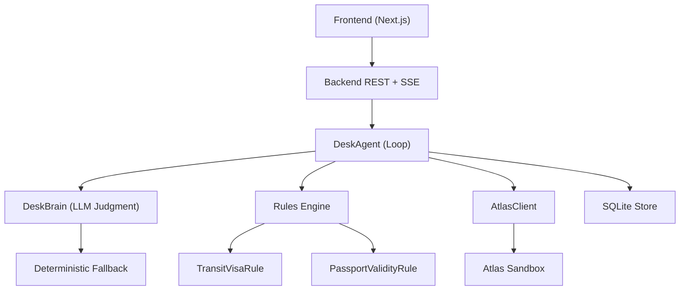
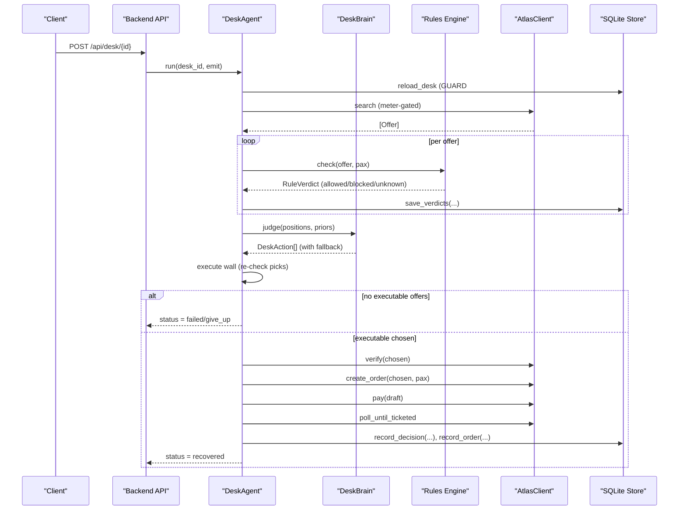
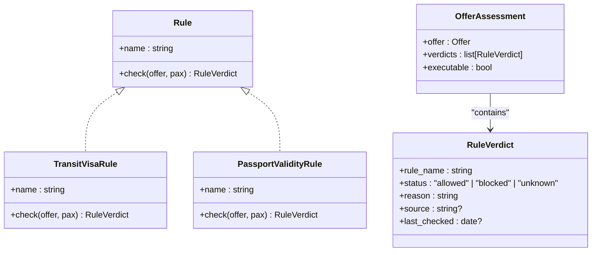
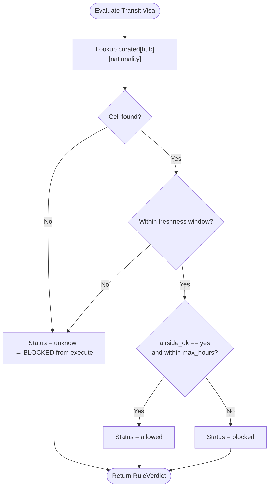
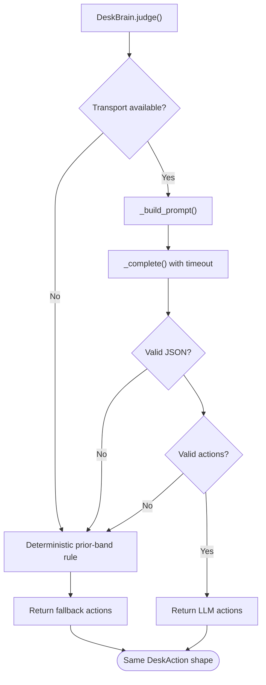
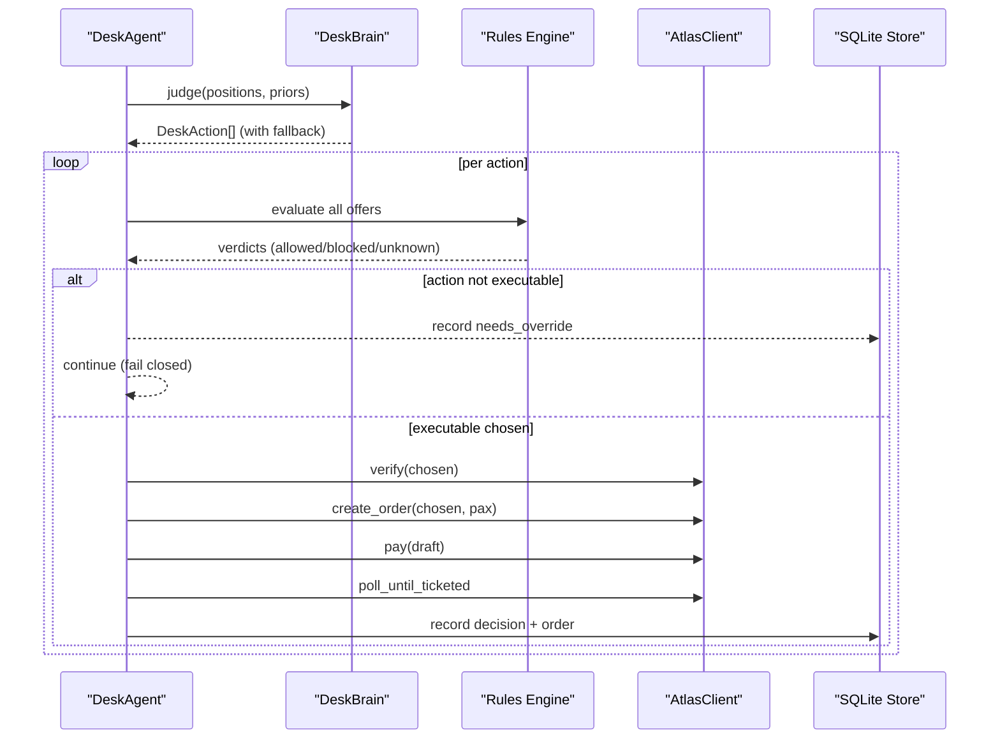
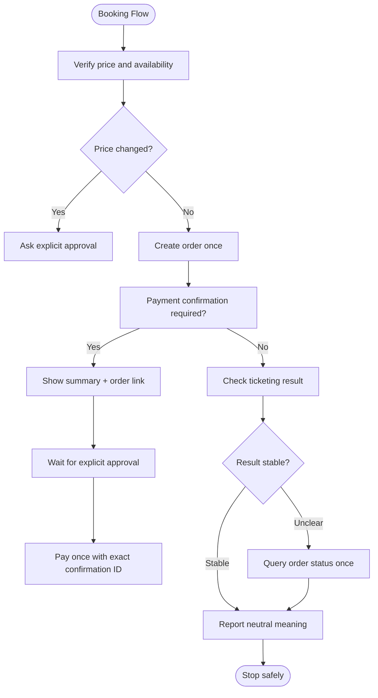
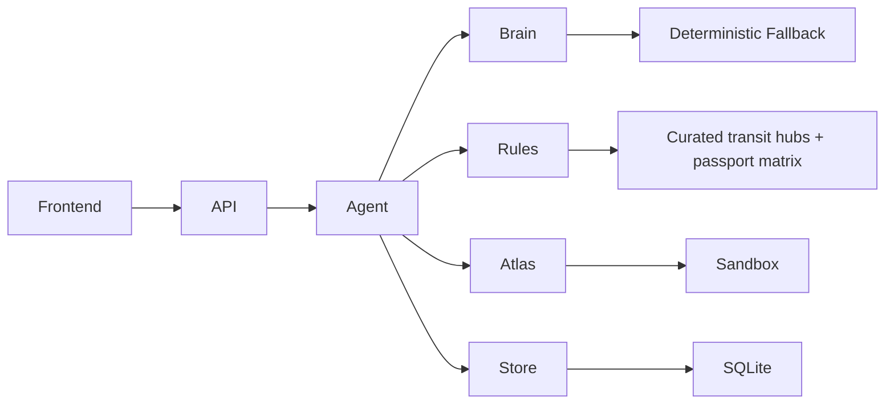

# Safety Principles & Fail-Closed Design

<cite>
**Referenced Files in This Document**
- [booking-workflow.md](file://.agents/skills/atlas-flight-booking/references/booking-workflow.md)
- [error-handling.md](file://.agents/skills/atlas-flight-booking/references/error-handling.md)
- [passenger-input.md](file://.agents/skills/atlas-flight-booking/references/passenger-input.md)
- [0002-visa-rules-curated-approximation.md](file://docs/adr/0002-visa-rules-curated-approximation.md)
- [0003-advise-execute-two-gate-split.md](file://docs/adr/0003-advise-execute-two-gate-split.md)
- [02-architecture.md](file://docs/plans/waypoint/02-architecture.md)
- [brain.py](file://backend/app/agent/brain.py)
- [loop.py](file://backend/app/agent/loop.py)
- [models.py](file://backend/app/models.py)
</cite>

## Update Summary
**Changes Made**
- Reinforced fail-closed design principles throughout all components
- Enhanced separation between LLM judgment (brain) and deterministic execution (loop)
- Added comprehensive error handling and graceful degradation mechanisms
- Updated escalation paths and logging strategies for safety guards
- Strengthened performance considerations for safety checks

## Table of Contents
1. [Introduction](#introduction)
2. [Project Structure](#project-structure)
3. [Core Components](#core-components)
4. [Architecture Overview](#architecture-overview)
5. [Detailed Component Analysis](#detailed-component-analysis)
6. [Dependency Analysis](#dependency-analysis)
7. [Performance Considerations](#performance-considerations)
8. [Troubleshooting Guide](#troubleshooting-guide)
9. [Conclusion](#conclusion)

## Introduction
Waypoint's safety principles center on a **reinforced fail-closed design** that prioritizes correctness over speed. Any uncertainty—whether from missing data, unknown rule states, or system failures—results in conservative hold decisions that prevent automatic execution. The system implements strict separation between LLM judgment (the "brain") and deterministic execution (the "loop"), ensuring that AI reasoning informs choices while deterministic code enforces safety boundaries.

The approach separates reasoning from action through two distinct gates:
- **Advise gate (open)**: All options are visible and labeled allowed, blocked, or unknown with reasons and provenance. The LLM can reason about all alternatives, including risky ones.
- **Execute gate (walled, fail-closed)**: Only offers where every rule is explicitly allowed can be auto-booked and auto-settled. Any blocked or unknown result requires explicit human approval before proceeding.

These principles apply across visa/transit rules, passport validity checks, pricing verification, order creation, payment confirmation, and ticketing outcomes.

**Section sources**
- [0003-advise-execute-two-gate-split.md:1-19](file://docs/adr/0003-advise-execute-two-gate-split.md#L1-L19)
- [brain.py:1-19](file://backend/app/agent/brain.py#L1-L19)

## Project Structure
Waypoint's backend hosts the rules engine, recovery agent loop, Atlas integration, and persistence. The frontend streams live reasoning steps and surfaces the two-gate model to users. Key responsibilities:
- **Rules engine**: Pluggable Rule interface; v1 includes TransitVisaRule and PassportValidityRule with fail-closed defaults.
- **Recovery agent**: Orchestrates search, rule evaluation, judge selection, re-verification, order creation, payment, and outcome assertion with comprehensive error handling.
- **Atlas integration**: Uses a forked skill library for sandboxed operations with auto-approval at price/payment checkpoints.
- **Data**: SQLite stores trips, segments, offers, rule verdicts, decisions, and orders for auditability.

**Diagram sources**
- [02-architecture.md:1-12](file://docs/plans/waypoint/02-architecture.md#L1-L12)
- [brain.py:71-119](file://backend/app/agent/brain.py#L71-L119)
- [loop.py:78-145](file://backend/app/agent/loop.py#L78-L145)

**Section sources**
- [02-architecture.md:1-12](file://docs/plans/waypoint/02-architecture.md#L1-L12)
- [brain.py:71-119](file://backend/app/agent/brain.py#L71-L119)
- [loop.py:78-145](file://backend/app/agent/loop.py#L78-L145)

## Core Components
- **Two-gate model**:
  - Advise gate: Open visibility of all options with labels allowed/blocked/unknown and reasons/provenance.
  - Execute gate: Fail-closed wall; auto-execution only when every rule is allowed.
- **Rules engine**:
  - Rule protocol returns a three-state verdict: allowed, blocked, unknown.
  - v1 rules: transit visa eligibility and passport validity with fail-closed defaults.
- **DeskBrain (LLM Judgment)**:
  - Provides recommendations but executes nothing.
  - Comprehensive fallback to deterministic prior-band rule on any failure.
  - Never raises exceptions—always degrades gracefully.
- **DeskAgent (Deterministic Execution)**:
  - Enforces guards: step budget, re-read/verify, assert outcome.
  - Re-checks every LLM recommendation against safety constraints.
  - Persists rule_verdicts and decisions for audit.
- **Atlas integration**:
  - Search, verify, create_order, pay (sandbox auto-approve), get_order for outcome assertion.
  - Query-only behavior on side-effect uncertainty.
- **Data**:
  - Curated transit hubs table and freshness windows ensure conservative defaults when data is missing or stale.

Fail-closed behavior is central: any missing hub, missing nationality cell, stale data, or system failure resolves to unknown and blocks autonomous execution.

**Section sources**
- [0002-visa-rules-curated-approximation.md:9-18](file://docs/adr/0002-visa-rules-curated-approximation.md#L9-L18)
- [brain.py:90-119](file://backend/app/agent/brain.py#L90-L119)
- [loop.py:227-323](file://backend/app/agent/loop.py#L227-L323)

## Architecture Overview
The recovery flow enforces safety through deterministic code and explicit gates with comprehensive error handling:

1. **Re-read trip state** with GUARD #2: never act on cached state.
2. **Search alternatives** via Atlas with meter gating.
3. **Evaluate each offer** with all rules; persist verdicts.
4. **Present all options** (advise gate).
5. **Choose an executable offer** (execute gate); if none, give up gracefully.
6. **Re-verify chosen offer** live; handle price changes with reconciliation.
7. **Create order and pay** (sandbox auto-approve) with query-only follow-up on uncertainty.
8. **Assert real outcome** (PNR/ticket) before marking success.
9. **Emit steps** via SSE stream with normalized error codes.

**Diagram sources**
- [loop.py:113-323](file://backend/app/agent/loop.py#L113-L323)
- [brain.py:90-119](file://backend/app/agent/brain.py#L90-L119)
- [02-architecture.md:34-49](file://docs/plans/waypoint/02-architecture.md#L34-L49)

**Section sources**
- [loop.py:113-323](file://backend/app/agent/loop.py#L113-L323)
- [02-architecture.md:34-49](file://docs/plans/waypoint/02-architecture.md#L34-L49)

## Detailed Component Analysis

### Rules Engine and Three-State Verdicts with Fail-Closed Defaults
- Rule protocol defines name and check method returning RuleVerdict with status allowed/blocked/unknown, reason, source, last_checked.
- OfferAssessment aggregates verdicts and computes executable flag only when all verdicts are allowed.
- Persistence: rule_verdicts store every rule check for auditability.
- **Fail-closed default**: Missing data or unknown states resolve to blocked from autonomous execution.

**Diagram sources**
- [03-program-design.md:57-95](file://docs/plans/waypoint/03-program-design.md#L57-L95)

**Section sources**
- [03-program-design.md:57-95](file://docs/plans/waypoint/03-program-design.md#L57-L95)
- [02-architecture.md:21-31](file://docs/plans/waypoint/02-architecture.md#L21-L31)

### Transit Visa Rule and Fail-Closed Defaults
- Curated transit-hub table keyed by (hub × nationality) with airside_ok, max_hours, source, last_checked.
- Lookup miss (missing hub or nationality) resolves to unknown → blocked from execute.
- Freshness window: airside cells trusted ≤ 6 months; entry-fallback cells ≤ 3 months. Past window → unknown → fail-closed.
- Same-ticket vs self-transfer is a secondary messaging hint; it never flips a verdict.

**Diagram sources**
- [0002-visa-rules-curated-approximation.md:9-18](file://docs/adr/0002-visa-rules-curated-approximation.md#L9-L18)

**Section sources**
- [0002-visa-rules-curated-approximation.md:9-18](file://docs/adr/0002-visa-rules-curated-approximation.md#L9-L18)

### DeskBrain: LLM Judgment with Comprehensive Error Handling
- **Advise gate ONLY**: Sees everything but executes nothing.
- **Comprehensive fallback**: ANY failure (no key, transport error, timeout, non-JSON, missing/duplicate position ids, unknown kind) degrades to deterministic prior-band rule.
- **Graceful degradation**: Never raises exceptions; always returns valid DeskAction shape.
- **Judgment boundary**: Pure deterministic code for price change resolution and admitted loss detection.

**Diagram sources**
- [brain.py:90-155](file://backend/app/agent/brain.py#L90-L155)

**Section sources**
- [brain.py:90-155](file://backend/app/agent/brain.py#L90-L155)

### Execute Gate and Agent Guards with Fail-Closed Behavior
- Execute gate ensures auto-book/auto-settle only when every rule is allowed.
- If no executable option exists, the agent gives up gracefully with a guard.
- Step budget limits the loop; re-read/verify and outcome assertion enforce correctness.
- **Comparison mode**: When ticketing is blocked, decisions are logged but never executed.

**Diagram sources**
- [loop.py:227-323](file://backend/app/agent/loop.py#L227-L323)

**Section sources**
- [loop.py:227-323](file://backend/app/agent/loop.py#L227-L323)

### Booking Workflow Safety and Side-Effect Uncertainty
- Price verification and payment confirmation require explicit user approval; prior approvals do not authorize increased prices or new payments.
- **Side-effect uncertainty triggers query-only behavior**: Do not retry order creation or payment when uncertain; present available links and stop.
- Error handling normalizes codes and routes behavior without exposing internal causes.
- **Never repeat write operations**: Order creation and payment are single-use and never retried.

**Diagram sources**
- [booking-workflow.md:1-63](file://.agents/skills/atlas-flight-booking/references/booking-workflow.md#L1-L63)

**Section sources**
- [booking-workflow.md:1-63](file://.agents/skills/atlas-flight-booking/references/booking-workflow.md#L1-L63)
- [error-handling.md:44-73](file://.agents/skills/atlas-flight-booking/references/error-handling.md#L44-L73)

### Passenger Input Safety
- Collect only required fields from verification response; use traveler IDs and passenger types provided by the system.
- One-time delivery via stdin; avoid echoing payloads or logging personal data.
- Safe correction: read details.fields, ask only those fields, rebuild payload once.
- **Privacy protection**: Never interpolate personal values into shell commands or log personal data.

**Section sources**
- [passenger-input.md:1-52](file://.agents/skills/atlas-flight-booking/references/passenger-input.md#L1-L52)

## Dependency Analysis
- Backend components depend on:
  - Rules engine for deterministic safety checks.
  - Atlas client for search, verify, order, pay, and outcome assertion.
  - SQLite store for persistence of verdicts, decisions, and orders.
- Frontend depends on backend REST endpoints and SSE stream for live reasoning.
- External dependencies:
  - Atlas sandbox via forked skill (auth/keyring, env config).
  - Qwen via DashScope for advice (not execution).
  - Bundled data files for transit rules and passport matrices.

**Diagram sources**
- [02-architecture.md:1-12](file://docs/plans/waypoint/02-architecture.md#L1-L12)

**Section sources**
- [02-architecture.md:1-12](file://docs/plans/waypoint/02-architecture.md#L1-L12)

## Performance Considerations
- **Rule evaluation is deterministic and fast**: Keep rules lightweight and data-backed to minimize latency during recovery loops.
- **Use curated tables and freshness windows**: Avoid expensive external lookups; treat them as honest proxies where live sources do not exist.
- **Limit retries**: Error handling specifies at most one retry for read-only commands when retryable=true; never repeat order creation or payment.
- **Persist verdicts and decisions early**: Support UI streaming and audit trails without recomputation.
- **Step budget bounds the agent loop**: Prevent runaway evaluations under uncertainty.
- **Bounded concurrency**: Fan-out limited to 4 concurrent searches with meter gating at 20 per cycle.
- **Timeout protection**: LLM calls wrapped with 15-second timeout to prevent hanging.

## Troubleshooting Guide
Common failure scenarios and safe responses:
- **Missing transit hub data**:
  - Lookup miss → unknown → blocked from execute; requires human override.
  - Freshness window exceeded → unknown → blocked from execute.
- **Unknown passport nationalities**:
  - Nationality absent in curated table → unknown → blocked from execute.
- **Corrupted or stale rule configurations**:
  - Treat as unknown due to freshness checks; fail-closed prevents auto-execution.
- **Authorization and access issues**:
  - AUTHORIZATION_REQUIRED, AUTH_EXPIRED, AUTH_SESSION_MISSING trigger login flows; AUTH_PENDING waits for completion; AUTH_SERVICE_UNAVAILABLE retains session and retries once when retryable=true.
- **Subscription and account readiness**:
  - SUBSCRIPTION_REQUIRED routes to account activation steps; do not proceed with ticketing until enabled.
- **Order and payment uncertainty**:
  - ORDER_CREATION_UNKNOWN, PAYMENT_STATUS_UNKNOWN, PAYMENT_BALANCE_CHECK_REQUIRED: query-only behavior; never retry payment or create another order; present order link when available.
- **General service failures**:
  - SERVICE_TEMPORARILY_UNAVAILABLE: retry identical read-only command once when retryable=true; never repeat side effects.
- **LLM failures**:
  - Any brain failure degrades to deterministic prior-band rule with identical DeskAction shape.

Escalation paths:
- When rules produce blocked or unknown, the execute gate blocks auto-execution; surface rationale and request explicit human override.
- When no legal option exists, the agent gives up gracefully with a guard and reports why.
- For side-effect uncertainty, follow query-only rules and avoid repeating actions that may have already succeeded.
- **Comparison mode**: When ticketing is blocked, all decisions are logged but never executed, providing full audit trail without risk.

Logging strategies:
- Persist rule_verdicts and decisions for full audit trails.
- Stream reasoning steps via SSE to provide transparency and debugging context.
- Normalize error codes and avoid exposing internal causes to users.
- **Honest disclosures**: Mark comparison mode, stale marks, and uncertainty explicitly in events.

**Section sources**
- [0002-visa-rules-curated-approximation.md:9-18](file://docs/adr/0002-visa-rules-curated-approximation.md#L9-L18)
- [loop.py:711-745](file://backend/app/agent/loop.py#L711-L745)
- [error-handling.md:7-73](file://.agents/skills/atlas-flight-booking/references/error-handling.md#L7-L73)
- [booking-workflow.md:48-63](file://.agents/skills/atlas-flight-booking/references/booking-workflow.md#L48-L63)

## Conclusion
Waypoint's safety principles center on a **reinforced fail-closed design** that prioritizes correctness over speed. Any uncertainty—whether from missing data, unknown rule states, system failures, or LLM errors—results in blocking automatic execution, preventing bookings when rule validation cannot be completed confidently. 

The system implements strict separation between LLM judgment (the "brain") and deterministic execution (the "loop"):
- **Brain**: Provides recommendations with comprehensive fallback to deterministic rules on any failure
- **Loop**: Re-checks every recommendation against safety constraints before execution

Key safety mechanisms include:
- Two-gate model separating open advice from strict execution
- Comprehensive error handling with graceful degradation
- Query-only behavior on side-effect uncertainty
- Bounded retries and timeouts
- Comparison mode for safe testing without execution
- Full audit trail through persistent logging

Escalation paths route uncertain or blocked cases to human intervention, with comprehensive logging and streaming for transparency. Performance considerations emphasize deterministic rule evaluation, bounded retries, and freshness-aware data usage to maintain safety guarantees without unnecessary overhead.

This design ensures that Waypoint never autonomously books an option it isn't confident is legal, making wrong-but-safe (pricier legal flight) preferable to wrong-but-dangerous (denied boarding).