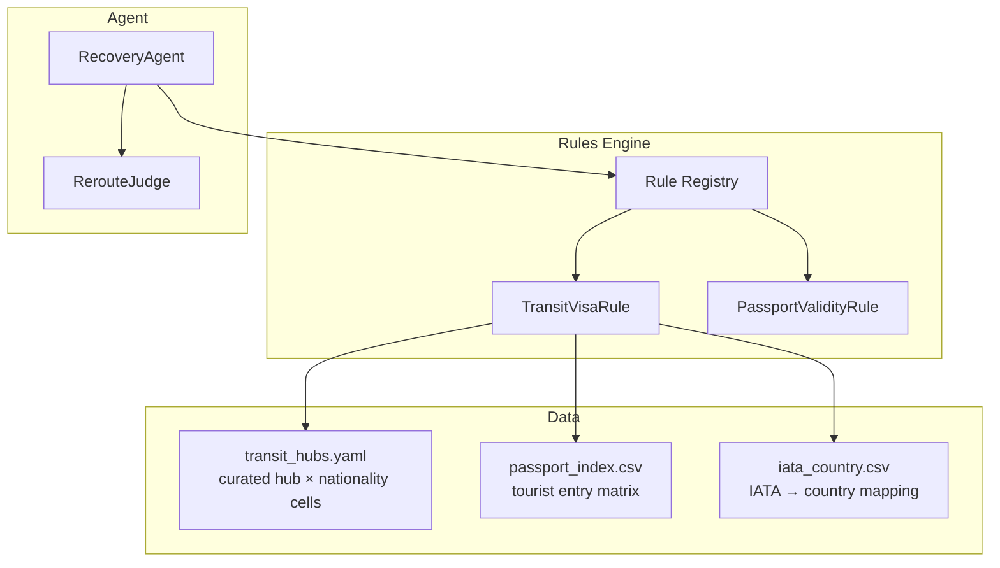
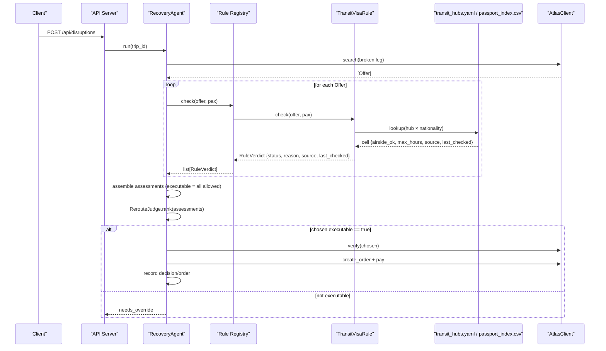
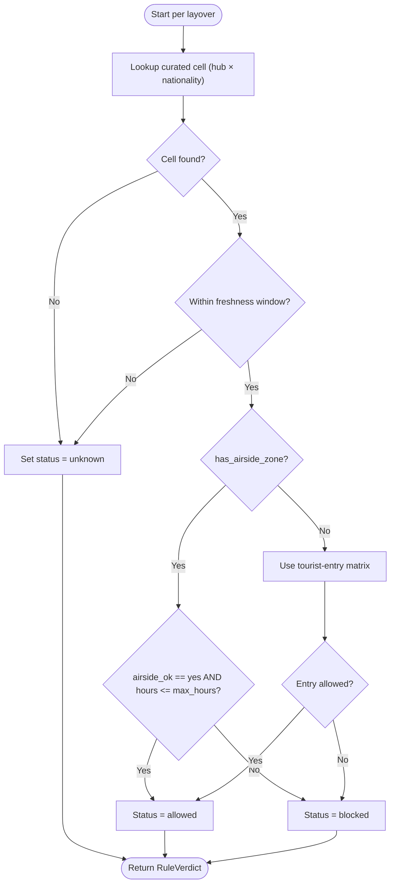
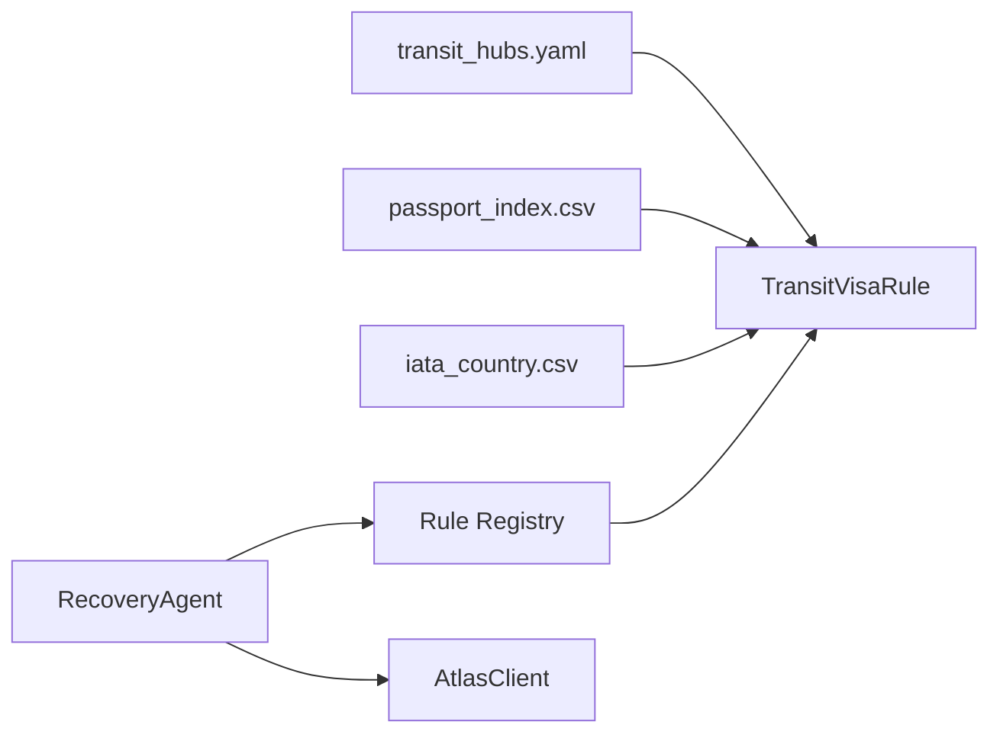

# Transit Visa Rules Implementation

<cite>
**Referenced Files in This Document**
- [0002-visa-rules-curated-approximation.md](file://docs/adr/0002-visa-rules-curated-approximation.md)
- [03-program-design.md](file://docs/plans/waypoint/03-program-design.md)
- [02-architecture.md](file://docs/plans/waypoint/02-architecture.md)
- [00-status.md](file://docs/plans/waypoint/00-status.md)
- [02-agent-recovering.html](file://docs/plans/waypoint/mockups/02-agent-recovering.html)
- [03-recovery-confirmed.html](file://docs/plans/waypoint/mockups/03-recovery-confirmed.html)
</cite>

## Table of Contents
1. [Introduction](#introduction)
2. [Project Structure](#project-structure)
3. [Core Components](#core-components)
4. [Architecture Overview](#architecture-overview)
5. [Detailed Component Analysis](#detailed-component-analysis)
6. [Dependency Analysis](#dependency-analysis)
7. [Performance Considerations](#performance-considerations)
8. [Troubleshooting Guide](#troubleshooting-guide)
9. [Conclusion](#conclusion)

## Introduction
This document explains Waypoint’s transit visa rules implementation as a curated, fail-closed safety layer that determines whether passengers can legally take connecting flights based on their passport nationality and the transit airport requirements. It focuses on the curated transit hub data structure keyed by (hub × passport-nationality), the per-cell fields airside_ok, max_hours, and provenance (source, last_checked), and how the system distinguishes airside versus landside transit scenarios to decide eligibility. It also covers lookup patterns, decision logic, freshness validation, audit trails via provenance, and fail-closed handling for missing or incomplete hub information.

## Project Structure
The transit visa rules are part of Waypoint’s broader recovery agent and rules engine. The relevant design is documented across architecture, program design, status, and mockup files. Key elements include:
- A curated transit hub table keyed by hub IATA and passenger nationality with per-cell transit eligibility metadata.
- A two-layer data approach: an authoritative curated layer plus a base tourist-entry fallback when no airside zone exists at a hub.
- A strict advise/execute split: all offers are evaluated and labeled; only fully allowed offers can be auto-executed.

**Diagram sources**
- [03-program-design.md:57-123](file://docs/plans/waypoint/03-program-design.md#L57-L123)
- [03-program-design.md:125-149](file://docs/plans/waypoint/03-program-design.md#L125-L149)

**Section sources**
- [03-program-design.md:9-32](file://docs/plans/waypoint/03-program-design.md#L9-L32)
- [02-architecture.md:13-29](file://docs/plans/waypoint/02-architecture.md#L13-L29)

## Core Components
- Curated transit hub table: keyed by hub IATA and passport nationality, with per-cell fields airside_ok (yes/no/unknown), max_hours (hours threshold for airside allowance), source (provenance URL), and last_checked (date). Each hub also has has_airside_zone (coarse flag indicating whether passengers must clear immigration).
- Base tourist-entry matrix: used only as an entry fallback when a hub lacks an airside zone.
- Rule verdict model: three-state status (allowed/blocked/unknown) with reason and optional source/last_checked.
- Recovery agent flow: search alternatives, evaluate all offers through rules, advise gate labels every option, execute gate enforces fail-closed policy.

Key behaviors:
- Missing hub or missing nationality cell resolves to unknown, which blocks autonomous execution.
- Freshness windows: airside cells trusted up to 6 months since last_checked; entry-fallback cells trusted up to 3 months. Past window → unknown → fail-closed.
- Ticket structure (same-ticket vs self-transfer) influences messaging but never flips the verdict.

**Section sources**
- [0002-visa-rules-curated-approximation.md:9-18](file://docs/adr/0002-visa-rules-curated-approximation.md#L9-L18)
- [03-program-design.md:34-55](file://docs/plans/waypoint/03-program-design.md#L34-L55)
- [03-program-design.md:57-96](file://docs/plans/waypoint/03-program-design.md#L57-L96)
- [03-program-design.md:125-149](file://docs/plans/waypoint/03-program-design.md#L125-L149)

## Architecture Overview
The transit visa rule integrates into the recovery workflow:
- On disruption, the agent searches alternative offers and evaluates each offer against all active rules.
- For each offer, the TransitVisaRule inspects layovers and applies the curated table keyed by (hub × nationality).
- Offers receive a verdict per rule; executable requires all rules to be allowed.
- The judge sees all options (advise gate) and recommends the best executable one; the execute gate prevents booking any blocked or unknown offer.

**Diagram sources**
- [03-program-design.md:125-149](file://docs/plans/waypoint/03-program-design.md#L125-L149)
- [03-program-design.md:57-96](file://docs/plans/waypoint/03-program-design.md#L57-L96)

## Detailed Component Analysis

### Curated Transit Hub Data Model
The curated table defines per-hub metadata and per-nationality transit rules:
- Hub-level:
  - country: ISO-2 country code
  - has_airside_zone: boolean; false implies everyone clearing terminals requires entry
- Nationality-level (per hub):
  - airside_ok: yes | no | unknown
  - max_hours: integer or null; hours threshold under which airside transit is allowed
  - source: provenance URL
  - last_checked: date; freshness timestamp

Lookup pattern:
- Primary key: (hub IATA, passport nationality)
- If hub absent or nationality absent: treat as unknown
- If has_airside_zone is false: fall back to tourist-entry matrix for entry requirements

Freshness:
- Airside cell trusted if last_checked within 6 months
- Entry-fallback cell trusted if last_checked within 3 months
- Past window: treat as unknown → fail-closed

Decision outcomes:
- Allowed: airside_ok is yes and layover ≤ max_hours (if applicable)
- Blocked: airside_ok is no or exceeds max_hours
- Unknown: missing cell or stale beyond freshness window

Provenance:
- source and last_checked are recorded in the verdict for auditability

**Section sources**
- [03-program-design.md:34-55](file://docs/plans/waypoint/03-program-design.md#L34-L55)
- [0002-visa-rules-curated-approximation.md:9-18](file://docs/adr/0002-visa-rules-curated-approximation.md#L9-L18)

### Decision Logic Flow
The TransitVisaRule processes each layover in an offer:
1. Identify hub and passenger nationality.
2. Lookup curated cell (hub × nationality).
3. If has_airside_zone is false, use tourist-entry matrix as fallback.
4. Validate freshness using last_checked.
5. Apply airside_ok and max_hours to determine allowed/blocked/unknown.
6. Record provenance (source, last_checked) in the verdict.

**Diagram sources**
- [03-program-design.md:57-96](file://docs/plans/waypoint/03-program-design.md#L57-L96)
- [03-program-design.md:34-55](file://docs/plans/waypoint/03-program-design.md#L34-L55)

**Section sources**
- [03-program-design.md:57-96](file://docs/plans/waypoint/03-program-design.md#L57-L96)

### Airside vs Landside Transit Scenarios
- Airside transit: passengers remain in the secure area without clearing immigration. Eligibility depends on airside_ok and max_hours for the specific hub and nationality.
- Landside transit: passengers clear immigration (e.g., changing terminals or self-transfer). When has_airside_zone is false, the system falls back to the tourist-entry matrix to determine entry requirements.

Implications:
- Same-ticket vs self-transfer affects messaging but does not change the verdict.
- Fail-closed ensures that any unknown or blocked scenario prevents autonomous booking.

**Section sources**
- [0002-visa-rules-curated-approximation.md:6-18](file://docs/adr/0002-visa-rules-curated-approximation.md#L6-L18)
- [03-program-design.md:34-55](file://docs/plans/waypoint/03-program-design.md#L34-L55)

### Examples and UI Context
- Mockup “recovering” shows evaluation of multiple options with passport verdicts, illustrating blocked vs allowed decisions for different hubs and nationalities.
- Mockup “recovery confirmed” demonstrates selection of a legal reroute over a cheaper illegal option, highlighting fare difference settlement and ticket assertion.

These examples reflect:
- Cheapest option rejected due to visa requirement (landside/self-transfer).
- Legal option selected based on airside transit eligibility for the passenger’s passport.

**Section sources**
- [02-agent-recovering.html:33-60](file://docs/plans/waypoint/mockups/02-agent-recovering.html#L33-L60)
- [03-recovery-confirmed.html:35-59](file://docs/plans/waypoint/mockups/03-recovery-confirmed.html#L35-L59)

### Data Freshness Validation and Provenance Tracking
- Freshness windows enforce trust limits:
  - Airside cells: trusted up to 6 months from last_checked
  - Entry-fallback cells: trusted up to 3 months from last_checked
- Past window → unknown → fail-closed
- Provenance tracking:
  - source: URL or reference to official transit rule
  - last_checked: date of last verification
  - Stored in RuleVerdict for audit trails

**Section sources**
- [0002-visa-rules-curated-approximation.md:16-18](file://docs/adr/0002-visa-rules-curated-approximation.md#L16-L18)
- [03-program-design.md:50-55](file://docs/plans/waypoint/03-program-design.md#L50-L55)

### Handling Missing or Incomplete Information (Fail-Closed)
- Missing hub or nationality cell → unknown
- Unknown blocks autonomous execution; requires human override
- Ticket structure is secondary messaging only and cannot flip verdict
- Demo choreography ensures fail-closed behavior by curating demo hubs and including both trap and legal options

**Section sources**
- [0002-visa-rules-curated-approximation.md:14-18](file://docs/adr/0002-visa-rules-curated-approximation.md#L14-L18)
- [03-program-design.md:151-167](file://docs/plans/waypoint/03-program-design.md#L151-L167)
- [00-status.md:18-31](file://docs/plans/waypoint/00-status.md#L18-L31)

## Dependency Analysis
The transit visa rule depends on curated data and integrates with the rules registry and recovery agent:
- Data dependencies:
  - transit_hubs.yaml: curated hub × nationality cells
  - passport_index.csv: tourist-entry matrix fallback
  - iata_country.csv: IATA to country mapping
- Runtime dependencies:
  - Rule registry orchestrates checks
  - Recovery agent executes search, assessment, judgment, and booking
  - Atlas client provides live verification before booking

**Diagram sources**
- [03-program-design.md:57-123](file://docs/plans/waypoint/03-program-design.md#L57-L123)
- [03-program-design.md:125-149](file://docs/plans/waypoint/03-program-design.md#L125-L149)

**Section sources**
- [03-program-design.md:9-32](file://docs/plans/waypoint/03-program-design.md#L9-L32)
- [03-program-design.md:57-123](file://docs/plans/waypoint/03-program-design.md#L57-L123)

## Performance Considerations
- Lookup complexity: O(1) per layover using a hash map keyed by (hub × nationality).
- Freshness checks: constant-time date comparisons against thresholds.
- Rule evaluation: linear in number of rules and offers; keep rule count minimal for performance.
- Avoid unnecessary re-reads: rely on curated table and freshness windows rather than live calls for visa rules.

[No sources needed since this section provides general guidance]

## Troubleshooting Guide
Common issues and resolutions:
- Stale data: If last_checked exceeds freshness window, the cell becomes unknown and blocks execution. Update the curated table and refresh last_checked.
- Missing hub/nationality: Add curated entries for new hubs or nationalities to avoid unknown verdicts.
- Incorrect airside_ok or max_hours: Review official sources and update the cell accordingly.
- Unexpected blocked offers: Verify has_airside_zone and ensure correct fallback to tourist-entry matrix when necessary.
- Audit trail gaps: Ensure source and last_checked are present in each cell to support compliance and debugging.

**Section sources**
- [03-program-design.md:50-55](file://docs/plans/waypoint/03-program-design.md#L50-L55)
- [03-program-design.md:151-167](file://docs/plans/waypoint/03-program-design.md#L151-L167)

## Conclusion
Waypoint’s transit visa rules implement a robust, fail-closed safety mechanism grounded in a curated (hub × nationality) data structure with explicit fields for airside eligibility, hour thresholds, and provenance. The system distinguishes airside and landside transit scenarios, applies freshness windows to maintain trustworthiness, and enforces a strict divide between advice and execution to prevent unsafe autonomous bookings. By documenting lookup patterns, decision logic, and audit trails, this approach balances accuracy, transparency, and safety while acknowledging the limitations of available transit-visa data.

[No sources needed since this section summarizes without analyzing specific files]