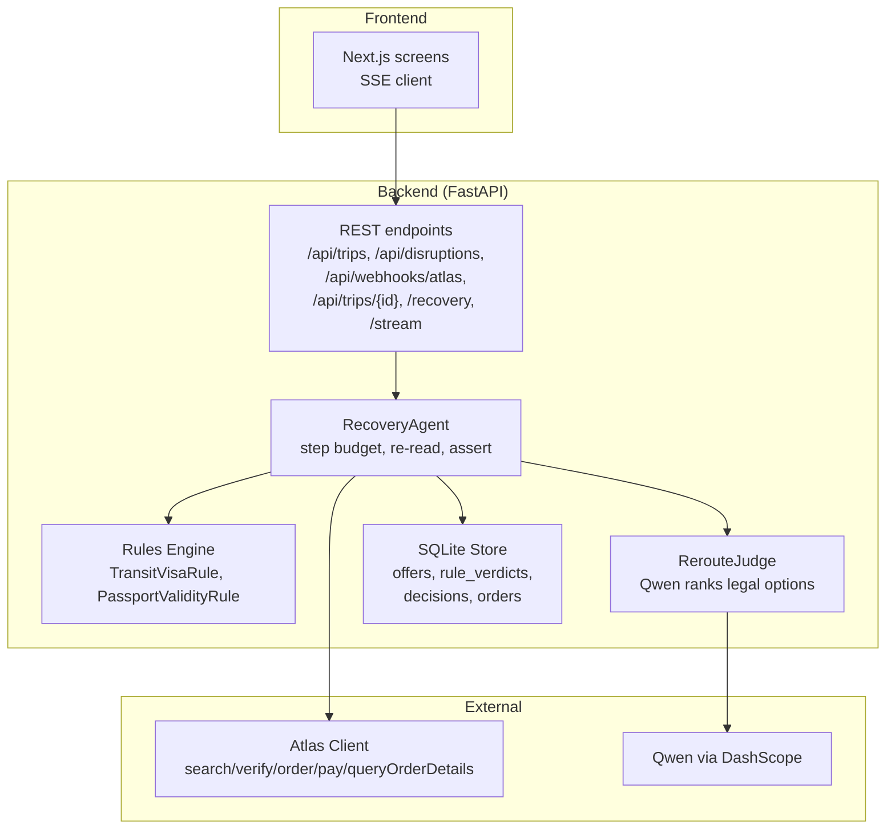
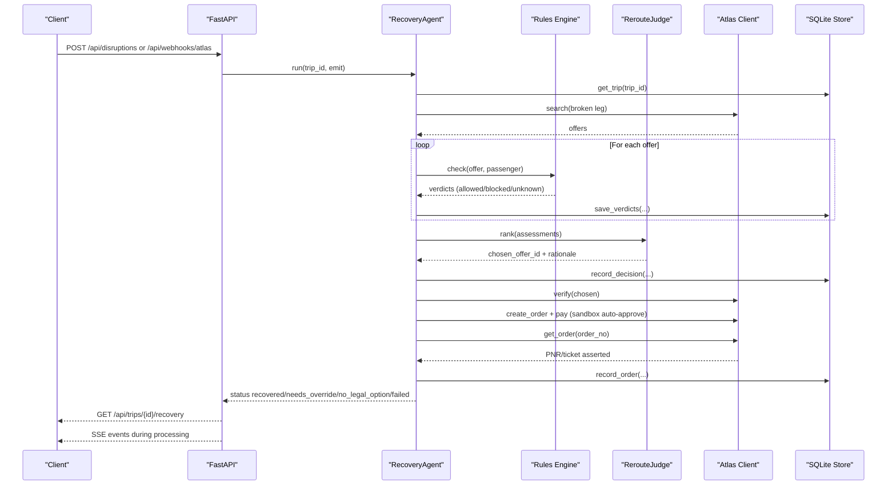
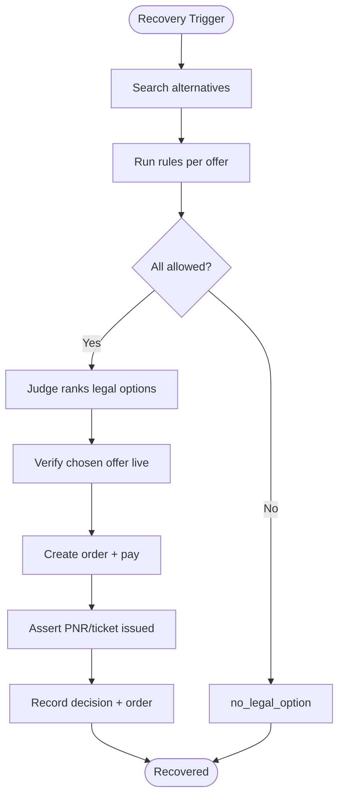
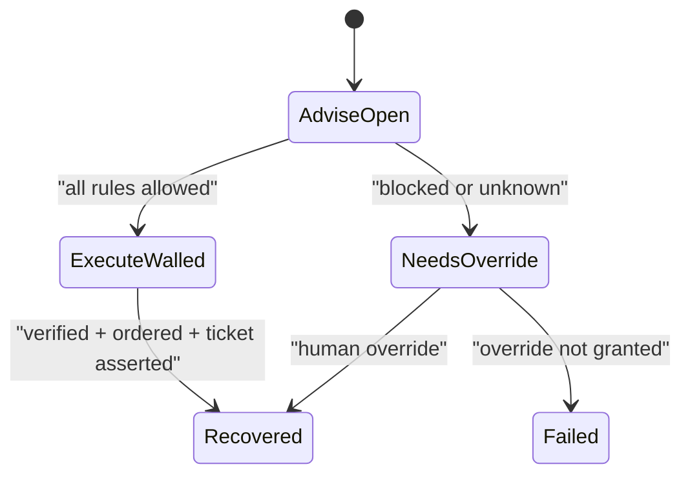
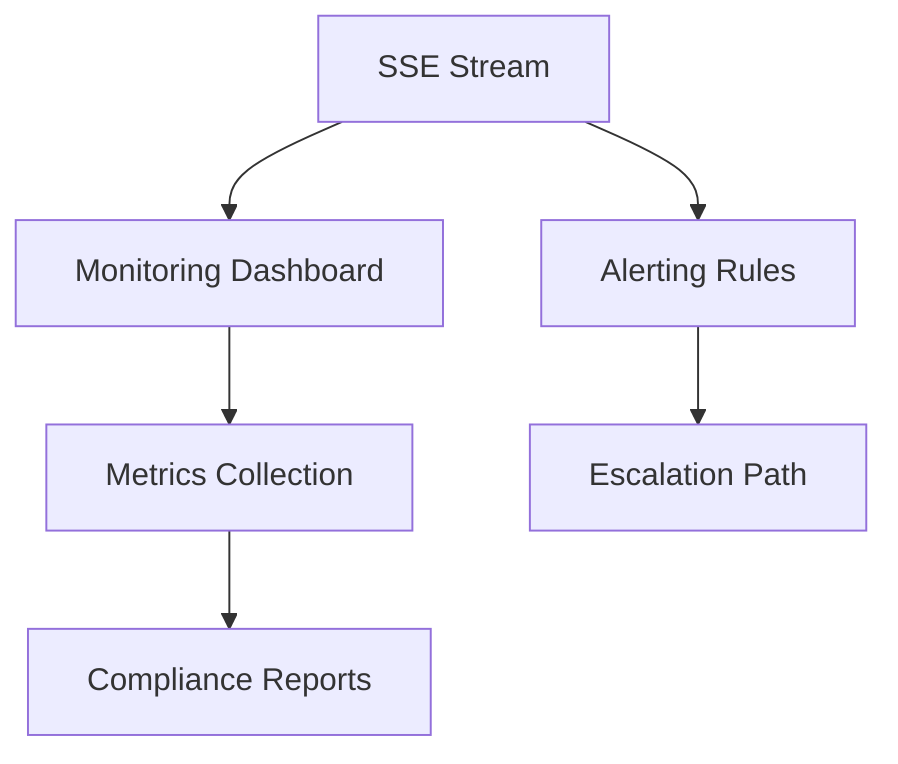
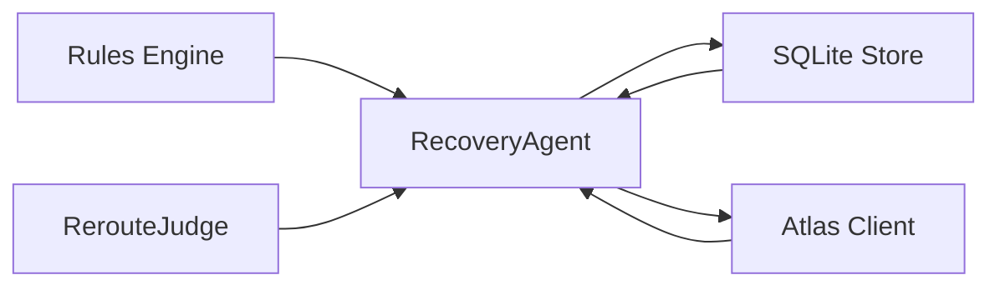
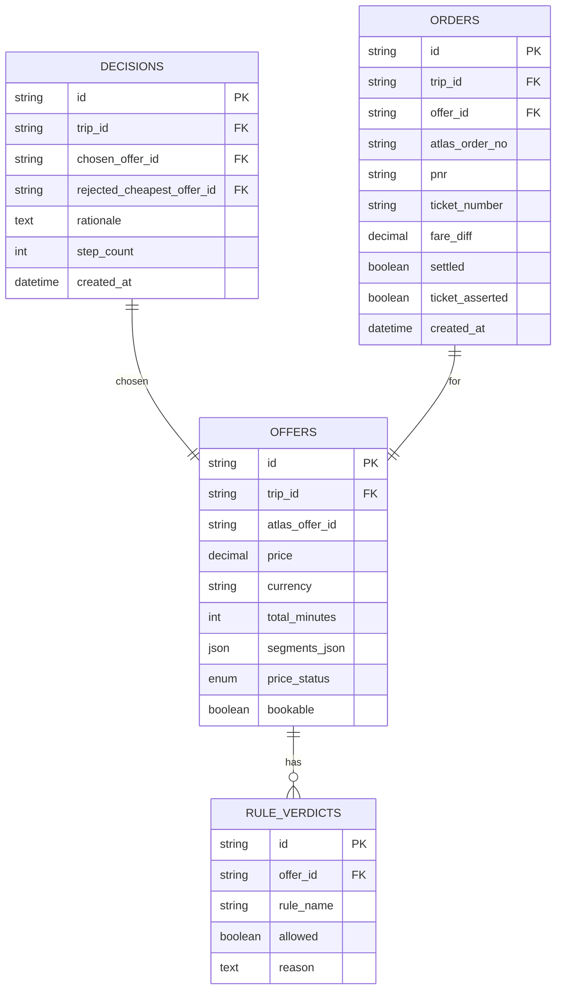

# Compliance & Monitoring

<cite>
**Referenced Files in This Document**
- [01-product.md](file://docs/plans/waypoint/01-product.md)
- [02-architecture.md](file://docs/plans/waypoint/02-architecture.md)
- [03-program-design.md](file://docs/plans/waypoint/03-program-design.md)
- [00-status.md](file://docs/plans/waypoint/00-status.md)
- [0001-fork-atlas-skill-sandbox-auto-approve.md](file://docs/adr/0001-fork-atlas-skill-sandbox-auto-approve.md)
- [0002-visa-rules-curated-approximation.md](file://docs/adr/0002-visa-rules-curated-approximation.md)
- [0003-advise-execute-two-gate-split.md](file://docs/adr/0003-advise-execute-two-gate-split.md)
- [atlas-integration.md](file://docs/external/atlas-integration.md)
- [SKILL.md](file://.agents/skills/atlas-flight-booking/SKILL.md)
</cite>

## Table of Contents
1. Introduction
2. Project Structure
3. Core Components
4. Architecture Overview
5. Detailed Component Analysis
6. Dependency Analysis
7. Performance Considerations
8. Troubleshooting Guide
9. Conclusion
10. Appendices

## Introduction
This document specifies the compliance and monitoring requirements for Waypoint, focusing on financial transaction compliance, audit trails for autonomous bookings and fare settlements, regulatory considerations for automated decision-making with human oversight, monitoring and alerting for agent decisions and rule violations, system health tracking, incident response procedures, and guidance for compliance audits and regulatory reporting. It synthesizes the product design, architecture, program design, and architectural decisions recorded in the repository to provide a comprehensive, code-mapped view of how compliance is enforced and monitored end-to-end.

## Project Structure
Waypoint’s compliance and monitoring are implemented through:
- A deterministic rules engine that enforces legal constraints (e.g., transit visa eligibility and passport validity).
- A two-gate model separating open advice from fail-closed execution to ensure autonomous actions only occur when all rules allow.
- Persistent audit tables capturing every rule check, decision rationale, and order outcome.
- An SSE stream exposing live reasoning steps for observability and auditing.
- External integrations (Atlas sandbox) with explicit guardrails around ticketing activation and payment behavior in sandbox vs production.

**Diagram sources**
- [02-architecture.md:13-30](file://docs/plans/waypoint/02-architecture.md#L13-L30)
- [03-program-design.md:125-149](file://docs/plans/waypoint/03-program-design.md#L125-L149)

**Section sources**
- [02-architecture.md:13-30](file://docs/plans/waypoint/02-architecture.md#L13-L30)
- [03-program-design.md:125-149](file://docs/plans/waypoint/03-program-design.md#L125-L149)

## Core Components
- Rules Engine: Pluggable Rule interface; v1 includes TransitVisaRule and PassportValidityRule. Verdicts are three-state (allowed, blocked, unknown) and persisted as audit evidence.
- Recovery Agent: Orchestrates search, rule checks, judge selection, verification, ordering, payment, and outcome assertion with guards (step budget, re-read before write, assert real outcome).
- Two-Gate Model: Advise gate is open (LLM sees all options); Execute gate is fail-closed (only allowed offers auto-booked; blocked/unknown require human override).
- Persistence: SQLite tables capture offers, rule verdicts, decisions, and orders — forming the audit trail for compliance.
- Observability: SSE stream emits each step of the agent loop for live visibility and downstream logging.

Key compliance implications:
- Financial transactions (fare-difference settlement) are deterministic and executed only after all rules pass and outcomes are asserted.
- Audit logs include per-offer rule checks, rationales, and order assertions, enabling post-hoc review and regulatory reporting.

**Section sources**
- [01-product.md:13-23](file://docs/plans/waypoint/01-product.md#L13-L23)
- [02-architecture.md:21-30](file://docs/plans/waypoint/02-architecture.md#L21-L30)
- [03-program-design.md:57-123](file://docs/plans/waypoint/03-program-design.md#L57-L123)

## Architecture Overview
The compliance architecture centers on deterministic enforcement and persistent evidence:
- REST endpoints trigger recovery flows (injected disruption or Atlas webhook).
- The agent loop runs bounded by a step budget, re-reading state at each stage.
- Offers are searched, evaluated by rules, and ranked by the judge over legal options only.
- Before booking, the chosen offer is verified live; payment occurs deterministically; outcome is asserted before marking success.
- All steps are emitted via SSE and stored in SQLite for audit.

**Diagram sources**
- [02-architecture.md:13-30](file://docs/plans/waypoint/02-architecture.md#L13-L30)
- [03-program-design.md:125-149](file://docs/plans/waypoint/03-program-design.md#L125-L149)

**Section sources**
- [02-architecture.md:13-30](file://docs/plans/waypoint/02-architecture.md#L13-L30)
- [03-program-design.md:125-149](file://docs/plans/waypoint/03-program-design.md#L125-L149)

## Detailed Component Analysis

### Financial Transaction Compliance and Audit Trails
- Autonomous fare-difference settlement occurs only after:
  - All rules evaluate to allowed for the chosen offer.
  - Live verification confirms price/availability.
  - Order creation and payment complete deterministically (sandbox auto-approve).
  - Outcome assertion verifies PNR and ticket issuance.
- Audit trail includes:
  - Per-offer rule verdicts with reasons and provenance.
  - Decision records including chosen offer, rejected cheapest offer, rationale, and step count.
  - Order records including atlas order number, PNR, ticket number, fare difference, settlement status, and ticket assertion flag.

**Diagram sources**
- [03-program-design.md:125-149](file://docs/plans/waypoint/03-program-design.md#L125-L149)
- [02-architecture.md:21-30](file://docs/plans/waypoint/02-architecture.md#L21-L30)

**Section sources**
- [02-architecture.md:21-30](file://docs/plans/waypoint/02-architecture.md#L21-L30)
- [03-program-design.md:125-149](file://docs/plans/waypoint/03-program-design.md#L125-L149)

### Regulatory Requirements for Automated Decision-Making and Human Oversight
- Two-gate split ensures:
  - Advise gate remains open: LLM can reason over all options, including risky ones, and narrate rationale.
  - Execute gate is fail-closed: autonomous booking only if all rules allow; blocked/unknown requires explicit human override.
- Safety guarantees:
  - Code re-checks executability after LLM picks an option.
  - No LLM involvement in payment; deterministic execution prevents AI-driven fund decisions.
- Transparency:
  - Each rule verdict includes reason and source/provenance where applicable.
  - Freshness windows for curated data are explicitly treated as proxies; stale data becomes unknown and blocks execution.

**Diagram sources**
- [0003-advise-execute-two-gate-split.md:1-19](file://docs/adr/0003-advise-execute-two-gate-split.md#L1-L19)
- [03-program-design.md:3-7](file://docs/plans/waypoint/03-program-design.md#L3-L7)

**Section sources**
- [0003-advise-execute-two-gate-split.md:1-19](file://docs/adr/0003-advise-execute-two-gate-split.md#L1-L19)
- [03-program-design.md:3-7](file://docs/plans/waypoint/03-program-design.md#L3-L7)

### Monitoring and Alerting Systems
- Live monitoring:
  - SSE stream emits each step of the agent loop (search results, rule verdicts, judge rationale, verification, order/payment, outcome assertion).
  - Frontend consumes SSE to render live reasoning and status changes.
- Alerting triggers (derived from design):
  - Step budget exceeded → agent gives up; surface “give up” status.
  - No executable offers → surface “no_legal_option”.
  - Stale data detected via freshness windows → treat as unknown and block execution.
  - Payment or ticket assertion failures → mark failed or needs_override.
- System health:
  - Endpoint availability and error responses indicate backend health.
  - Atlas integration status (ticketing activation) affects capability; current state documented externally.

[No sources needed since this diagram shows conceptual workflow, not actual code structure]

**Section sources**
- [02-architecture.md:13-19](file://docs/plans/waypoint/02-architecture.md#L13-L19)
- [00-status.md:33-46](file://docs/plans/waypoint/00-status.md#L33-L46)

### Audit Logging for Autonomous Actions
- Every rule check is persisted with:
  - Offer identifier, rule name, verdict (allowed/blocked/unknown), reason, and source/provenance where available.
- Decisions are recorded with:
  - Chosen offer, rejected cheapest offer, rationale, step count, timestamp.
- Orders are recorded with:
  - Atlas order number, PNR, ticket number, fare difference, settlement status, ticket assertion flag, timestamp.
- These tables form the core audit trail for compliance reporting and post-incident analysis.

**Section sources**
- [02-architecture.md:21-30](file://docs/plans/waypoint/02-architecture.md#L21-L30)
- [03-program-design.md:125-149](file://docs/plans/waypoint/03-program-design.md#L125-L149)

### Metrics Collection for Agent Performance, Safety Guard Activations, and Reliability
- Agent performance metrics:
  - Step count per recovery attempt.
  - Time-to-recovery (from trigger to recovered/failed).
  - Number of offers searched and evaluated.
- Safety guard activations:
  - Step budget exceeded counts.
  - Instances of “no_legal_option” and “needs_override”.
  - Freshness window violations leading to unknown verdicts.
- Reliability metrics:
  - Verification success rate before booking.
  - Ticket assertion success rate.
  - Error rates across Atlas calls (search, verify, order, pay, query).

[No sources needed since this section provides general guidance]

### Incident Response Procedures and Escalation Paths
- When safety systems detect anomalies:
  - If no executable offers exist, return “no_legal_option” and surface why.
  - If any rule is blocked/unknown, return “needs_override” requiring human intervention.
  - If verification fails or ticket assertion fails, mark “failed” and halt further action.
- Escalation paths:
  - Human override required for blocked/unknown cases.
  - Operational team reviews SSE logs and persisted evidence to determine next steps.
  - Atlas ticketing activation issues must be resolved before full functionality; current status documented externally.

**Section sources**
- [03-program-design.md:125-149](file://docs/plans/waypoint/03-program-design.md#L125-L149)
- [atlas-integration.md:26-37](file://docs/external/atlas-integration.md#L26-L37)

### Guidance for Compliance Audits and Regulatory Reporting
- Use persisted tables to reconstruct:
  - All offers considered and their rule verdicts.
  - The chosen offer and rationale.
  - Order details, fare differences, and settlement status.
- Demonstrate adherence to:
  - Fail-closed execution policy.
  - Freshness windows and transparent proxy usage for curated data.
  - Explicit separation of advise and execute gates.
- Report on:
  - Rates of blocked/unknown verdicts and override requests.
  - Success rates of verification and ticket assertion.
  - Incidents where agent gave up due to step budget or lack of legal options.

**Section sources**
- [02-architecture.md:21-30](file://docs/plans/waypoint/02-architecture.md#L21-L30)
- [0002-visa-rules-curated-approximation.md:1-25](file://docs/adr/0002-visa-rules-curated-approximation.md#L1-L25)

## Dependency Analysis
Waypoint’s compliance depends on:
- Deterministic rules engine enforcing legal constraints.
- Two-gate model ensuring autonomous actions only proceed when safe.
- Persistent audit tables providing evidence for compliance.
- External Atlas integration with sandbox-specific behaviors and ticketing activation constraints.

**Diagram sources**
- [03-program-design.md:125-149](file://docs/plans/waypoint/03-program-design.md#L125-L149)
- [02-architecture.md:13-30](file://docs/plans/waypoint/02-architecture.md#L13-L30)

**Section sources**
- [03-program-design.md:125-149](file://docs/plans/waypoint/03-program-design.md#L125-L149)
- [02-architecture.md:13-30](file://docs/plans/waypoint/02-architecture.md#L13-L30)

## Performance Considerations
- Step budget bounds agent loops to prevent infinite execution and resource exhaustion.
- Re-read-before-write guards reduce stale-data risks and improve reliability.
- Deterministic execution for payment avoids LLM latency and non-determinism in financial steps.
- SSE streaming enables efficient frontend updates without polling overhead.

[No sources needed since this section provides general guidance]

## Troubleshooting Guide
Common issues and resolutions:
- No executable offers:
  - Cause: All alternatives blocked or unknown by rules.
  - Action: Surface “no_legal_option”; collect rule verdicts and rationale for review.
- Needs override:
  - Cause: Chosen offer not executable (blocked/unknown).
  - Action: Require human override; log override decision and reason.
- Stale data:
  - Cause: Curated data past freshness window treated as unknown.
  - Action: Update curated tables; treat as unknown until refreshed.
- Ticketing activation:
  - Cause: Sandbox ticketing not activated; blocks verify/order/pay.
  - Action: Complete UAT testing per external documentation; monitor status.

**Section sources**
- [03-program-design.md:125-149](file://docs/plans/waypoint/03-program-design.md#L125-L149)
- [atlas-integration.md:26-37](file://docs/external/atlas-integration.md#L26-L37)

## Conclusion
Waypoint embeds compliance into its core architecture through deterministic rules, a fail-closed execute gate, and comprehensive audit logging. Financial transactions are isolated from AI judgment and executed only after rigorous verification and outcome assertion. Monitoring via SSE streams and persisted evidence supports operational visibility, alerting, and regulatory reporting. The two-gate model balances open advice with conservative execution, ensuring safety and transparency while enabling autonomous recovery under strict compliance constraints.

[No sources needed since this section summarizes without analyzing specific files]

## Appendices

### Appendix A: Data Model for Compliance Auditing

**Diagram sources**
- [02-architecture.md:21-30](file://docs/plans/waypoint/02-architecture.md#L21-L30)

**Section sources**
- [02-architecture.md:21-30](file://docs/plans/waypoint/02-architecture.md#L21-L30)

### Appendix B: Sandbox Auto-Approval Policy
- In sandbox environment, price-increase and payment checkpoints auto-approve to enable end-to-end demo autonomy.
- Production retains mandatory human checkpoints; auto-approval is strictly gated on sandbox.
- This policy ensures compliance boundaries are maintained while demonstrating autonomous settlement capabilities.

**Section sources**
- [0001-fork-atlas-skill-sandbox-auto-approve.md:1-21](file://docs/adr/0001-fork-atlas-skill-sandbox-auto-approve.md#L1-L21)

### Appendix C: Visa Rules Approximation and Freshness
- Transit-visa rules rely on curated approximation with explicit provenance and freshness windows.
- Missing or stale data resolves to unknown, blocking autonomous execution.
- Transparent communication of approximation nature supports compliance and user trust.

**Section sources**
- [0002-visa-rules-curated-approximation.md:1-25](file://docs/adr/0002-visa-rules-curated-approximation.md#L1-L25)