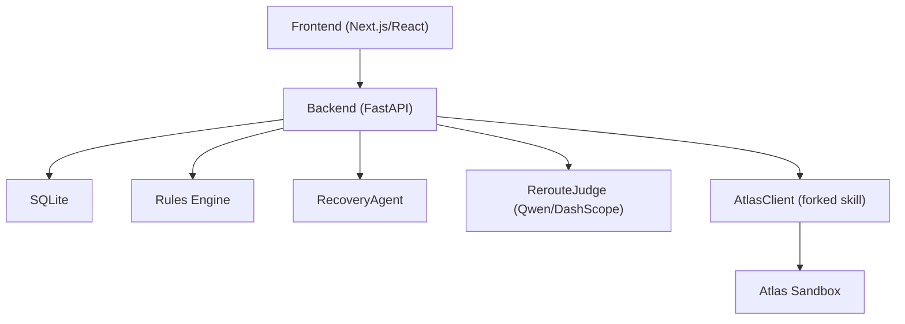
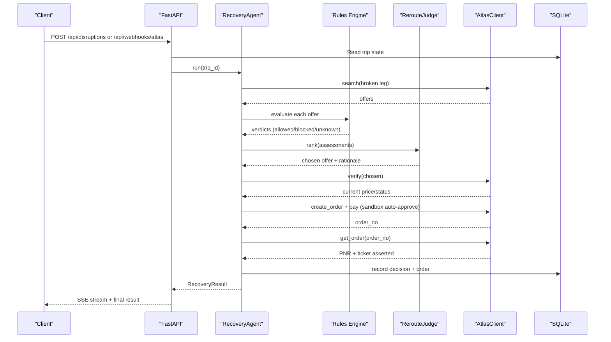
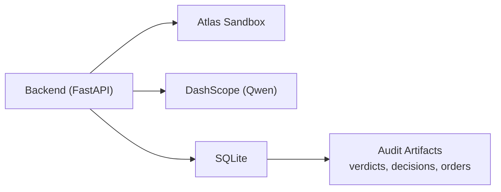

# Data Privacy & Security

<cite>
**Referenced Files in This Document**
- [02-architecture.md](file://docs/plans/waypoint/02-architecture.md)
- [03-program-design.md](file://docs/plans/waypoint/03-program-design.md)
- [04-slices.md](file://docs/plans/waypoint/04-slices.md)
- [01-product.md](file://docs/plans/waypoint/01-product.md)
- [00-status.md](file://docs/plans/waypoint/00-status.md)
- [SKILL.md](file://.agents/skills/atlas-flight-booking/SKILL.md)
- [passenger-input.md](file://.agents/skills/atlas-flight-booking/references/passenger-input.md)
- [error-handling.md](file://.agents/skills/atlas-flight-booking/references/error-handling.md)
- [cli-contract.md](file://.agents/skills/atlas-flight-booking/references/cli-contract.md)
- [atlas-integration.md](file://docs/external/atlas-integration.md)
- [0001-fork-atlas-skill-sandbox-auto-approve.md](file://docs/adr/0001-fork-atlas-skill-sandbox-auto-approve.md)
- [0002-visa-rules-curated-approximation.md](file://docs/adr/0002-visa-rules-curated-approximation.md)
- [0003-advise-execute-two-gate-split.md](file://docs/adr/0003-advise-execute-two-gate-split.md)
</cite>

## Table of Contents
1. Introduction
2. Project Structure
3. Core Components
4. Architecture Overview
5. Detailed Component Analysis
6. Dependency Analysis
7. Performance Considerations
8. Troubleshooting Guide
9. Conclusion
10. Appendices

## Introduction
This document defines the data privacy and security posture for Waypoint, focusing on how sensitive passenger information (including passport details) and payment-related data are handled end-to-end. It covers encryption expectations, access controls, data retention, PCI considerations, authentication and authorization, data minimization, GDPR and international travel compliance, logging and audit trails, and best practices for development and production environments.

## Project Structure
Waypoint is a two-part system:
- Frontend: Next.js/React screens with an SSE client to visualize agent reasoning.
- Backend: Python FastAPI hosting the recovery agent loop, rules engine, Atlas integration, SQLite persistence, and REST endpoints.

The backend persists passenger and trip data in SQLite and integrates with the Atlas sandbox via a forked skill library. The design emphasizes deterministic execution for booking/payment and AI-driven judgment only for reroute selection.

**Diagram sources**
- [02-architecture.md:13-55](file://docs/plans/waypoint/02-architecture.md#L13-L55)
- [03-program-design.md:9-32](file://docs/plans/waypoint/03-program-design.md#L9-L32)

**Section sources**
- [02-architecture.md:1-56](file://docs/plans/waypoint/02-architecture.md#L1-L56)
- [03-program-design.md:1-186](file://docs/plans/waypoint/03-program-design.md#L1-L186)

## Core Components
- Passenger and trip data model: stored in SQLite tables including passengers, trips, segments, offers, rule_verdicts, decisions, orders.
- Rules engine: enforces transit-visa and passport validity checks; fail-closed by default.
- Recovery agent: orchestrates search, rules evaluation, judge selection, verification, order creation, payment, and outcome assertion.
- Atlas integration: uses a forked skill that auto-approves price increases and payments only in sandbox; production keeps human checkpoints.
- External services: Qwen via DashScope for reasoning; Atlas sandbox for flight search/ordering; OS keyring for Atlas auth.

Key privacy implications:
- Sensitive fields include name, passport number, issuing country, expiry, nationality, contact info, and order/PNR/ticket identifiers.
- Audit artifacts (rule_verdicts, decisions, orders) must be treated as sensitive and protected accordingly.

**Section sources**
- [02-architecture.md:21-32](file://docs/plans/waypoint/02-architecture.md#L21-L32)
- [03-program-design.md:57-149](file://docs/plans/waypoint/03-program-design.md#L57-L149)
- [0001-fork-atlas-skill-sandbox-auto-approve.md:1-21](file://docs/adr/0001-fork-atlas-skill-sandbox-auto-approve.md#L1-L21)

## Architecture Overview
The recovery flow is designed with strict guards and clear separation between advice and execution:
- Advise gate: open; all options are visible and labeled allowed/blocked/unknown with reasons.
- Execute gate: fail-closed; autonomous booking and fare-difference settlement occur only when all rules allow.

**Diagram sources**
- [02-architecture.md:34-49](file://docs/plans/waypoint/02-architecture.md#L34-L49)
- [03-program-design.md:125-149](file://docs/plans/waypoint/03-program-design.md#L125-L149)

**Section sources**
- [02-architecture.md:34-55](file://docs/plans/waypoint/02-architecture.md#L34-L55)
- [03-program-design.md:125-149](file://docs/plans/waypoint/03-program-design.md#L125-L149)

## Detailed Component Analysis

### Passport and Passenger Data Handling
- Data collected includes name, nationality, document type, document number, issuing country, and expiry. Contact email/mobile may be included if provided.
- One-time delivery pattern: pass passenger payload directly to the Atlas CLI via stdin or file without echoing, saving, or logging it.
- Safety directive: do not inspect configuration or credentials; do not expose passenger input in chat, logs, command arguments, or saved files.

Privacy controls:
- Minimize collection: request only required fields returned by verification responses.
- Avoid persistence of raw payloads beyond what is necessary for order creation; store only domain-level fields in SQLite.
- Treat PII as sensitive at rest and in transit; ensure database encryption and secure transport where applicable.

Compliance notes:
- International travel requires accurate passport and visa eligibility checks; the rules engine enforces fail-closed behavior for unknown or blocked cases.

**Section sources**
- [passenger-input.md:1-52](file://.agents/skills/atlas-flight-booking/references/passenger-input.md#L1-L52)
- [SKILL.md:64-67](file://.agents/skills/atlas-flight-booking/SKILL.md#L64-L67)
- [02-architecture.md:21-32](file://docs/plans/waypoint/02-architecture.md#L21-L32)

### Payment Information Security and Fare Differences
- Autonomous fare-difference settlement occurs only in sandbox via the forked skill; production retains explicit human confirmation at payment and price increase steps.
- The execute gate ensures deterministic operations (no LLM involvement) for pricing and payment, reducing risk.
- Orders persist order numbers, PNR, ticket numbers, and fare differences; these are sensitive records requiring protection.

PCI considerations:
- While this project does not process cardholder data directly, it interacts with a payment-capable service. Ensure:
  - No PAN, CVV, or full cardholder names are stored or logged.
  - Only non-sensitive identifiers (order numbers, PNR, ticket numbers) are persisted.
  - Any payment step is delegated to the external service’s secure flows.

**Section sources**
- [0001-fork-atlas-skill-sandbox-auto-approve.md:1-21](file://docs/adr/0001-fork-atlas-skill-sandbox-auto-approve.md#L1-L21)
- [03-program-design.md:116-149](file://docs/plans/waypoint/03-program-design.md#L116-L149)
- [02-architecture.md:34-49](file://docs/plans/waypoint/02-architecture.md#L34-L49)

### Authentication and Authorization
- Atlas authentication uses ATRIP OAuth via browser; tokens and credentials live in the OS keyring, not environment variables or code.
- Error handling standardizes authorization states and prevents leaking internal codes or messages to users.
- Webhook endpoint receives real Atlas incidents; ensure it is secured (e.g., signed requests, IP allowlisting, rate limiting) in production.

Recommendations:
- Add API-level authentication and authorization for all endpoints (e.g., JWT/session-based).
- Enforce HTTPS/TLS for all inbound/outbound traffic.
- Validate webhook signatures and restrict sources.

**Section sources**
- [atlas-integration.md:10-13](file://docs/external/atlas-integration.md#L10-L13)
- [error-handling.md:7-17](file://.agents/skills/atlas-flight-booking/references/error-handling.md#L7-L17)
- [cli-contract.md:19-26](file://.agents/skills/atlas-flight-booking/references/cli-contract.md#L19-L26)
- [02-architecture.md:51-55](file://docs/plans/waypoint/02-architecture.md#L51-L55)

### Data Minimization and Privacy-by-Design
- Collect only required fields from verification responses; avoid asking for optional data unless needed.
- Use one-time delivery for passenger payloads; do not echo or log them.
- Fail-closed rules: unknown or missing data results in blocked execution until explicitly overridden by a human.
- Freshness windows: curated rules have time-bound trust; past window → unknown → fail-closed.

**Section sources**
- [passenger-input.md:1-52](file://.agents/skills/atlas-flight-booking/references/passenger-input.md#L1-L52)
- [0002-visa-rules-curated-approximation.md:1-25](file://docs/adr/0002-visa-rules-curated-approximation.md#L1-L25)
- [03-program-design.md:50-55](file://docs/plans/waypoint/03-program-design.md#L50-L55)

### GDPR and Regulatory Compliance for International Travel
- Lawful basis and transparency: clearly inform users why passport and contact data are collected and how they are used.
- Data subject rights: provide mechanisms to access, correct, delete, or export personal data held in SQLite.
- Cross-border transfers: ensure any third-party processing (Atlas, DashScope) complies with applicable transfer mechanisms and safeguards.
- Retention: define and enforce retention periods for passenger data, audit logs, and order records; securely dispose after expiration.
- Risk assessment: conduct DPIAs for high-risk processing (passport data, automated decisions affecting travel).

**Section sources**
- [02-architecture.md:21-32](file://docs/plans/waypoint/02-architecture.md#L21-L32)
- [0002-visa-rules-curated-approximation.md:1-25](file://docs/adr/0002-visa-rules-curated-approximation.md#L1-L25)

### Logging and Audit Trails with Privacy Preservation
- Persist rule verdicts, decisions, and orders as audit evidence; treat these as sensitive.
- Do not log raw passenger payloads, secrets, or full cardholder data.
- Mask or redact sensitive fields in logs; limit log retention and secure storage.
- Include provenance and timestamps for rule checks and decisions to support compliance audits.

**Section sources**
- [02-architecture.md:21-32](file://docs/plans/waypoint/02-architecture.md#L21-L32)
- [passenger-input.md:9-15](file://.agents/skills/atlas-flight-booking/references/passenger-input.md#L9-L15)

### Security Best Practices for Development and Production
- Secrets management: use OS keyring for Atlas credentials; never store secrets in env vars or code.
- Environment separation: sandbox auto-approval is strictly limited to sandbox; production requires human confirmation.
- Transport security: enforce TLS for all communications; validate certificates.
- Input validation: validate all inputs at API boundaries; sanitize outputs.
- Least privilege: restrict database and service access to minimum required permissions.
- Monitoring and alerting: monitor for unauthorized access attempts, anomalies, and policy violations.

**Section sources**
- [atlas-integration.md:10-13](file://docs/external/atlas-integration.md#L10-L13)
- [0001-fork-atlas-skill-sandbox-auto-approve.md:1-21](file://docs/adr/0001-fork-atlas-skill-sandbox-auto-approve.md#L1-L21)
- [02-architecture.md:51-55](file://docs/plans/waypoint/02-architecture.md#L51-L55)

## Dependency Analysis
External dependencies and their security implications:
- Atlas sandbox: handles flight search, verification, ordering, payment, and ticketing; authenticated via OS keyring.
- DashScope (Qwen): used solely for reasoning; API keys managed via environment variables not committed to repo.
- SQLite: local database storing sensitive passenger and order data; requires encryption at rest and secure backups.

**Diagram sources**
- [02-architecture.md:51-55](file://docs/plans/waypoint/02-architecture.md#L51-L55)
- [02-architecture.md:21-32](file://docs/plans/waypoint/02-architecture.md#L21-L32)

**Section sources**
- [02-architecture.md:51-55](file://docs/plans/waypoint/02-architecture.md#L51-L55)
- [02-architecture.md:21-32](file://docs/plans/waypoint/02-architecture.md#L21-L32)

## Performance Considerations
- Keep AI out of deterministic steps (visa lookup, fare math, payment) to reduce latency and risk.
- Re-read before write: verify prices and availability immediately before booking to prevent stale decisions.
- Step budget: bound agent loops to prevent runaway processes and resource exhaustion.

[No sources needed since this section provides general guidance]

## Troubleshooting Guide
Common issues and privacy-aware resolutions:
- Authorization failures: follow standardized error handling; do not expose internal codes or messages.
- Secure store unavailable: stop safely and report neutral errors; do not retry side-effecting operations.
- Stale offers: re-verify before booking; log old/new values without exposing sensitive details.
- Unknown rules: treat as blocked; require human override; preserve provenance and freshness metadata.

**Section sources**
- [error-handling.md:7-17](file://.agents/skills/atlas-flight-booking/references/error-handling.md#L7-L17)
- [03-program-design.md:50-55](file://docs/plans/waypoint/03-program-design.md#L50-L55)

## Conclusion
Waypoint’s design embeds privacy and security into its core workflows: minimal data collection, fail-closed execution, strong separation of advice and action, and robust auditability. To fully meet regulatory and operational requirements, implement encryption at rest/in transit, API authentication/authorization, secure secret management, and comprehensive logging with PII protection. Maintain strict environment boundaries (sandbox vs production) and uphold data minimization throughout the lifecycle.

[No sources needed since this section summarizes without analyzing specific files]

## Appendices

### Endpoints Summary
- POST /api/trips — seed trip (passenger profile + segments)
- POST /api/disruptions — inject cancellation trigger
- POST /api/webhooks/atlas — receive real Atlas incident/webhook
- GET /api/trips/{id} — trip + status
- GET /api/trips/{id}/recovery — recovery result
- GET /api/trips/{id}/stream — SSE stream of agent reasoning

**Section sources**
- [02-architecture.md:13-19](file://docs/plans/waypoint/02-architecture.md#L13-L19)

### Data Model Summary
- passengers: id, name, passport_country, passport_expiry, doc_number, issuing_country
- trips: id, passenger_id, status, created_at
- segments: id, trip_id, dep_airport, arr_airport, dep_time, arr_time, flight_number, direction, status
- offers: id, trip_id, atlas_offer_id, price, currency, total_minutes, segments_json, price_status, bookable
- rule_verdicts: id, offer_id, rule_name, allowed, reason
- decisions: id, trip_id, chosen_offer_id, rejected_cheapest_offer_id, rationale, step_count, created_at
- orders: id, trip_id, offer_id, atlas_order_no, pnr, ticket_number, fare_diff, settled, ticket_asserted, created_at

**Section sources**
- [02-architecture.md:21-32](file://docs/plans/waypoint/02-architecture.md#L21-L32)