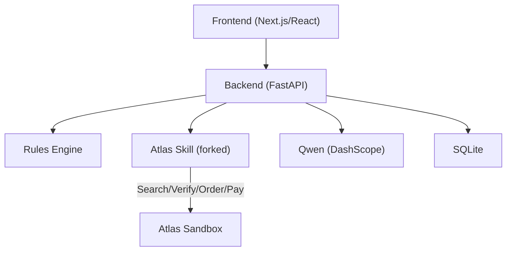
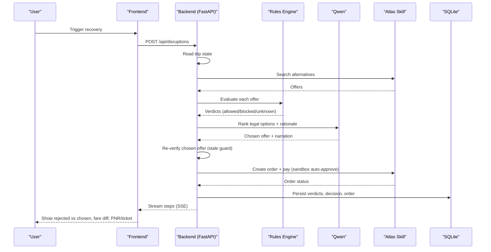
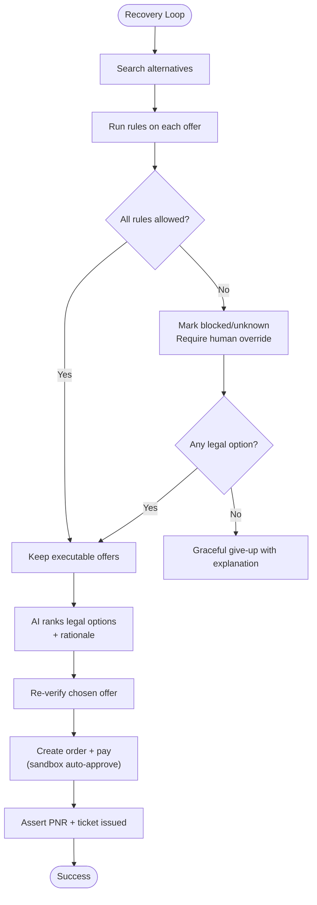
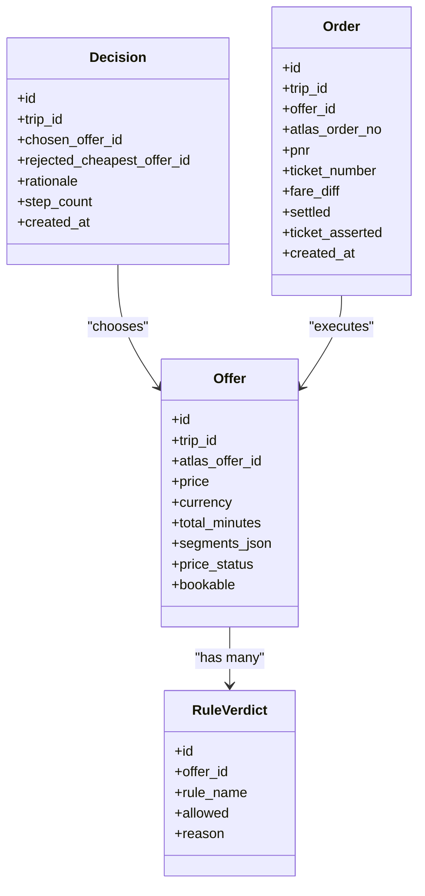
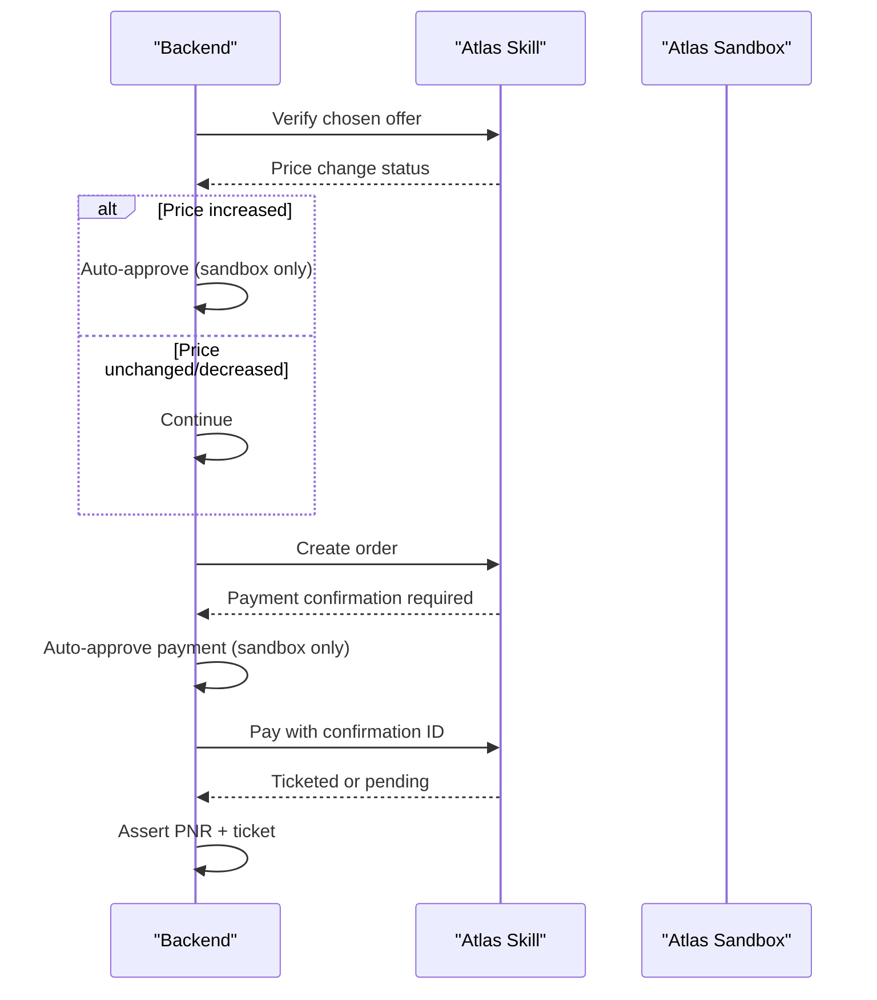
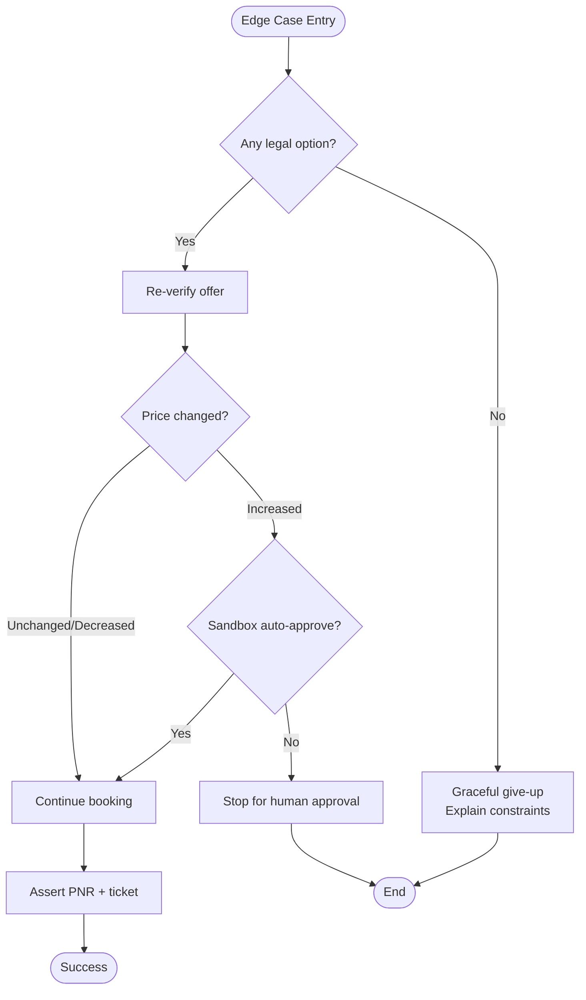
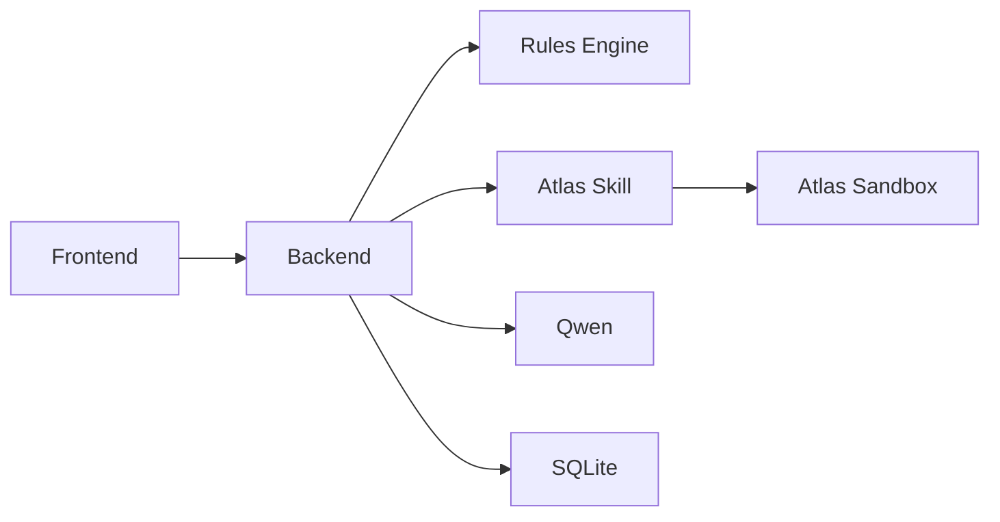
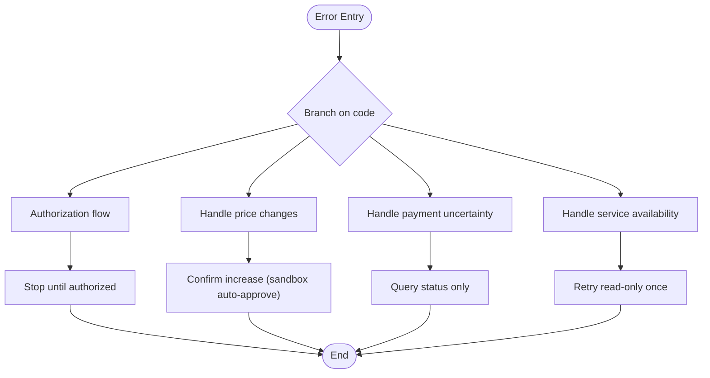

# Fail-Closed Architecture

<cite>
**Referenced Files in This Document**
- [0003-advise-execute-two-gate-split.md](file://docs/adr/0003-advise-execute-two-gate-split.md)
- [02-architecture.md](file://docs/plans/waypoint/02-architecture.md)
- [04-slices.md](file://docs/plans/waypoint/04-slices.md)
- [SKILL.md](file://.agents/skills/atlas-flight-booking/SKILL.md)
- [booking-workflow.md](file://.agents/skills/atlas-flight-booking/references/booking-workflow.md)
- [error-handling.md](file://.agents/skills/atlas-flight-booking/references/error-handling.md)
- [0001-fork-atlas-skill-sandbox-auto-approve.md](file://docs/adr/0001-fork-atlas-skill-sandbox-auto-approve.md)
</cite>

## Table of Contents
1. [Introduction](#introduction)
2. [Project Structure](#project-structure)
3. [Core Components](#core-components)
4. [Architecture Overview](#architecture-overview)
5. [Detailed Component Analysis](#detailed-component-analysis)
6. [Dependency Analysis](#dependency-analysis)
7. [Performance Considerations](#performance-considerations)
8. [Troubleshooting Guide](#troubleshooting-guide)
9. [Conclusion](#conclusion)

## Introduction
This document explains Waypoint’s fail-closed architecture for autonomous flight recovery and booking. The core principle is simple: when the system is unsure or unsafe, it blocks rather than proceeds. Unknown or risky situations are treated as blocked at execution time, even if they were considered during reasoning.

The design splits responsibilities into two gates:
- Advise gate (open): AI can see and reason about all options, including risky or unknown ones, and narrate why certain choices are rejected.
- Execute gate (walled, fail-closed): Only offers that are fully allowed by deterministic rules can be booked and settled. Blocked or unknown options require explicit human override; the agent cannot autonomously execute them.

This ensures the agent never books an option it isn’t confident is legal. Wrong-but-safe outcomes (e.g., a pricier legal flight) are preferred over wrong-but-dangerous ones (e.g., denied boarding due to visa issues).

**Section sources**
- [0003-advise-execute-two-gate-split.md:1-19](file://docs/adr/0003-advise-execute-two-gate-split.md#L1-L19)

## Project Structure
Waypoint is organized around a clear separation between frontend, backend, external integrations, and safety policies:
- Frontend: Next.js/React screens and live agent-reasoning stream via SSE.
- Backend: Python FastAPI hosting the recovery loop, rules engine, Atlas integration, Qwen calls, and SQLite persistence.
- Atlas integration: Forked skill used as a library with sandbox-only auto-approval for price/payment checkpoints.
- Rules engine: Pluggable rule interface with v1 rules for transit visas and passport validity.

**Diagram sources**
- [02-architecture.md:3-11](file://docs/plans/waypoint/02-architecture.md#L3-L11)

**Section sources**
- [02-architecture.md:3-11](file://docs/plans/waypoint/02-architecture.md#L3-L11)

## Core Components
- Two-gate split:
  - Advise gate: Open reasoning surface where AI evaluates all alternatives and explains rejections.
  - Execute gate: Deterministic wall ensuring only fully allowed offers are executed.
- Rules engine:
  - Evaluates each offer against curated rules and returns allowed/blocked/unknown with reasons and provenance.
- Atlas integration:
  - Forked skill provides search, verify, order, pay, and status queries; sandbox-only auto-approval enables end-to-end demo autonomy without real charges.
- Persistence and audit:
  - SQLite stores offers, rule verdicts, decisions, and orders to provide full evidence of correct reasoning and execution.

Key behaviors:
- No legal option → graceful give-up with explanation.
- Re-verify chosen offer before booking to guard against stale prices.
- Assert real outcome (PNR + ticket) before marking success.

**Section sources**
- [0003-advise-execute-two-gate-split.md:9-18](file://docs/adr/0003-advise-execute-two-gate-split.md#L9-L18)
- [02-architecture.md:21-30](file://docs/plans/waypoint/02-architecture.md#L21-L30)
- [02-architecture.md:34-49](file://docs/plans/waypoint/02-architecture.md#L34-L49)
- [0001-fork-atlas-skill-sandbox-auto-approve.md:6-21](file://docs/adr/0001-fork-atlas-skill-sandbox-auto-approve.md#L6-L21)

## Architecture Overview
The fail-closed architecture enforces strict boundaries between reasoning and execution:

**Diagram sources**
- [02-architecture.md:13-19](file://docs/plans/waypoint/02-architecture.md#L13-L19)
- [02-architecture.md:34-49](file://docs/plans/waypoint/02-architecture.md#L34-L49)

## Detailed Component Analysis

### Two-Gate Split: Advise vs Execute
- Advise gate (open):
  - AI sees all options labeled allowed/blocked/unknown with reasons and provenance.
  - AI narrates why illegal/unknown options are rejected, providing transparent judgment under uncertainty.
- Execute gate (walled, fail-closed):
  - Auto-book and settle only offers where every rule is allowed.
  - Blocked and unknown require explicit human override; code re-checks executability after LLM selection.

**Diagram sources**
- [0003-advise-execute-two-gate-split.md:9-18](file://docs/adr/0003-advise-execute-two-gate-split.md#L9-L18)
- [02-architecture.md:34-49](file://docs/plans/waypoint/02-architecture.md#L34-L49)

**Section sources**
- [0003-advise-execute-two-gate-split.md:9-18](file://docs/adr/0003-advise-execute-two-gate-split.md#L9-L18)

### Rules Engine and Safety Wall
- Deterministic code owns rules checks, fare-difference math, and order/pay execution.
- v1 rules include TransitVisaRule and PassportValidityRule, backed by curated data files.
- Each offer receives a verdict per rule; only offers with all rules allowed proceed to execution.
- Audit trail persists rule_verdicts, decisions, and orders for compliance and operational scale.

**Diagram sources**
- [02-architecture.md:21-29](file://docs/plans/waypoint/02-architecture.md#L21-L29)

**Section sources**
- [02-architecture.md:21-30](file://docs/plans/waypoint/02-architecture.md#L21-L30)

### Atlas Integration and Financial Safety
- Forked skill adds sandbox-only auto-approval for price-increase and payment checkpoints, enabling autonomous settlement in demo environments.
- Production retains human checkpoints; auto-approve is strictly gated on sandbox environment.
- Booking workflow emphasizes explicit confirmations for price increases and payments, with robust error handling and idempotent behavior.

**Diagram sources**
- [0001-fork-atlas-skill-sandbox-auto-approve.md:6-21](file://docs/adr/0001-fork-atlas-skill-sandbox-auto-approve.md#L6-L21)
- [booking-workflow.md:1-16](file://.agents/skills/atlas-flight-booking/references/booking-workflow.md#L1-L16)
- [booking-workflow.md:42-58](file://.agents/skills/atlas-flight-booking/references/booking-workflow.md#L42-L58)

**Section sources**
- [0001-fork-atlas-skill-sandbox-auto-approve.md:6-21](file://docs/adr/0001-fork-atlas-skill-sandbox-auto-approve.md#L6-L21)
- [booking-workflow.md:1-16](file://.agents/skills/atlas-flight-booking/references/booking-workflow.md#L1-L16)
- [booking-workflow.md:42-58](file://.agents/skills/atlas-flight-booking/references/booking-workflow.md#L42-L58)

### Edge Cases and Conservative Behavior
- No legal option:
  - System gives up gracefully and surfaces why no executable option exists.
- Stale guard:
  - Re-verify chosen offer before booking; log old/new prices and auto-approve in sandbox.
- Error handling:
  - Branch on stable codes; avoid parsing messages; never retry side-effecting operations; query-only when uncertain.
- UI rendering:
  - All three labels (allowed/blocked/unknown) are visible with AI narration over rejected options to demonstrate conservative behavior.

**Diagram sources**
- [04-slices.md:15-29](file://docs/plans/waypoint/04-slices.md#L15-L29)
- [error-handling.md:44-74](file://.agents/skills/atlas-flight-booking/references/error-handling.md#L44-L74)

**Section sources**
- [04-slices.md:15-29](file://docs/plans/waypoint/04-slices.md#L15-L29)
- [error-handling.md:44-74](file://.agents/skills/atlas-flight-booking/references/error-handling.md#L44-L74)

## Dependency Analysis
Waypoint’s dependencies are intentionally bounded to minimize risk:
- Frontend depends on backend REST + SSE.
- Backend depends on:
  - Rules engine (pluggable, data-backed).
  - Atlas skill (forked, sandbox-only auto-approve).
  - Qwen (for ranking legal options).
  - SQLite (for audit persistence).
- External services:
  - Atlas sandbox (no real bookings/charges in sandbox).
  - DashScope API key for Qwen.
  - Bundled data files for passport/visa/IATA mappings.

**Diagram sources**
- [02-architecture.md:3-11](file://docs/plans/waypoint/02-architecture.md#L3-L11)
- [02-architecture.md:51-55](file://docs/plans/waypoint/02-architecture.md#L51-L55)

**Section sources**
- [02-architecture.md:3-11](file://docs/plans/waypoint/02-architecture.md#L3-L11)
- [02-architecture.md:51-55](file://docs/plans/waypoint/02-architecture.md#L51-L55)

## Performance Considerations
- Step budget bounds the agent loop to prevent runaway reasoning.
- Re-read trip state each iteration avoids acting on stale world state.
- Deterministic rules and fare math reduce latency and risk compared to LLM-driven decisions.
- SQLite persistence keeps audit trails lightweight and fast for demo and compliance use cases.
- SSE streaming provides responsive user feedback without blocking execution.

[No sources needed since this section provides general guidance]

## Troubleshooting Guide
Common failure modes and conservative responses:
- Authorization issues:
  - Present login/authorization flow; stop until authorized; poll once after user confirmation.
- Price changes:
  - On increase, present old/new totals; obtain explicit confirmation (auto-approve only in sandbox).
- Payment uncertainties:
  - Never repay or recreate orders; query status using returned identifiers; report neutral meanings.
- Service unavailability:
  - Retry identical read-only commands at most once when retryable; never repeat side-effecting operations.

**Diagram sources**
- [error-handling.md:7-18](file://.agents/skills/atlas-flight-booking/references/error-handling.md#L7-L18)
- [error-handling.md:44-74](file://.agents/skills/atlas-flight-booking/references/error-handling.md#L44-L74)

**Section sources**
- [error-handling.md:7-18](file://.agents/skills/atlas-flight-booking/references/error-handling.md#L7-L18)
- [error-handling.md:44-74](file://.agents/skills/atlas-flight-booking/references/error-handling.md#L44-L74)

## Conclusion
Waypoint’s fail-closed architecture ensures that autonomous agents prioritize safety over speed. By separating open reasoning from a walled execution path, the system guarantees that only fully allowed offers are booked and settled. The forked Atlas skill enables sandbox-only auto-approval for demo autonomy while preserving human checkpoints in production. Robust error handling, audit persistence, and conservative edge-case behavior make Waypoint suitable for high-stakes scenarios where wrong-but-safe outcomes must always beat wrong-but-dangerous ones.

[No sources needed since this section summarizes without analyzing specific files]