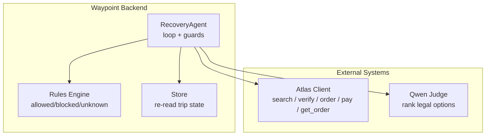
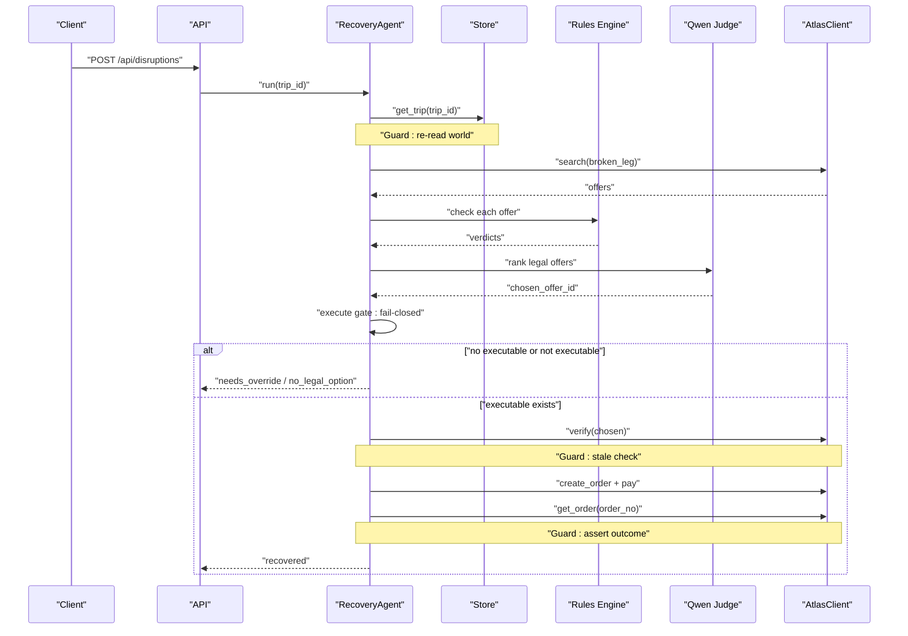
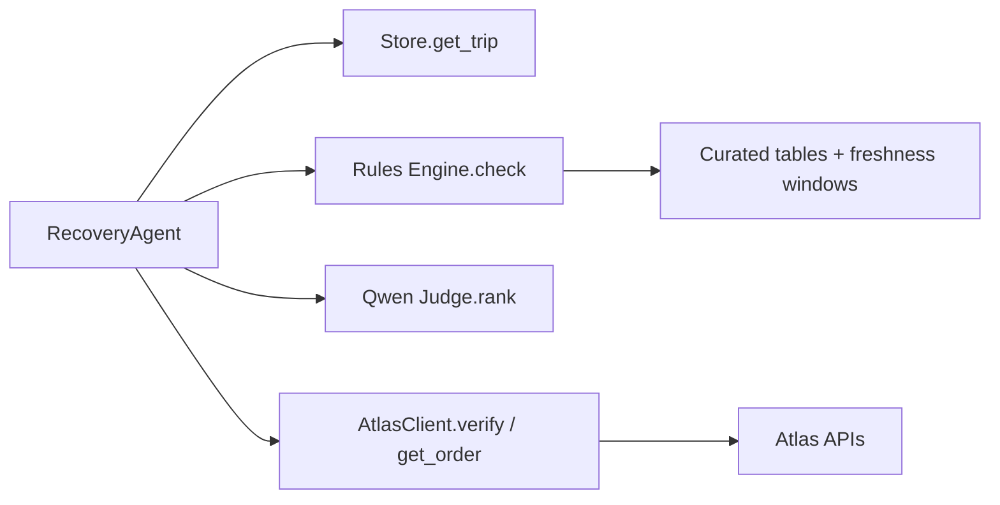

# Safety Guards

<cite>
**Referenced Files in This Document**
- [03-program-design.md](file://docs/plans/waypoint/03-program-design.md)
- [02-architecture.md](file://docs/plans/waypoint/02-architecture.md)
- [00-status.md](file://docs/plans/waypoint/00-status.md)
- [0003-advise-execute-two-gate-split.md](file://docs/adr/0003-advise-execute-two-gate-split.md)
- [atlas-integration.md](file://docs/external/atlas-integration.md)
- [error-handling.md](file://.agents/skills/atlas-flight-booking/references/error-handling.md)
</cite>

## Table of Contents
1. [Introduction](#introduction)
2. [Project Structure](#project-structure)
3. [Core Components](#core-components)
4. [Architecture Overview](#architecture-overview)
5. [Detailed Component Analysis](#detailed-component-analysis)
6. [Dependency Analysis](#dependency-analysis)
7. [Performance Considerations](#performance-considerations)
8. [Troubleshooting Guide](#troubleshooting-guide)
9. [Conclusion](#conclusion)

## Introduction
This document explains the three critical agent-failure guards that keep Waypoint’s autonomous recovery safe and reliable:
- Infinite loop prevention via step budget limits and explicit give-up behavior.
- Stale data protection via re-read/verify before write operations to avoid acting on outdated information.
- False success prevention via outcome assertion mechanisms that confirm actions actually succeeded.

These guards are intentionally visible in the user experience and are part of both correctness and operational reliability. They are embedded into the agent’s main recovery loop and are designed to fail closed when safety is uncertain.

## Project Structure
The repository contains design and integration documentation that defines how the agent operates, where the guards are applied, and how they integrate with external systems like Atlas. The key artifacts for this document are the program design, architecture overview, status notes, and ADRs that formalize guard behavior.

**Diagram sources**
- [03-program-design.md:125-149](file://docs/plans/waypoint/03-program-design.md#L125-L149)
- [02-architecture.md:34-49](file://docs/plans/waypoint/02-architecture.md#L34-L49)

**Section sources**
- [03-program-design.md:1-32](file://docs/plans/waypoint/03-program-design.md#L1-L32)
- [02-architecture.md:1-20](file://docs/plans/waypoint/02-architecture.md#L1-L20)

## Core Components
- RecoveryAgent: orchestrates the recovery loop, enforces the step budget, and applies all three guards at appropriate points.
- Rules Engine: evaluates offers against rules (e.g., transit visa, passport validity) and returns a three-state verdict: allowed, blocked, unknown.
- Store: provides re-reads of trip state before any action to ensure the agent never acts on stale cached world state.
- AtlasClient: wraps search, verify, order creation, payment, and outcome query used by the agent to interact with the booking system.
- Qwen Judge: ranks legal options and provides rationale; execution remains fail-closed based on rule verdicts.

Key implementation anchors:
- Step budget and give-up: every step is counted; exceeding the budget triggers an explicit give-up.
- Re-read/verify: trip state is re-read from Store; offer verification occurs immediately before booking.
- Outcome assertion: after payment, the agent queries the real order to assert PNR/ticket issuance before declaring success.

**Section sources**
- [03-program-design.md:106-123](file://docs/plans/waypoint/03-program-design.md#L106-L123)
- [03-program-design.md:125-149](file://docs/plans/waypoint/03-program-design.md#L125-L149)
- [02-architecture.md:34-49](file://docs/plans/waypoint/02-architecture.md#L34-L49)

## Architecture Overview
The recovery flow embeds the three guards directly into the agent’s loop. Each guard is triggered at a precise point to prevent failure modes:

**Diagram sources**
- [03-program-design.md:125-149](file://docs/plans/waypoint/03-program-design.md#L125-L149)
- [02-architecture.md:34-49](file://docs/plans/waypoint/02-architecture.md#L34-L49)

**Section sources**
- [03-program-design.md:125-149](file://docs/plans/waypoint/03-program-design.md#L125-L149)
- [02-architecture.md:34-49](file://docs/plans/waypoint/02-architecture.md#L34-L49)

## Detailed Component Analysis

### Guard 1: Infinite Loop Prevention (Step Budget + Explicit Give-Up)
Purpose:
- Prevent runaway loops during recovery by bounding the number of steps the agent can take.
- Provide a clear, observable give-up path when progress stalls or no legal option exists.

Implementation pattern:
- The agent increments a step counter for each major operation in the loop.
- If the step count exceeds the configured step budget, the agent stops and emits a give-up result.
- When no executable offer exists, the agent explicitly returns a “no legal option” status rather than looping indefinitely.

Configuration:
- Step budget is a parameter to the RecoveryAgent constructor (default value documented).
- Tune the budget once the loop runs end-to-end; it is currently a placeholder subject to tuning.

Monitoring:
- Emit events for each step so operators can see progression and detect when the budget is reached.
- Persist decision records including step_count for post-run analysis.

Troubleshooting:
- If the agent frequently hits the budget, investigate whether the rules engine or search is too restrictive, or whether the judge needs better guidance.
- Check emitted rationale and verdicts to understand why no executable option was found.

Example scenario:
- A disruption yields only blocked or unknown offers due to visa constraints; the agent exhausts its budget trying to find a legal reroute and then gives up gracefully, surfacing the reason to the operator.

Impact on reliability:
- Guarantees bounded runtime and prevents infinite retries or endless planning cycles.
- Ensures predictable behavior under uncertainty by failing closed when no legal option is available.

**Section sources**
- [03-program-design.md:106-114](file://docs/plans/waypoint/03-program-design.md#L106-L114)
- [03-program-design.md:125-149](file://docs/plans/waypoint/03-program-design.md#L125-L149)
- [03-program-design.md:151-169](file://docs/plans/waypoint/03-program-design.md#L151-L169)
- [02-architecture.md:34-49](file://docs/plans/waypoint/02-architecture.md#L34-L49)

### Guard 2: Stale Data Protection (Re-Read/Verify Before Write)
Purpose:
- Ensure the agent never acts on outdated information by re-reading the world state and verifying live availability/pricing before executing writes.

Implementation pattern:
- Before any write (order creation), the agent calls Atlas verify on the chosen offer to confirm current price and seat availability.
- Trip state is re-read from Store at the start of each loop iteration to avoid operating on cached data.
- For visa/transit rules without a live source, freshness windows are enforced: airside cells trusted within 6 months, entry-fallback within 3 months; past the window, the rule returns unknown and execution is blocked.

Configuration:
- Freshness windows are defined per cell type (airside vs entry-fallback).
- Offer price_status must be current or verified before proceeding to order creation.

Monitoring:
- Emit old/new values when verify detects changes to pricing or availability.
- Persist rule_verdicts and decisions to audit which offers were considered and why.

Troubleshooting:
- If verify fails or indicates stale pricing, inspect emitted logs showing old vs new values and decide whether to retry search or surface to human override.
- If rules return unknown due to freshness, review curated data and update last_checked timestamps accordingly.

Example scenario:
- An offer appears bookable but has changed price or availability by the time the agent attempts to create the order; verify catches the staleness and prevents booking an invalid offer.

Impact on reliability:
- Prevents booking non-existent or mispriced inventory.
- Enforces honest boundaries between live data (price/availability) and curated approximations (visa rules), making stale-data risks explicit.

**Section sources**
- [03-program-design.md:50-55](file://docs/plans/waypoint/03-program-design.md#L50-L55)
- [03-program-design.md:125-149](file://docs/plans/waypoint/03-program-design.md#L125-L149)
- [02-architecture.md:34-49](file://docs/plans/waypoint/02-architecture.md#L34-L49)

### Guard 3: False Success Prevention (Outcome Assertion)
Purpose:
- Confirm that actions actually succeeded by asserting the real-world outcome (PNR and ticket issued) rather than relying solely on HTTP success responses.

Implementation pattern:
- After creating the order and paying, the agent queries the order details to assert that a PNR and ticket number exist.
- Only if the outcome matches expectations does the agent mark the recovery as successful; otherwise, it reports failure or needs-override.

Configuration:
- No additional configuration beyond ensuring the Atlas client supports querying order details and returning authoritative outcomes.

Monitoring:
- Emit outcome assertion results and persist order records including ticket_asserted flags.
- Track failures where payment appeared successful but the final outcome did not include a ticket.

Troubleshooting:
- If outcome assertion fails, inspect the order query response and upstream error codes to determine whether the payment settled but ticketing did not complete.
- Use Atlas error handling references to interpret codes and decide retry or escalation paths.

Example scenario:
- Payment auto-approves in sandbox, but ticketing is not yet activated; outcome assertion detects missing PNR/ticket and prevents marking the trip as recovered until the issue is resolved.

Impact on reliability:
- Eliminates false positives where side effects appear successful but did not produce the required real-world result.
- Ensures the system only claims success when the customer actually has a confirmed ticket.

**Section sources**
- [03-program-design.md:125-149](file://docs/plans/waypoint/03-program-design.md#L125-L149)
- [atlas-integration.md:15-21](file://docs/external/atlas-integration.md#L15-L21)
- [error-handling.md:65-74](file://.agents/skills/atlas-flight-booking/references/error-handling.md#L65-L74)

## Dependency Analysis
The guards depend on several components and interfaces:

**Diagram sources**
- [03-program-design.md:106-123](file://docs/plans/waypoint/03-program-design.md#L106-L123)
- [02-architecture.md:34-49](file://docs/plans/waypoint/02-architecture.md#L34-L49)

Coupling and cohesion:
- The agent tightly coordinates Store, Rules, Judge, and Atlas, but each dependency is well-scoped and testable.
- Rules are pluggable via a protocol interface, improving cohesion around policy checks.
- Atlas interactions are encapsulated behind a client abstraction, isolating external API concerns.

Potential circular dependencies:
- None observed; the flow is linear through the agent loop with clear input/output contracts.

External dependencies:
- Atlas sandbox and ticketing activation affect the ability to verify/book/pay/assert outcomes.
- Qwen is used only for judgment; deterministic code owns execution and settlement.

**Section sources**
- [03-program-design.md:106-123](file://docs/plans/waypoint/03-program-design.md#L106-L123)
- [02-architecture.md:1-20](file://docs/plans/waypoint/02-architecture.md#L1-L20)
- [atlas-integration.md:26-37](file://docs/external/atlas-integration.md#L26-L37)

## Performance Considerations
- Step budget bounds total work and prevents excessive API calls or LLM invocations.
- Re-read/verify adds latency but ensures correctness; batch or cache where safe, but never bypass verify before writes.
- Outcome assertion requires an extra call; consider idempotency and retry policies for transient errors.
- Tuning the step budget should balance responsiveness with thoroughness; monitor average step counts and failure rates.

[No sources needed since this section provides general guidance]

## Troubleshooting Guide
Common issues and how to diagnose them:

- Infinite loop prevention triggered:
  - Check emitted step events and rationale to understand why no legal option was found.
  - Review rule verdicts and freshness windows; update curated data if necessary.
  - Adjust step budget if legitimate recovery requires more steps.

- Stale data protection triggered:
  - Inspect verify logs showing old vs new prices or availability changes.
  - Confirm offer price_status is current or verified before attempting order creation.
  - Validate curated table last_checked timestamps and adjust freshness windows if business requirements change.

- False success prevention triggered:
  - Examine order query results to identify missing PNR or ticket.
  - Consult Atlas error handling references to interpret codes and determine retryability.
  - Ensure ticketing activation is completed in sandbox/production environments.

Operational visibility:
- Use SSE stream events to observe guard activations in real time.
- Persist decisions and orders for post-mortem analysis and compliance audits.

**Section sources**
- [03-program-design.md:151-169](file://docs/plans/waypoint/03-program-design.md#L151-L169)
- [error-handling.md:65-74](file://.agents/skills/atlas-flight-booking/references/error-handling.md#L65-L74)
- [atlas-integration.md:26-37](file://docs/external/atlas-integration.md#L26-L37)

## Conclusion
Waypoint’s three agent-failure guards form a robust safety layer:
- Step budget and explicit give-up prevent infinite loops and ensure graceful degradation.
- Re-read/verify protects against stale data, enforcing honest boundaries between live and curated information.
- Outcome assertion eliminates false successes by confirming real-world results before declaring recovery complete.

Together, these guards make the system fail closed under uncertainty, improve reliability, and provide clear operational signals for monitoring and troubleshooting.

[No sources needed since this section summarizes without analyzing specific files]