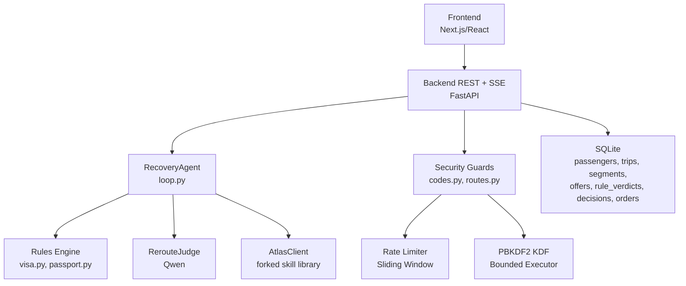
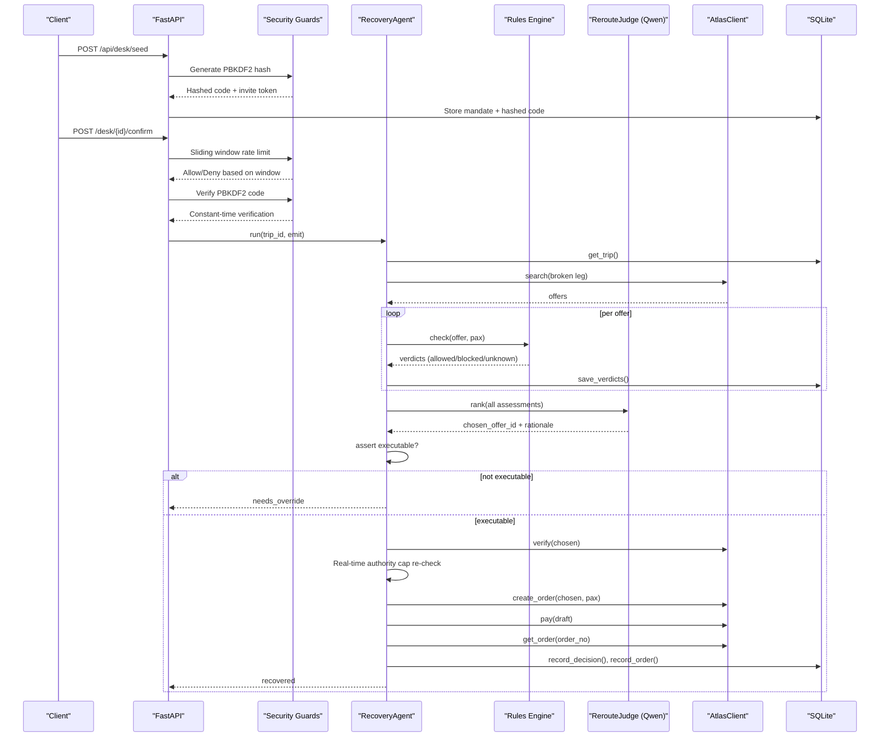
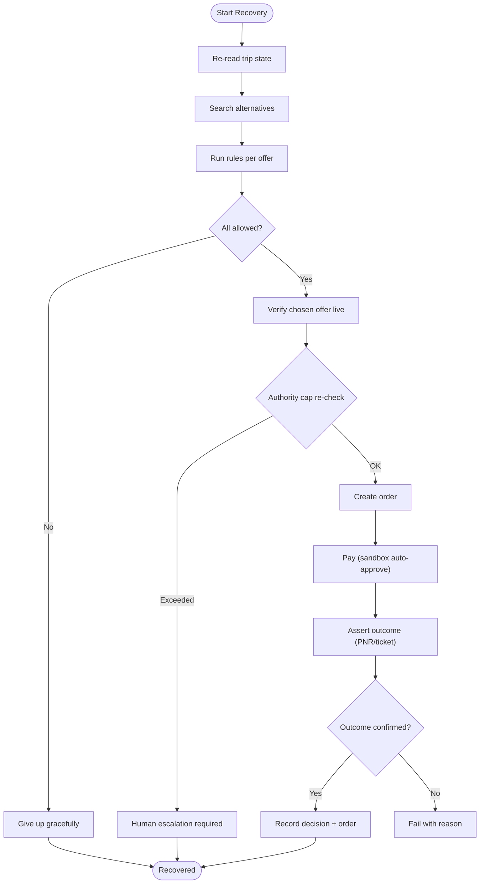
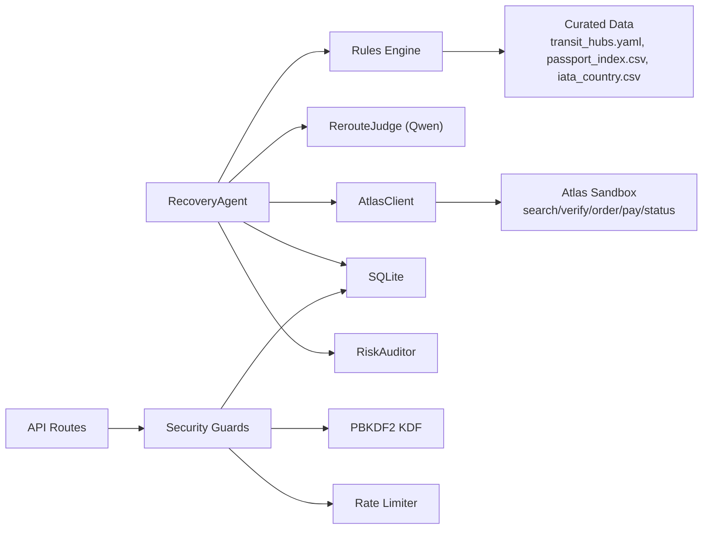

# Security & Safety

<cite>
**Referenced Files in This Document**
- [0003-advise-execute-two-gate-split.md](file://docs/adr/0003-advise-execute-two-gate-split.md)
- [02-architecture.md](file://docs/plans/waypoint/02-architecture.md)
- [03-program-design.md](file://docs/plans/waypoint/03-program-design.md)
- [error-handling.md](file://.agents/skills/atlas-flight-booking/references/error-handling.md)
- [passenger-input.md](file://.agents/skills/atlas-flight-booking/references/passenger-input.md)
- [booking-workflow.md](file://.agents/skills/atlas-flight-booking/references/booking-workflow.md)
- [loop.py](file://backend/app/agent/loop.py)
- [client.py](file://backend/app/atlas/client.py)
- [brain.py](file://backend/app/agent/brain.py)
- [auditor.py](file://backend/app/agent/auditor.py)
- [models.py](file://backend/app/models.py)
- [codes.py](file://backend/app/codes.py)
- [routes.py](file://backend/app/api/routes.py)
- [config.py](file://backend/app/config.py)
- [test_waybot_security.py](file://backend/tests/test_waybot_security.py)
</cite>

## Update Summary
**Changes Made**
- Added comprehensive documentation for the seven security guard layers implemented in Waybot
- Enhanced PBKDF2 confirmation code implementation with OWASP 2023 standards and bounded concurrency protection
- Documented sliding-window rate limiting for /confirm endpoint with per-desk isolation
- Added detailed coverage of bounded ThreadPoolExecutor for KDF operations to prevent CPU exhaustion
- Enhanced role separation and one-shot semantics documentation
- Updated compliance requirements to include new security measures

## Table of Contents
1. Introduction
2. Project Structure
3. Core Components
4. Architecture Overview
5. Seven Security Guard Layers
6. Detailed Component Analysis
7. Dependency Analysis
8. Performance Considerations
9. Troubleshooting Guide
10. Conclusion
11. Appendices

## Introduction
This document provides comprehensive security and safety guidance for the Waypoint system, focusing on its fail-closed architecture and enhanced safety guards. It explains the dual-gate authorization system that separates AI reasoning (advise = open) from execution (execute = fail-closed wall), details the seven critical security guard layers including PBKDF2 confirmation codes, sliding-window rate limiting, and bounded concurrency protection, outlines data privacy considerations for sensitive passenger information with dynamic payload construction, documents compliance requirements for financial transactions and personal data handling, and describes monitoring and audit capabilities to track agent decisions and actions. It also addresses security implications of autonomous booking execution and safeguards for production deployment.

## Project Structure
Waypoint is organized into a frontend (Next.js/React) and a backend (Python FastAPI). The backend hosts the recovery agent loop, rules engine, Atlas integration, Qwen calls, and SQLite persistence. The design intentionally keeps deterministic code responsible for rules checks, fare-difference math, and order/pay execution, while the AI focuses on reroute judgment.

**Diagram sources**
- [02-architecture.md:1-56](file://docs/plans/waypoint/02-architecture.md#L1-L56)
- [03-program-design.md:9-32](file://docs/plans/waypoint/03-program-design.md#L9-L32)

**Section sources**
- [02-architecture.md:1-56](file://docs/plans/waypoint/02-architecture.md#L1-L56)
- [03-program-design.md:9-32](file://docs/plans/waypoint/03-program-design.md#L9-L32)

## Core Components
- **Enhanced Two-Gate Split**: Advise gate is open; Execute gate requires BOTH human switch (`WAYPOINT_LIVE_BOOKING=1`) AND live ticketing availability check via `ticketing_live()` probe.
- **Seven Security Guard Layers**: Comprehensive protection including PBKDF2 confirmation codes, sliding-window rate limiting, bounded concurrency, role separation, submission integrity, PII minimization, and one-shot semantics.
- RecoveryAgent orchestrates bounded steps with explicit give-up behavior and real-time authority cap verification.
- Rules engine enforces visa and passport validity with a three-state verdict model (allowed/blocked/unknown).
- RerouteJudge uses Qwen to rank legal options and narrate rejections.
- AtlasClient integrates with the forked Atlas skill for search, verify, order creation, payment, and outcome assertion with enhanced safety gates.
- RiskAuditor provides second-pass policy breach detection and challenge narration.
- Persistence stores offers, rule verdicts, decisions, and orders for auditability.

Key responsibilities:
- Deterministic code owns rules, fare math, settlement, and dual-gate authorization.
- AI owns reroute judgment only.
- Every step emits events via SSE for visibility and auditing.

**Section sources**
- [0003-advise-execute-two-gate-split.md:1-19](file://docs/adr/0003-advise-execute-two-gate-split.md#L1-L19)
- [03-program-design.md:3-8](file://docs/plans/waypoint/03-program-design.md#L3-L8)
- [03-program-design.md:57-123](file://docs/plans/waypoint/03-program-design.md#L57-L123)
- [02-architecture.md:13-31](file://docs/plans/waypoint/02-architecture.md#L13-L31)

## Architecture Overview
The system implements a strict separation between advice and execution with enhanced dual-gate authorization and seven security guard layers:

- **Advise gate**: All alternatives are visible and labeled allowed/blocked/unknown by the rules engine. The AI reasons over all options and explains why it rejects risky or illegal ones.
- **Execute gate**: Requires BOTH human switch armed AND live ticketing available. Only offers where every rule is allowed can be auto-booked and auto-settled. Code re-checks executability after the LLM picks, including real-time authority cap verification.

**Diagram sources**
- [03-program-design.md:125-149](file://docs/plans/waypoint/03-program-design.md#L125-L149)
- [02-architecture.md:13-31](file://docs/plans/waypoint/02-architecture.md#L13-L31)

**Section sources**
- [0003-advise-execute-two-gate-split.md:1-19](file://docs/adr/0003-advise-execute-two-gate-split.md#L1-L19)
- [03-program-design.md:125-149](file://docs/plans/waypoint/03-program-design.md#L125-L149)

## Seven Security Guard Layers

### Guard 1: Confirmation Code Protection with PBKDF2
- **Hashed-only storage**: Confirmation codes are never stored in plaintext; only PBKDF2-HMAC-SHA256 hashes with 260,000 iterations (OWASP 2023 minimum)
- **Constant-time comparison**: Uses `hmac.compare_digest` to prevent timing attacks
- **Attempt cap**: 5 wrong attempts trigger 429 throttling, but correct codes always release (verify-first ordering prevents DoS lockout)
- **TTL expiry**: Codes expire after 24 hours (default, env-tunable via `WAYPOINT_CODE_TTL`)
- **Bounded concurrency**: PBKDF2 verification runs on dedicated `ThreadPoolExecutor(2)` to prevent CPU exhaustion

**Security impact**: Prevents brute-force attacks, timing attacks, and resource exhaustion while ensuring legitimate users can always access their desks.

**Section sources**
- [codes.py:22-78](file://backend/app/codes.py#L22-L78)
- [routes.py:571-595](file://backend/app/api/routes.py#L571-L595)
- [test_waybot_security.py:148-329](file://backend/tests/test_waybot_security.py#L148-L329)

### Guard 2: Invite Token Isolation
- **128-bit random tokens**: Generated using `secrets.token_urlsafe(16)` for cryptographic randomness
- **Single-purpose binding**: Tokens bind chat-to-desk only; cannot be used to release desks
- **Leakage protection**: Even if invite tokens are leaked, they cannot release desks without the confirmation code

**Security impact**: Ensures that compromised invite links cannot be used to hijack desk control.

**Section sources**
- [routes.py:115-119](file://backend/app/api/routes.py#L115-L119)
- [test_waybot_security.py:548-598](file://backend/tests/test_waybot_security.py#L548-L598)

### Guard 3: Role Separation
- **Traveler restrictions**: Bot-path/traveler sessions can submit passports but cannot call confirm/approve endpoints
- **Authority isolation**: Release and approval authority lives only on the code path, which travelers never receive
- **Credential separation**: Travelers have invite tokens; managers have confirmation codes and approval tokens

**Security impact**: Prevents unauthorized travelers from controlling desk operations or approving bookings.

**Section sources**
- [routes.py:609-695](file://backend/app/api/routes.py#L609-L695)
- [test_waybot_security.py:605-690](file://backend/tests/test_waybot_security.py#L605-L690)

### Guard 4: Submission Integrity
- **Checksum validation**: Data integrity checks before storage
- **Team size caps**: Enforced limits on team sizes to prevent abuse
- **Duplicate document rejection**: Prevents duplicate passport numbers (also enforced by sandbox)
- **Photo size protection**: Oversized photos rejected before extraction via pre-download `file_size` gate and post-download verification

**Security impact**: Ensures data integrity and prevents resource exhaustion through malformed or oversized submissions.

**Section sources**
- [02-architecture.md:81-89](file://docs/plans/waypoint/02-architecture.md#L81-L89)

### Guard 5: PII Minimization
- **Memory-only processing**: Image bytes never touch database or disk; deleted post-extraction
- **Telegram cleanup**: `deleteMessage` called to remove uploaded images from Telegram servers
- **Traveler row purging**: Traveler rows are purged at desk close to prevent PII retention
- **Event masking**: Events and logs mask sensitive data patterns (document numbers, dates of birth)

**Security impact**: Minimizes exposure of sensitive passenger information throughout the system lifecycle.

**Section sources**
- [02-architecture.md:81-89](file://docs/plans/waypoint/02-architecture.md#L81-L89)

### Guard 6: Untrusted Text Containment
- **MRZ-as-data**: MRZ-derived strings flow only into structured passenger JSON (stdin), never into brain prompts or CLI arguments
- **Injection prevention**: Mirrored injection tests with hostile names ensure no command injection vulnerabilities
- **Data boundary enforcement**: Strict separation between untrusted text and trusted command execution

**Security impact**: Prevents command injection attacks through malicious passenger data.

**Section sources**
- [02-architecture.md:81-89](file://docs/plans/waypoint/02-architecture.md#L81-L89)

### Guard 7: One-Shot Semantics
- **Single-use confirmations**: Confirm and approve endpoints are single-use; second calls return 410 (gone)
- **Approval slot protection**: Approval slots work like escalation slots - once decided, they cannot be replayed
- **Atomic state transitions**: Compare-and-set operations prevent race conditions in critical state changes

**Security impact**: Prevents replay attacks and ensures atomicity of critical security operations.

**Section sources**
- [routes.py:552-554](file://backend/app/api/routes.py#L552-L554)
- [routes.py:644-647](file://backend/app/api/routes.py#L644-L647)

## Detailed Component Analysis

### Enhanced Two-Gate Split: Dual-Gate Authorization vs Execute
- **Advise gate**: Open reasoning surface. The UI and AI see every alternative with labels and provenance. The AI narrates why it rejects cheap but illegal or unknown options.
- **Execute gate**: Fail-closed wall requiring BOTH conditions:
  1. Human switch `WAYPOINT_LIVE_BOOKING=1` must be armed
  2. Live `atlas-flight auth status` probe reports ticketing available
  - Either gate blocking → comparison mode: decisions logged, marked, disclosed as simulation; no write commands run
  - Real-time authority cap re-checking before every write operation
  - Dynamic passenger payload construction from verify responses

Security impact:
- Prevents unauthorized or unsafe actions from being executed autonomously
- Ensures deterministic code controls funds settlement and ticketing outcomes
- Eliminates TOCTOU vulnerabilities through single env var reads per cycle

**Section sources**
- [0003-advise-execute-two-gate-split.md:1-19](file://docs/adr/0003-advise-execute-two-gate-split.md#L1-L19)
- [03-program-design.md:3-8](file://docs/plans/waypoint/03-program-design.md#L3-L8)
- [loop.py:951-977](file://backend/app/agent/loop.py#L951-L977)

### Three Critical Agent-Failure Guards with Enhanced Verification
1. **Infinite loop prevention through step budget and explicit give-up**
   - The agent loop is bounded by a step budget; exceeding it triggers a graceful give-up with explanation.
2. **Stale data protection through re-read/verify before writes**
   - Before any write (order creation/payment), the system performs a live re-read/verify via Atlas to ensure current price and availability. For visa/transit rules without a live source, freshness windows are used as honest proxies; past window → unknown → fail-closed.
3. **False success prevention through outcome assertion**
   - After payment, the system asserts real outcomes by querying order status and confirming PNR/ticket issuance before marking success.
4. **Real-time authority cap re-checking**
   - Authority cap is re-checked against the REAL verified price (not just stale marks) before every write operation, preventing intra-cycle price increases from bypassing caps.

**Diagram sources**
- [03-program-design.md:125-149](file://docs/plans/waypoint/03-program-design.md#L125-L149)
- [02-architecture.md:34-49](file://docs/plans/waypoint/02-architecture.md#L34-L49)

**Section sources**
- [02-architecture.md:34-49](file://docs/plans/waypoint/02-architecture.md#L34-L49)
- [03-program-design.md:50-55](file://docs/plans/waypoint/03-program-design.md#L50-L55)
- [loop.py:706-720](file://backend/app/agent/loop.py#L706-L720)

### Enhanced Booking Workflow and Payment Safeguards
- **Dual-gate authorization**: Both human switch and live ticketing probe must be active for write operations
- **Real-time authority cap verification**: Re-checks against verified prices, not just marks
- **Dynamic passenger payload construction**: Built from verify responses, carrying traveler IDs and passenger types
- Price changes handled explicitly: decreased continues without approval; increased requires new explicit confirmation
- Passenger input collected minimally and delivered once via stdin; never echoed, saved, or logged
- Order creation runs once; payment requires explicit user approval; subsequent status queries avoid duplicate payments
- Side-effect uncertainty resolved by query-only rules; never retry order creation or payment automatically

Financial compliance impact:
- Explicit confirmations and masked summaries reduce risk of unintended charges
- Query-only recovery prevents double billing and ensures accurate state reconciliation
- Comparison mode logging provides full audit trail even when writes are blocked

**Section sources**
- [booking-workflow.md:1-63](file://.agents/skills/atlas-flight-booking/references/booking-workflow.md#L1-L63)
- [error-handling.md:1-74](file://.agents/skills/atlas-flight-booking/references/error-handling.md#L1-L74)
- [loop.py:722-731](file://backend/app/agent/loop.py#L722-L731)

### Enhanced Data Privacy for Sensitive Passenger Information
- Passenger fields include names, gender, birthday, nationality, and document details (type, number, issuing country, expiry)
- **Dynamic payload construction**: Passenger payloads are built at write time from verify responses, carrying traveler IDs and passenger types rather than using static constants
- Collection rule: ask only required fields identified by verification responses; do not echo payloads; prefer one-time delivery via stdin; do not place personal values in shell commands
- Safe correction: rebuild payload once with only missing fields; never repeat rejected personal data in explanations
- **Unique identity generation**: Each passenger gets distinct demo identities with per-index suffixes to prevent upstream validation failures

Privacy safeguards:
- Minimize exposure of sensitive data in logs and outputs
- Avoid storing unnecessary personal data beyond what is required for booking and compliance
- Dynamic construction ensures traveler IDs are always current and valid

**Section sources**
- [passenger-input.md:1-52](file://.agents/skills/atlas-flight-booking/references/passenger-input.md#L1-L52)
- [loop.py:70-115](file://backend/app/agent/loop.py#L70-L115)

### Enhanced Monitoring and Audit Capabilities
- Persistence schema includes:
  - rule_verdicts: per-offer rule checks with allowed/blocked/unknown, reason, and provenance
  - decisions: chosen offer, rejected cheapest offer, rationale, step count, timestamp
  - orders: offer mapping, external identifiers (order_no, PNR, ticket_number), fare difference, settled flag, ticket assertion status
- **Risk Auditor**: Second-pass policy breach detection with deterministic code-computed breach counts
- SSE stream emits every step for live visibility and post-hoc analysis
- **Comparison mode disclosure**: Clear indication of which gate blocks write operations (human switch vs ticketing availability)

Auditability impact:
- Full trace of agent reasoning and deterministic enforcement supports compliance reviews and incident response
- Zero-policy-breach counting provides structural guarantee of policy compliance
- Enhanced mode disclosures provide transparency about operational state

**Section sources**
- [02-architecture.md:21-31](file://docs/plans/waypoint/02-architecture.md#L21-L31)
- [03-program-design.md:125-149](file://docs/plans/waypoint/03-program-design.md#L125-L149)
- [auditor.py:52-77](file://backend/app/agent/auditor.py#L52-L77)

### Enhanced Security Implications of Autonomous Booking Execution
- **Dual-gate authorization**: Autonomous booking occurs only when BOTH human switch is armed AND live ticketing is available
- **Real-time authority cap enforcement**: Re-checks against verified prices prevent intra-cycle price increases from bypassing caps
- **Dynamic passenger data handling**: Payloads constructed from verify responses ensure traveler IDs are current and valid
- Deterministic code controls fare-difference math and settlement; AI is excluded from these steps to minimize risk
- Outcome assertion ensures tickets are actually issued before marking success, preventing false positives

Production safeguards:
- Enforce execute gate strictly; block auto-execution for blocked/unknown offers
- Require explicit user approvals for payment and any overrides
- Maintain robust logging and audit trails for all financial actions
- Comparison mode provides safe development/testing environment with full audit capability

**Section sources**
- [02-architecture.md:8-11](file://docs/plans/waypoint/02-architecture.md#L8-L11)
- [03-program-design.md:125-149](file://docs/plans/waypoint/03-program-design.md#L125-L149)
- [client.py:337-353](file://backend/app/atlas/client.py#L337-L353)

## Dependency Analysis
Waypoint's dependencies center around deterministic enforcement and safe external integrations:

Coupling and cohesion:
- High cohesion within RecoveryAgent for orchestration and guard enforcement
- Low coupling between AI judgment and deterministic execution paths
- External dependencies isolated behind AtlasClient with stable contracts
- RiskAuditor provides independent second-pass policy review
- Security layer provides centralized protection across all endpoints

Potential risks:
- Over-reliance on curated data freshness; mitigated by unknown→blocked policy and explicit freshness windows
- External service instability; mitigated by retryable flags and query-only recovery rules
- TOCTOU vulnerabilities; eliminated through single env var reads per cycle

**Diagram sources**
- [03-program-design.md:9-32](file://docs/plans/waypoint/03-program-design.md#L9-L32)
- [02-architecture.md:1-11](file://docs/plans/waypoint/02-architecture.md#L1-L11)

**Section sources**
- [03-program-design.md:9-32](file://docs/plans/waypoint/03-program-design.md#L9-L32)
- [02-architecture.md:1-11](file://docs/plans/waypoint/02-architecture.md#L1-L11)

## Performance Considerations
- Bounded agent loops prevent runaway resource consumption
- Live verification reduces wasted downstream operations on stale offers
- Minimal passenger input collection reduces I/O overhead and privacy exposure
- **Single cache per cycle**: Ticketing availability cached per cycle to avoid repeated subprocess calls
- **Bounded KDF verification**: PBKDF2 operations run on dedicated `ThreadPoolExecutor(2)` to prevent CPU exhaustion
- **Sliding-window rate limiting**: Per-desk request volume control prevents resource exhaustion
- SQLite persistence is lightweight for demo and small-scale deployments; consider scaling strategies for higher throughput

## Troubleshooting Guide
Common error scenarios and safe behaviors:
- **Authorization issues**: prompt for login or session refresh; stop polling until authorized
- **Subscription or ticketing blockers**: present official links and wait for user action; do not guess activation steps
- **Search limits or expired offers**: replay retained search once; collect new inputs if unavailable
- **Price changes**: show old/new totals; require explicit confirmation for increases
- **Payment uncertainties**: query order status using returned identifiers; never retry payment automatically
- **Ticketing pending**: report processing status and provide order link when available; do not treat as failure
- **Authority cap exceeded**: escalate to human operator with two priced options + recommendation
- **Comparison mode**: clearly indicate which gate blocks write operations (human switch vs ticketing availability)
- **Rate limiting**: 429 responses indicate temporary throttling; retry after window expires
- **Code expiration**: 410 responses indicate expired confirmation codes; seed new desk if needed

Operational tips:
- Use normalized codes rather than parsing messages
- Keep internal causes out of user-facing output
- Respect retryable flags conservatively; never authorize different commands on retries
- Monitor comparison mode indicators for production deployments
- Watch for rate limiting patterns that may indicate attack attempts

**Section sources**
- [error-handling.md:1-74](file://.agents/skills/atlas-flight-booking/references/error-handling.md#L1-L74)
- [booking-workflow.md:1-63](file://.agents/skills/atlas-flight-booking/references/booking-workflow.md#L1-L63)

## Conclusion
Waypoint's enhanced fail-closed architecture with dual-gate authorization and seven security guard layers provides strong safety guarantees for autonomous disruption recovery. The seven guard layers include PBKDF2 confirmation codes with OWASP 2023 standards, sliding-window rate limiting, bounded concurrency protection, role separation, submission integrity, PII minimization, and one-shot semantics. The enhanced two-gate split ensures AI reasoning remains open while execution stays conservative and deterministic, requiring both human authorization and live ticketing availability. Robust privacy practices protect sensitive passenger data through dynamic payload construction, and comprehensive auditability supports compliance and operational oversight. Production deployments should enforce explicit human approvals for financial actions, maintain strict adherence to the execute gate, leverage comparison mode for safe development and testing environments, and monitor the seven security guard layers for optimal protection.

## Appendices

### Compliance Requirements Summary
- **Financial transactions**:
  - Dual-gate authorization required before payment (human switch + live ticketing probe)
  - Real-time authority cap verification against actual verified prices
  - Masked summaries and clear price-change handling
  - Query-only recovery to prevent duplicate charges
  - Comparison mode logging for full audit trail
- **Personal data handling**:
  - Dynamic payload construction from verify responses
  - Minimal collection based on verified requirements
  - One-time delivery via stdin; no echoing, saving, or logging of payloads
  - Safe correction without repeating rejected personal data
  - Unique identity generation for multi-passenger bookings
- **Security authentication**:
  - PBKDF2-HMAC-SHA256 with 260,000 iterations (OWASP 2023 minimum)
  - Constant-time comparison to prevent timing attacks
  - Attempt caps with verify-first ordering to prevent DoS lockouts
  - Sliding-window rate limiting per desk (default 10 requests/60 seconds)
  - Bounded concurrency for KDF operations (ThreadPoolExecutor with 2 workers)
  - One-shot semantics for confirm and approve endpoints
  - Role separation between travelers and managers

**Section sources**
- [booking-workflow.md:31-63](file://.agents/skills/atlas-flight-booking/references/booking-workflow.md#L31-L63)
- [passenger-input.md:1-52](file://.agents/skills/atlas-flight-booking/references/passenger-input.md#L1-L52)
- [loop.py:951-977](file://backend/app/agent/loop.py#L951-L977)
- [client.py:337-353](file://backend/app/atlas/client.py#L337-L353)
- [codes.py:22-78](file://backend/app/codes.py#L22-L78)
- [routes.py:448-595](file://backend/app/api/routes.py#L448-L595)
- [config.py:17-31](file://backend/app/config.py#L17-L31)