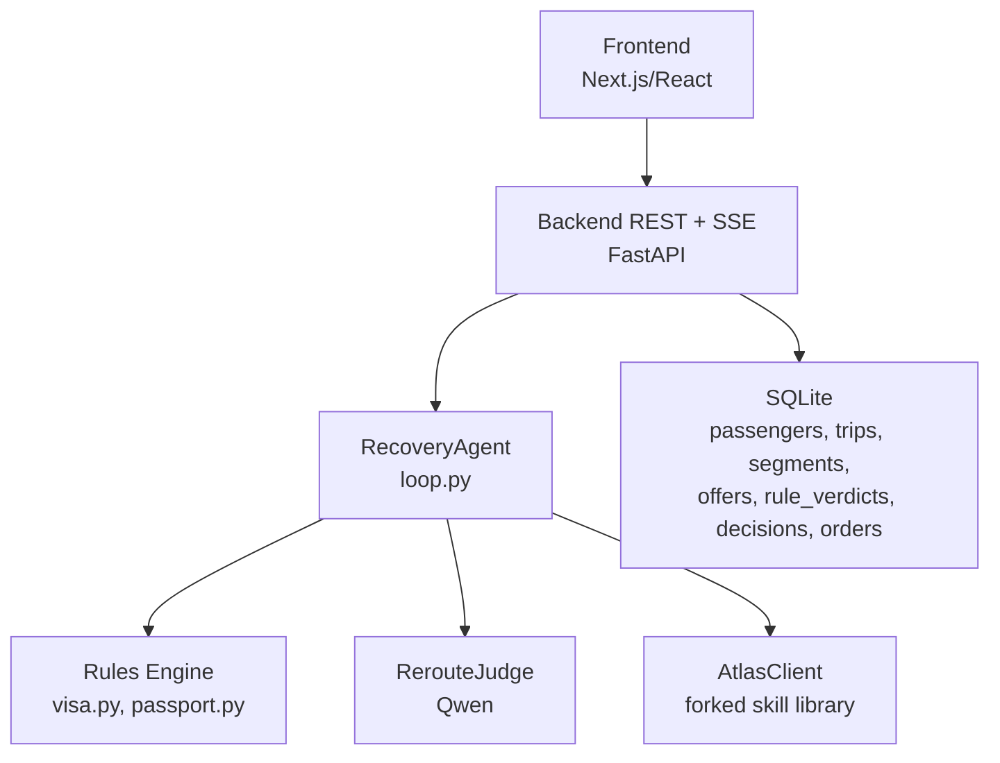
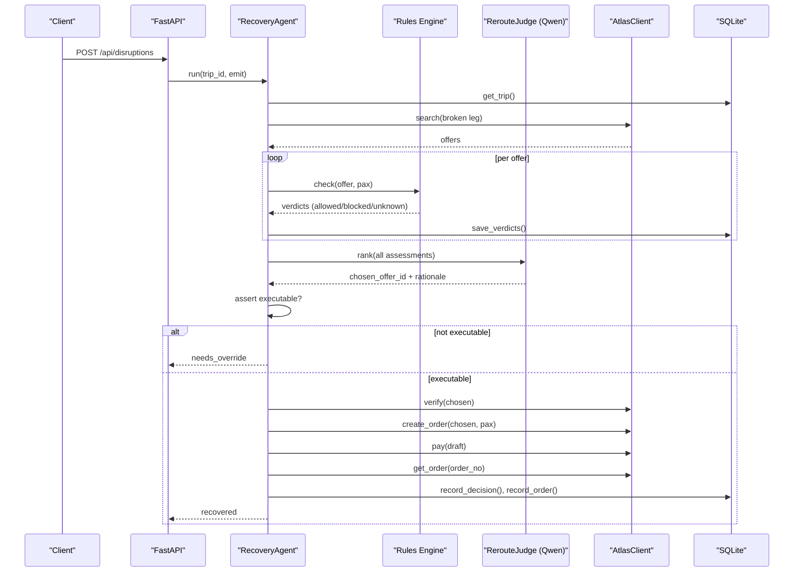
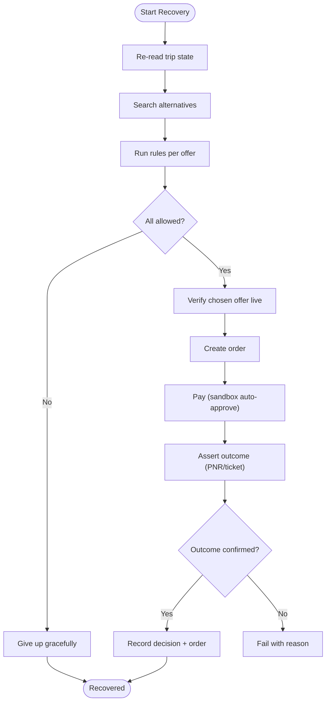
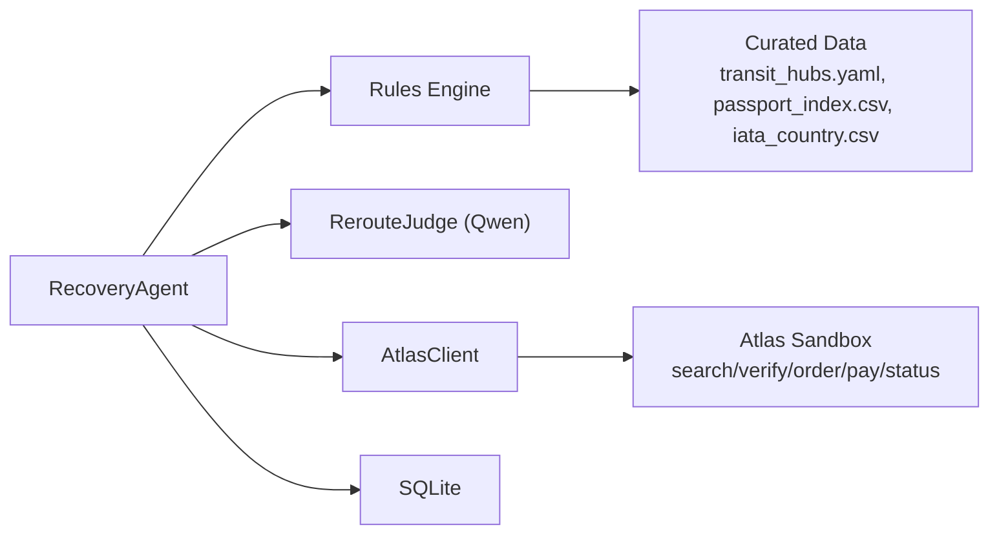

# Security & Safety

<cite>
**Referenced Files in This Document**
- [0003-advise-execute-two-gate-split.md](file://docs/adr/0003-advise-execute-two-gate-split.md)
- [02-architecture.md](file://docs/plans/waypoint/02-architecture.md)
- [03-program-design.md](file://docs/plans/waypoint/03-program-design.md)
- [error-handling.md](file://.agents/skills/atlas-flight-booking/references/error-handling.md)
- [passenger-input.md](file://.agents/skills/atlas-flight-booking/references/passenger-input.md)
- [booking-workflow.md](file://.agents/skills/atlas-flight-booking/references/booking-workflow.md)
</cite>

## Table of Contents
1. Introduction
2. Project Structure
3. Core Components
4. Architecture Overview
5. Detailed Component Analysis
6. Dependency Analysis
7. Performance Considerations
8. Troubleshooting Guide
9. Conclusion
10. Appendices

## Introduction
This document provides comprehensive security and safety guidance for the Waypoint system, focusing on its fail-closed architecture and safety guards. It explains the two-gate split that separates AI reasoning (advise = open) from execution (execute = fail-closed wall), details three critical agent-failure guards, outlines data privacy considerations for sensitive passenger information, documents compliance requirements for financial transactions and personal data handling, and describes monitoring and audit capabilities to track agent decisions and actions. It also addresses security implications of autonomous booking execution and safeguards for production deployment.

## Project Structure
Waypoint is organized into a frontend (Next.js/React) and a backend (Python FastAPI). The backend hosts the recovery agent loop, rules engine, Atlas integration, Qwen calls, and SQLite persistence. The design intentionally keeps deterministic code responsible for rules checks, fare-difference math, and order/pay execution, while the AI focuses on reroute judgment.

**Diagram sources**
- [02-architecture.md:1-56](file://docs/plans/waypoint/02-architecture.md#L1-L56)
- [03-program-design.md:9-32](file://docs/plans/waypoint/03-program-design.md#L9-L32)

**Section sources**
- [02-architecture.md:1-56](file://docs/plans/waypoint/02-architecture.md#L1-L56)
- [03-program-design.md:9-32](file://docs/plans/waypoint/03-program-design.md#L9-L32)

## Core Components
- Two-gate split: Advise gate is open; Execute gate is walled and fail-closed.
- RecoveryAgent orchestrates bounded steps with explicit give-up behavior.
- Rules engine enforces visa and passport validity with a three-state verdict model (allowed/blocked/unknown).
- RerouteJudge uses Qwen to rank legal options and narrate rejections.
- AtlasClient integrates with the forked Atlas skill for search, verify, order creation, payment, and outcome assertion.
- Persistence stores offers, rule verdicts, decisions, and orders for auditability.

Key responsibilities:
- Deterministic code owns rules, fare math, and settlement.
- AI owns reroute judgment only.
- Every step emits events via SSE for visibility and auditing.

**Section sources**
- [0003-advise-execute-two-gate-split.md:1-19](file://docs/adr/0003-advise-execute-two-gate-split.md#L1-L19)
- [03-program-design.md:3-8](file://docs/plans/waypoint/03-program-design.md#L3-L8)
- [03-program-design.md:57-123](file://docs/plans/waypoint/03-program-design.md#L57-L123)
- [02-architecture.md:13-31](file://docs/plans/waypoint/02-architecture.md#L13-L31)

## Architecture Overview
The system implements a strict separation between advice and execution:

- Advise gate: All alternatives are visible and labeled allowed/blocked/unknown by the rules engine. The AI reasons over all options and explains why it rejects risky or illegal ones.
- Execute gate: Only offers where every rule is allowed can be auto-booked and auto-settled. Blocked or unknown requires an explicit human override; code re-checks executability after the LLM picks.

**Diagram sources**
- [03-program-design.md:125-149](file://docs/plans/waypoint/03-program-design.md#L125-L149)
- [02-architecture.md:13-31](file://docs/plans/waypoint/02-architecture.md#L13-L31)

**Section sources**
- [0003-advise-execute-two-gate-split.md:1-19](file://docs/adr/0003-advise-execute-two-gate-split.md#L1-L19)
- [03-program-design.md:125-149](file://docs/plans/waypoint/03-program-design.md#L125-L149)

## Detailed Component Analysis

### Two-Gate Split: Advise vs Execute
- Advise gate: Open reasoning surface. The UI and AI see every alternative with labels and provenance. The AI narrates why it rejects cheap but illegal or unknown options.
- Execute gate: Fail-closed wall. Auto-booking and auto-settlement occur only when every rule is allowed. Any blocked or unknown option requires explicit human override. Code enforces this line; the LLM cannot cross it.

Security impact:
- Prevents unauthorized or unsafe actions from being executed autonomously.
- Ensures deterministic code controls funds settlement and ticketing outcomes.

**Section sources**
- [0003-advise-execute-two-gate-split.md:1-19](file://docs/adr/0003-advise-execute-two-gate-split.md#L1-L19)
- [03-program-design.md:3-8](file://docs/plans/waypoint/03-program-design.md#L3-L8)

### Three Critical Agent-Failure Guards
1. Infinite loop prevention through step budget and explicit give-up
   - The agent loop is bounded by a step budget; exceeding it triggers a graceful give-up with explanation.
2. Stale data protection through re-read/verify before writes
   - Before any write (order creation/payment), the system performs a live re-read/verify via Atlas to ensure current price and availability. For visa/transit rules without a live source, freshness windows are used as honest proxies; past window → unknown → fail-closed.
3. False success prevention through outcome assertion
   - After payment, the system asserts real outcomes by querying order status and confirming PNR/ticket issuance before marking success.

**Diagram sources**
- [03-program-design.md:125-149](file://docs/plans/waypoint/03-program-design.md#L125-L149)
- [02-architecture.md:34-49](file://docs/plans/waypoint/02-architecture.md#L34-L49)

**Section sources**
- [02-architecture.md:34-49](file://docs/plans/waypoint/02-architecture.md#L34-L49)
- [03-program-design.md:50-55](file://docs/plans/waypoint/03-program-design.md#L50-L55)

### Rules Engine and Data Freshness
- Three-state verdicts: allowed, blocked, unknown. Unknown is intentionally preserved to enforce fail-closed behavior.
- Curated transit hub table includes airside zone flags, nationality-specific allowances, max hours, source, and last_checked timestamps.
- Freshness windows: airside cells trusted ≤ 6 months; entry-fallback cells trusted ≤ 3 months. Past window → unknown → fail-closed.

Compliance and safety impact:
- Transparent labeling and provenance support auditability and compliance.
- Honest proxy for live verification avoids misleading claims about visa checks.

**Section sources**
- [03-program-design.md:34-48](file://docs/plans/waypoint/03-program-design.md#L34-L48)
- [03-program-design.md:50-55](file://docs/plans/waypoint/03-program-design.md#L50-L55)

### Booking Workflow and Payment Safeguards
- Authorization checks precede search work; present normalized offers and preserve selected offer IDs.
- Price changes handled explicitly: decreased continues without approval; increased requires new explicit confirmation.
- Passenger input collected minimally and delivered once via stdin; never echoed, saved, or logged.
- Order creation runs once; payment requires explicit user approval; subsequent status queries avoid duplicate payments.
- Side-effect uncertainty resolved by query-only rules; never retry order creation or payment automatically.

Financial compliance impact:
- Explicit confirmations and masked summaries reduce risk of unintended charges.
- Query-only recovery prevents double billing and ensures accurate state reconciliation.

**Section sources**
- [booking-workflow.md:1-63](file://.agents/skills/atlas-flight-booking/references/booking-workflow.md#L1-L63)
- [error-handling.md:1-74](file://.agents/skills/atlas-flight-booking/references/error-handling.md#L1-L74)

### Data Privacy for Sensitive Passenger Information
- Passenger fields include names, gender, birthday, nationality, and document details (type, number, issuing country, expiry).
- Collection rule: ask only required fields identified by verification responses; do not echo payloads; prefer one-time delivery via stdin; do not place personal values in shell commands.
- Safe correction: rebuild payload once with only missing fields; never repeat rejected personal data in explanations.

Privacy safeguards:
- Minimize exposure of sensitive data in logs and outputs.
- Avoid storing unnecessary personal data beyond what is required for booking and compliance.

**Section sources**
- [passenger-input.md:1-52](file://.agents/skills/atlas-flight-booking/references/passenger-input.md#L1-L52)

### Monitoring and Audit Capabilities
- Persistence schema includes:
  - rule_verdicts: per-offer rule checks with allowed/blocked/unknown, reason, and provenance.
  - decisions: chosen offer, rejected cheapest offer, rationale, step count, timestamp.
  - orders: offer mapping, external identifiers (order_no, PNR, ticket_number), fare difference, settled flag, ticket assertion status.
- SSE stream emits every step for live visibility and post-hoc analysis.

Auditability impact:
- Full trace of agent reasoning and deterministic enforcement supports compliance reviews and incident response.

**Section sources**
- [02-architecture.md:21-31](file://docs/plans/waypoint/02-architecture.md#L21-L31)
- [03-program-design.md:125-149](file://docs/plans/waypoint/03-program-design.md#L125-L149)

### Security Implications of Autonomous Booking Execution
- Autonomous booking occurs only in sandbox mode with auto-approval enabled; production must require explicit human approvals for payment and settlement.
- Deterministic code controls fare-difference math and settlement; AI is excluded from these steps to minimize risk.
- Outcome assertion ensures tickets are actually issued before marking success, preventing false positives.

Production safeguards:
- Enforce execute gate strictly; block auto-execution for blocked/unknown offers.
- Require explicit user approvals for payment and any overrides.
- Maintain robust logging and audit trails for all financial actions.

**Section sources**
- [02-architecture.md:8-11](file://docs/plans/waypoint/02-architecture.md#L8-L11)
- [03-program-design.md:125-149](file://docs/plans/waypoint/03-program-design.md#L125-L149)

## Dependency Analysis
Waypoint’s dependencies center around deterministic enforcement and safe external integrations:

Coupling and cohesion:
- High cohesion within RecoveryAgent for orchestration and guard enforcement.
- Low coupling between AI judgment and deterministic execution paths.
- External dependencies isolated behind AtlasClient with stable contracts.

Potential risks:
- Over-reliance on curated data freshness; mitigated by unknown→blocked policy and explicit freshness windows.
- External service instability; mitigated by retryable flags and query-only recovery rules.

**Diagram sources**
- [03-program-design.md:9-32](file://docs/plans/waypoint/03-program-design.md#L9-L32)
- [02-architecture.md:1-11](file://docs/plans/waypoint/02-architecture.md#L1-L11)

**Section sources**
- [03-program-design.md:9-32](file://docs/plans/waypoint/03-program-design.md#L9-L32)
- [02-architecture.md:1-11](file://docs/plans/waypoint/02-architecture.md#L1-L11)

## Performance Considerations
- Bounded agent loops prevent runaway resource consumption.
- Live verification reduces wasted downstream operations on stale offers.
- Minimal passenger input collection reduces I/O overhead and privacy exposure.
- SQLite persistence is lightweight for demo and small-scale deployments; consider scaling strategies for higher throughput.

[No sources needed since this section provides general guidance]

## Troubleshooting Guide
Common error scenarios and safe behaviors:
- Authorization issues: prompt for login or session refresh; stop polling until authorized.
- Subscription or ticketing blockers: present official links and wait for user action; do not guess activation steps.
- Search limits or expired offers: replay retained search once; collect new inputs if unavailable.
- Price changes: show old/new totals; require explicit confirmation for increases.
- Payment uncertainties: query order status using returned identifiers; never retry payment automatically.
- Ticketing pending: report processing status and provide order link when available; do not treat as failure.

Operational tips:
- Use normalized codes rather than parsing messages.
- Keep internal causes out of user-facing output.
- Respect retryable flags conservatively; never authorize different commands on retries.

**Section sources**
- [error-handling.md:1-74](file://.agents/skills/atlas-flight-booking/references/error-handling.md#L1-L74)
- [booking-workflow.md:1-63](file://.agents/skills/atlas-flight-booking/references/booking-workflow.md#L1-L63)

## Conclusion
Waypoint’s fail-closed architecture and three-agent-failure guards provide strong safety guarantees for autonomous disruption recovery. The two-gate split ensures AI reasoning remains open while execution stays conservative and deterministic. Robust privacy practices protect sensitive passenger data, and comprehensive auditability supports compliance and operational oversight. Production deployments should enforce explicit human approvals for financial actions and maintain strict adherence to the execute gate to prevent unauthorized bookings.

[No sources needed since this section summarizes without analyzing specific files]

## Appendices

### Compliance Requirements Summary
- Financial transactions:
  - Explicit user approval required before payment.
  - Masked summaries and clear price-change handling.
  - Query-only recovery to prevent duplicate charges.
- Personal data handling:
  - Minimal collection based on verified requirements.
  - One-time delivery via stdin; no echoing, saving, or logging of payloads.
  - Safe correction without repeating rejected personal data.

**Section sources**
- [booking-workflow.md:31-63](file://.agents/skills/atlas-flight-booking/references/booking-workflow.md#L31-L63)
- [passenger-input.md:1-52](file://.agents/skills/atlas-flight-booking/references/passenger-input.md#L1-L52)