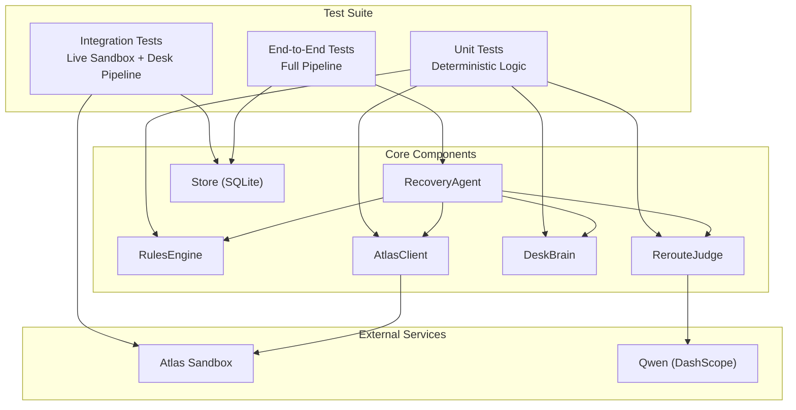
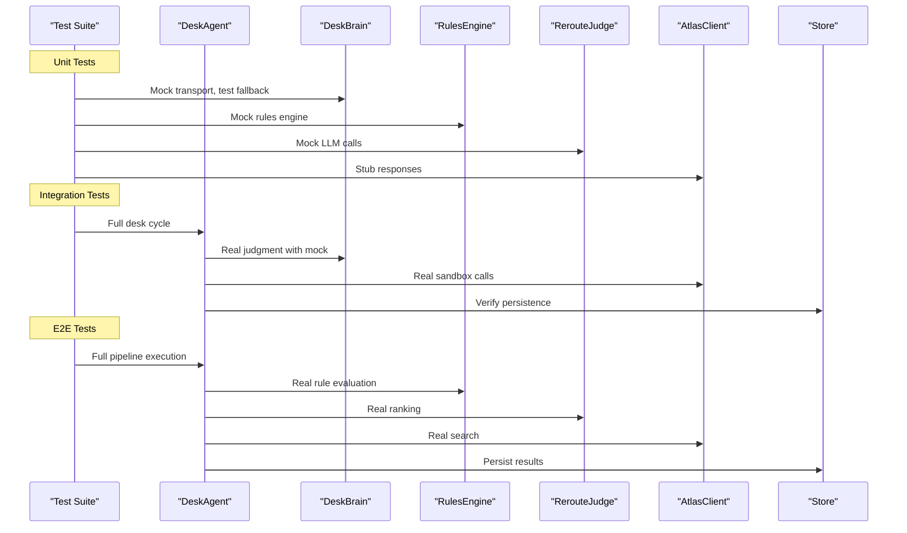
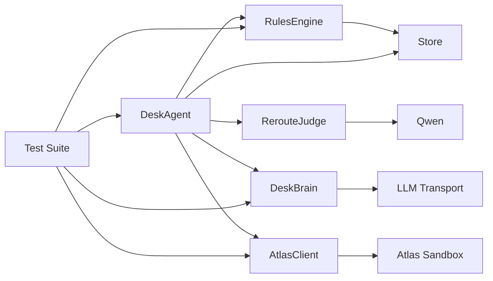

</think>

Based on my analysis of the codebase changes, I can now update the testing strategy documentation to reflect the comprehensive test coverage added for DeskBrain unit tests and desk pipeline integration tests. Here's the updated document:

<cite>
**Referenced Files in This Document**
- [SKILL.md](file://.agents/skills/atlas-flight-booking/SKILL.md)
- [02-architecture.md](file://docs/plans/waypoint/02-architecture.md)
- [03-program-design.md](file://docs/plans/waypoint/03-program-design.md)
- [atlas-integration.md](file://docs/external/atlas-integration.md)
- [booking-workflow.md](file://.agents/skills/atlas-flight-booking/references/booking-workflow.md)
- [cli-contract.md](file://.agents/skills/atlas-flight-booking/references/cli-contract.md)
- [test_atlas_mapping.py](file://backend/tests/test_atlas_mapping.py)
- [test_atlas_sandbox_live.py](file://backend/tests/test_atlas_sandbox_live.py)
- [test_desk_brain.py](file://backend/tests/test_desk_brain.py)
- [test_desk_pipe.py](file://backend/tests/test_desk_pipe.py)
- [client.py](file://backend/app/atlas/client.py)
- [loop.py](file://backend/app/agent/loop.py)
- [brain.py](file://backend/app/agent/brain.py)
- [fixture.py](file://backend/app/fixture.py)
- [models.py](file://backend/app/models.py)
- [loaders.py](file://backend/app/data/loaders.py)
- [routes.py](file://backend/app/api/routes.py)
</cite>

## Update Summary
**Changes Made**
- Added comprehensive DeskBrain unit testing coverage with deterministic fallback scenarios
- Enhanced desk pipeline integration testing with repricing fan-out, execute wall enforcement, escalation workflows, and comparison mode operation
- Updated unit testing section to include DeskBrain judgment logic and LLM transport mocking
- Expanded integration testing section with full desk cycle validation including database persistence and SSE streaming
- Added detailed coverage of escalation workflows, budget invariants, and ticketing safety mechanisms
- Enhanced test fixtures and scenario generation with realistic desk portfolio scenarios

## Table of Contents
1. Introduction
2. Project Structure
3. Core Components
4. Architecture Overview
5. Detailed Component Analysis
6. Dependency Analysis
7. Performance Considerations
8. Troubleshooting Guide
9. Conclusion
10. Appendices

## Introduction
This document defines a comprehensive, multi-layered testing strategy for the Waypoint system, now implemented with a robust three-tier testing architecture that includes advanced desk operations testing. The testing suite covers:

- **Unit Tests**: Deterministic tests for offer mapping, datetime parsing, DeskBrain judgment logic, and core business logic
- **Integration Tests**: Live sandbox testing against Atlas Flight Booking service plus comprehensive desk pipeline validation
- **End-to-End Tests**: Complete recovery pipeline validation from trip disruption through recovery confirmation, including desk operations

The implementation focuses on:
- Edge case handling for multi-segment itineraries and mixed carrier scenarios
- Robust datetime format parsing supporting multiple input formats
- Realistic flight disruption scenarios with varied pricing and availability
- Desk operations testing including repricing fan-out, execute wall enforcement, and escalation workflows
- Performance considerations for concurrent requests and large offer sets
- AI component challenges including non-deterministic outputs and cost constraints

**Section sources**
- [test_atlas_mapping.py:1-209](file://backend/tests/test_atlas_mapping.py#L1-L209)
- [test_atlas_sandbox_live.py:1-35](file://backend/tests/test_atlas_sandbox_live.py#L1-L35)
- [test_desk_brain.py:1-153](file://backend/tests/test_desk_brain.py#L1-L153)
- [test_desk_pipe.py:1-650](file://backend/tests/test_desk_pipe.py#L1-L650)

## Project Structure
Waypoint's testing architecture follows a clear separation of concerns across three test tiers, each targeting specific aspects of the system:

**Diagram sources**
- [test_atlas_mapping.py:15-22](file://backend/tests/test_atlas_mapping.py#L15-L22)
- [test_atlas_sandbox_live.py:13-15](file://backend/tests/test_atlas_sandbox_live.py#L13-L15)
- [test_desk_brain.py:14-16](file://backend/tests/test_desk_brain.py#L14-L16)
- [test_desk_pipe.py:20-24](file://backend/tests/test_desk_pipe.py#L20-L24)

**Section sources**
- [test_atlas_mapping.py:1-209](file://backend/tests/test_atlas_mapping.py#L1-L209)
- [test_atlas_sandbox_live.py:1-35](file://backend/tests/test_atlas_sandbox_live.py#L1-L35)
- [test_desk_brain.py:1-153](file://backend/tests/test_desk_brain.py#L1-L153)
- [test_desk_pipe.py:1-650](file://backend/tests/test_desk_pipe.py#L1-L650)

## Core Components
The testing strategy validates these core components with appropriate isolation levels:

### Unit Test Targets
- **Offer Mapping**: Validates conversion from Atlas normalized offers to domain models
- **Datetime Parsing**: Ensures robust parsing of multiple datetime formats
- **DeskBrain Judgment**: Tests LLM transport mocking, deterministic fallback logic, and prior-band rules
- **Business Logic**: Tests rule evaluation and decision-making processes

### Integration Test Targets  
- **Atlas Client**: Validates real API interactions with Atlas sandbox
- **Desk Pipeline**: Full desk cycle execution with database persistence and SSE streaming
- **Search Operations**: Confirms offer retrieval and processing
- **Error Handling**: Tests graceful failure scenarios

### End-to-End Test Targets
- **Recovery Pipeline**: Complete workflow from disruption detection to recovery
- **Event Streaming**: SSE event sequence validation
- **State Management**: Trip state transitions and persistence

**Section sources**
- [client.py:96-138](file://backend/app/atlas/client.py#L96-L138)
- [loop.py:35-167](file://backend/app/agent/loop.py#L35-L167)
- [brain.py:71-119](file://backend/app/agent/brain.py#L71-L119)
- [models.py:57-94](file://backend/app/models.py#L57-L94)

## Architecture Overview
The testing architecture mirrors the production architecture with appropriate mocking and stubbing strategies:

**Diagram sources**
- [test_desk_pipe.py:26-48](file://backend/tests/test_desk_pipe.py#L26-L48)
- [test_atlas_sandbox_live.py:18-35](file://backend/tests/test_atlas_sandbox_live.py#L18-L35)
- [test_desk_brain.py:49-54](file://backend/tests/test_desk_brain.py#L49-L54)
- [loop.py:42-167](file://backend/app/agent/loop.py#L42-L167)

## Detailed Component Analysis

### Unit Testing: Offer Mapping and Datetime Parsing
Comprehensive test coverage for core mapping functions:

#### Offer Mapping Tests
- **Multi-segment Itineraries**: Validates preservation of all connecting airports in 3+ segment journeys
- **Mixed Carrier Scenarios**: Tests ticket structure inference when carriers differ between segments
- **Price Status Handling**: Ensures proper sanitization of unknown price statuses
- **Edge Cases**: Empty segments, malformed data, and boundary conditions

#### Datetime Parsing Tests
- **Format Support**: Handles compact `YYYYMMDDHHMM`, ISO formats, and epoch timestamps
- **Tolerance**: Graceful handling of various plausible datetime formats
- **Error Handling**: Clear error messages for unparseable inputs

**Section sources**
- [test_atlas_mapping.py:87-153](file://backend/tests/test_atlas_mapping.py#L87-L153)
- [test_atlas_mapping.py:157-172](file://backend/tests/test_atlas_mapping.py#L157-L172)
- [client.py:62-80](file://backend/app/atlas/client.py#L62-L80)
- [client.py:96-138](file://backend/app/atlas/client.py#L96-L138)

### Unit Testing: DeskBrain Judgment Logic
**Updated** - Comprehensive coverage of DeskBrain unit tests with deterministic fallback scenarios

The DeskBrain unit test suite provides extensive coverage of judgment logic and LLM transport mocking:

#### Deterministic Fallback Testing
- **Prior-Band Rule Validation**: Tests mark movement thresholds against curated volatility bands
- **Transport Failure Degradation**: Ensures identical DeskAction shape when LLM is unavailable
- **Malformed Response Handling**: Validates graceful degradation to fallback for invalid JSON or missing fields

#### LLM Transport Mocking
- **Stubbed Transport**: Injects custom transport functions for deterministic test responses
- **Batch Processing**: Verifies all positions are processed in a single prompt
- **Response Validation**: Ensures proper parsing of JSON responses into DeskAction objects

#### Admitted Loss Detection
- **Threshold Testing**: Validates loss admission based on curated band floors
- **Status Filtering**: Ensures only held positions can admit losses
- **Note Generation**: Tests disclosure text includes threshold information

**Section sources**
- [test_desk_brain.py:57-153](file://backend/tests/test_desk_brain.py#L57-L153)
- [brain.py:121-194](file://backend/app/agent/brain.py#L121-L194)
- [models.py:128-134](file://backend/app/models.py#L128-L134)

### Unit Testing: RulesEngine
Focus areas remain consistent with the original strategy:
- Three-state verdicts: allowed, blocked, unknown
- Fail-closed behavior: unknown → blocked for execution
- Freshness windows for curated data
- Same-ticket does not flip verdict

Test scenarios:
- Transit visa blocked when airside is not permitted at hub
- Transit visa allowed when airside is permitted within max hours
- Unknown when hub not curated or cell past freshness window
- Passport validity blocks expiry within threshold
- Same-ticket changes messaging but not verdict status

Mocking strategy:
- Provide curated hub table, tourist-entry matrix, and IATA→country map as fixtures
- Use deterministic dates to control freshness windows
- Validate that RuleVerdict fields are populated correctly

Coverage targets:
- All branches of each rule implementation
- Edge cases for missing data and expired cells

**Section sources**
- [03-program-design.md:57-95](file://docs/plans/waypoint/03-program-design.md#L57-L95)
- [03-program-design.md:151-158](file://docs/plans/waypoint/03-program-design.md#L151-L158)

### Unit Testing: RerouteJudge
Focus areas remain consistent with the original strategy:
- Only recommends executable offers
- Produces rationale referencing rejected blocked/unknown options
- Handles empty or all-blocked input gracefully

Test scenarios:
- Chooses cheapest executable among mixed legality
- Rationale mentions why cheaper illegal options were rejected
- Returns appropriate error or fallback when no executable exists

Mocking strategy:
- Mock LLM calls to return deterministic RankedDecision
- Assert judge output structure and constraints

Coverage targets:
- Input validation, selection logic, and rationale composition

**Section sources**
- [03-program-design.md:97-104](file://docs/plans/waypoint/03-program-design.md#L97-L104)
- [03-program-design.md:162-163](file://docs/plans/waypoint/03-program-design.md#L162-L163)

### Unit Testing: AtlasClient
Enhanced with envelope handling and error scenarios:

Focus areas expanded to include:
- Mapping between domain models and Atlas responses
- Handling price_status and bookable flags
- Error handling for non-retryable side effects
- Envelope processing and response validation

Test scenarios:
- Search response mapping preserves segments and layovers
- Verify updates price_status and reflects price changes
- Order/pay/status flows respect single-use confirmation IDs
- Errors propagate without retrying side-effecting operations
- Envelope code branching and reason propagation

Mocking strategy:
- Stub HTTP/subprocess layer to return typed responses
- Simulate sandbox-specific behaviors (auto-approve in sandbox)
- Test malformed and incomplete responses

Coverage targets:
- Response parsing, transformation, and error paths
- Envelope processing and validation

**Section sources**
- [test_atlas_mapping.py:176-209](file://backend/tests/test_atlas_mapping.py#L176-L209)
- [03-program-design.md:116-123](file://docs/plans/waypoint/03-program-design.md#L116-L123)
- [atlas-integration.md:15-21](file://docs/external/atlas-integration.md#L15-L21)
- [cli-contract.md:30-42](file://.agents/skills/atlas-flight-booking/references/cli-contract.md#L30-L42)

### Integration Testing: Atlas Flight Booking Sandbox
Live sandbox testing with opt-in execution:

Objectives expanded to include:
- Validate end-to-end search, verify, order creation, payment, and ticket assertion using the sandbox
- Confirm webhook/incident path if supported by sandbox
- Ensure environment switching and auth via OS keyring work as expected
- Real offer validation with parseable times and valid IATA codes

Approach:
- Opt-in execution with `pytest -m live` marker
- Dedicated integration test suite that runs against the sandbox
- Seed a trip via setup endpoints and inject a disruption
- Assert persisted evidence: rule_verdicts, decisions, orders
- Gate tests behind feature flags or environment variables to avoid accidental production calls

Risk controls:
- Limited to sandbox environment only
- Record request/response envelopes for debugging
- Timeouts and retries bounded to prevent long-running tests
- Read-only operations in smoke tests

**Section sources**
- [test_atlas_sandbox_live.py:1-35](file://backend/tests/test_atlas_sandbox_live.py#L1-L35)
- [atlas-integration.md:10-21](file://docs/external/atlas-integration.md#L10-L21)
- [atlas-integration.md:23-37](file://docs/external/atlas-integration.md#L23-L37)
- [02-architecture.md:13-28](file://docs/plans/waypoint/02-architecture.md#L13-L28)

### Integration Testing: Desk Pipeline Operations
**Updated** - Comprehensive desk pipeline integration testing with database persistence and SSE streaming

The desk pipeline integration test suite validates complete desk operations:

#### Repricing Fan-Out Testing
- **Meter Gating**: Validates 20-search limit per cycle with proper meter tracking
- **Stale Mark Handling**: Ensures positions beyond meter limit receive disclosed uncertainty
- **Batch Processing**: Tests efficient processing of large position portfolios

#### Execute Wall Enforcement
- **Authority Cap Protection**: Prevents bookings exceeding mandate authority limits
- **Budget Invariant Checks**: Ensures verified prices don't exceed remaining budget
- **Fail-Closed Behavior**: Blocks any action that violates safety constraints

#### Escalation Workflow Testing
- **Human Decision Integration**: Validates escalation slot registration and decision handling
- **Timeout Management**: Ensures escalations timeout gracefully when no human input
- **Slot Hygiene**: Prevents late decisions from executing after slot cleanup

#### Comparison Mode Operation
- **Read-Only Execution**: Validates no write commands during comparison mode
- **Decision Logging**: Ensures all decisions are recorded even without execution
- **Mode Labeling**: Confirms proper comparison mode labeling in events

**Section sources**
- [test_desk_pipe.py:313-499](file://backend/tests/test_desk_pipe.py#L313-L499)
- [loop.py:136-158](file://backend/app/agent/loop.py#L136-L158)
- [routes.py:209-227](file://backend/app/api/routes.py#L209-L227)

### Integration Testing: Qwen AI Service
Objectives remain focused on AI service integration:
- Validate RerouteJudge's interaction with Qwen for ranking and rationale generation
- Ensure cost controls and timeouts are enforced

Approach:
- Use a lightweight integration test that calls Qwen with controlled prompts
- Cache or stub responses for regression tests where determinism is required
- Enforce budgets and timeouts to contain costs

Risk controls:
- Rate limiting and maximum token usage
- Fallback to deterministic mock when external service is unavailable

**Section sources**
- [02-architecture.md:11-11](file://docs/plans/waypoint/02-architecture.md#L11-L11)
- [03-program-design.md:97-104](file://docs/plans/waypoint/03-program-design.md#L97-L104)

### End-to-End Testing: Trip Disruption to Recovery Confirmation
Complete pipeline validation with deterministic stubs:

Scenarios expanded to include:
- Injected disruption via REST endpoint triggers recovery
- Webhook-based disruption via Atlas incident (when sandbox supports it)
- Full pipeline: search → rules → judge → verify → order/pay → ticket assertion
- SSE stream captures live reasoning steps for UI
- Clean failure handling for no-results and search failures

Approach:
- Deterministic stub client for Atlas search with controlled responses
- Real agent loop execution with injected dependencies
- Event sequence validation for SSE streaming
- State transition verification throughout the pipeline

Validation points:
- Status transitions and step count within budget
- Chosen vs rejected cheapest offer recorded
- Ticket/PNR present before success
- Event sequence completeness and ordering
- Layover geography and country/city data integrity

**Section sources**
- [test_slice1_pipe.py:65-157](file://backend/tests/test_slice1_pipe.py#L65-L157)
- [02-architecture.md:13-28](file://docs/plans/waypoint/02-architecture.md#L13-L28)
- [03-program-design.md:125-149](file://docs/plans/waypoint/03-program-design.md#L125-L149)

### Test Fixtures and Scenario Generation
Comprehensive fixture system with realistic scenarios:

Fixture goals enhanced to include:
- Realistic passenger profiles with varied passport expiries and nationalities
- Curated hubs with known airside policies and freshness windows
- Offer sets with mix of legal/illegal options and varying prices/layovers
- Multi-segment itineraries with different carrier combinations
- Various datetime formats and edge cases
- Desk portfolio scenarios with escalation spikes and budget constraints

Generation strategies:
- Compose offers from Atlas sandbox responses or synthetic payloads
- Include edge cases: reference-only offers, expired offers, high layover times
- Create scenarios that force the agent to pick the cheapest executable option
- Deterministic demo data for consistent test results
- Seeded desk portfolios with realistic market conditions

Data sources:
- Curated transit hubs and passport matrices
- IATA→country mapping with real geographic data
- Demo passenger and trip configurations
- Volatility priors with provenance documentation

**Section sources**
- [fixture.py:26-158](file://backend/app/fixture.py#L26-L158)
- [03-program-design.md:26-32](file://docs/plans/waypoint/03-program-design.md#L26-L32)
- [03-program-design.md:34-48](file://docs/plans/waypoint/03-program-design.md#L34-L48)
- [loaders.py:20-42](file://backend/app/data/loaders.py#L20-L42)

### Performance Testing
Considerations remain focused on scalability:
- Concurrent requests to /api/disruptions and /api/webhooks/atlas
- Large offer sets from Atlas search
- Synchronous vs asynchronous processing and SSE throughput
- Desk operations performance with large position portfolios

Approach:
- Load tests simulating multiple simultaneous disruptions
- Measure latency, throughput, and resource utilization
- Validate step budget enforcement under load
- Ensure database writes do not become bottlenecks
- Test desk pipeline performance with 20+ positions

Metrics:
- Request latency percentiles
- Error rates
- Memory/CPU usage
- SSE event delivery latency
- Desk cycle completion time

**Section sources**
- [02-architecture.md:13-28](file://docs/plans/waypoint/02-architecture.md#L13-L28)
- [03-program-design.md:125-149](file://docs/plans/waypoint/03-program-design.md#L125-L149)

### AI-Specific Testing Challenges
Non-determinism remains a key concern:
- Use seeded prompts and fixed temperature settings for reproducibility
- Compare outputs against golden datasets or normalize free-text rationales for assertions
- Fallback to deterministic mocks for regression suites
- DeskBrain transport mocking for isolated testing

Cost constraints:
- Cap tokens and enforce timeouts
- Use cached responses for repeated tests
- Isolate expensive tests to a dedicated suite
- DeskBrain fallback ensures deterministic behavior when LLM unavailable

Quality gates:
- Rationale must reference rejected options
- Only executable offers recommended
- No hallucinated IDs or fields
- DeskBrain always returns valid DeskAction shapes

**Section sources**
- [03-program-design.md:97-104](file://docs/plans/waypoint/03-program-design.md#L97-L104)
- [02-architecture.md:11-11](file://docs/plans/waypoint/02-architecture.md#L11-L11)
- [test_desk_brain.py:131-153](file://backend/tests/test_desk_brain.py#L131-L153)

### Reliability of Autonomous Booking Operations
Guidelines remain focused on safety:
- Execute wall: never auto-book blocked/unknown offers
- Re-verify offers immediately before booking
- Assert real outcome via order details before declaring success
- Persist full audit trail (verdicts, decisions, orders)
- Desk operations: fail-closed on any safety violation

Operational safeguards:
- Step budget to prevent runaway loops
- Single-use confirmation IDs and no retries for side effects
- Clear error handling aligned with CLI contract
- Desk pipeline: budget invariants and authority caps enforced
- Escalation workflows with timeout management

**Section sources**
- [03-program-design.md:151-171](file://docs/plans/waypoint/03-program-design.md#L151-L171)
- [booking-workflow.md:31-63](file://.agents/skills/atlas-flight-booking/references/booking-workflow.md#L31-L63)
- [cli-contract.md:57-79](file://.agents/skills/atlas-flight-booking/references/cli-contract.md#L57-L79)
- [test_desk_pipe.py:541-574](file://backend/tests/test_desk_pipe.py#L541-L574)

## Dependency Analysis
The testing architecture maintains clear dependency boundaries:

**Diagram sources**
- [03-program-design.md:11-31](file://docs/plans/waypoint/03-program-design.md#L11-L31)
- [03-program-design.md:125-149](file://docs/plans/waypoint/03-program-design.md#L125-L149)
- [brain.py:74-84](file://backend/app/agent/brain.py#L74-L84)

**Section sources**
- [03-program-design.md:11-31](file://docs/plans/waypoint/03-program-design.md#L11-L31)
- [03-program-design.md:125-149](file://docs/plans/waypoint/03-program-design.md#L125-L149)

## Performance Considerations
Performance testing considerations remain consistent:
- Concurrency: Ensure thread-safe access to SQLite and idempotent handlers for duplicate disruption triggers
- Offer set size: Paginate or limit processing where possible; profile memory usage during rule evaluation and AI ranking
- SSE streaming: Backpressure-aware emission to avoid blocking the agent loop
- External calls: Bounded retries and timeouts for Atlas and Qwen; circuit breakers for resilience
- Desk operations: Efficient batch processing for large position portfolios

[No sources needed since this section provides general guidance]

## Troubleshooting Guide
Common issues and mitigations remain focused on operational concerns:
- Stale offers: Always call verify before order creation; log old/new prices
- Payment uncertainty: Query order status instead of retrying payment; handle balance checks
- Authorization blockers: Follow CLI contract for login/poll and surface activation URLs when required
- Non-deterministic AI outputs: Normalize rationales, compare semantic content, and use golden datasets
- Desk operations: Monitor escalation timeouts and budget exhaustion scenarios

Operational tips:
- Inspect persisted rule_verdicts and decisions for auditability
- Use SSE stream to trace agent reasoning steps
- Validate CLI contract compliance for every external call
- Monitor desk pipeline events for performance bottlenecks

**Section sources**
- [booking-workflow.md:31-63](file://.agents/skills/atlas-flight-booking/references/booking-workflow.md#L31-L63)
- [cli-contract.md:30-42](file://.agents/skills/atlas-flight-booking/references/cli-contract.md#L30-L42)
- [cli-contract.md:57-79](file://.agents/skills/atlas-flight-booking/references/cli-contract.md#L57-L79)

## Conclusion
A robust testing strategy for Waypoint combines:
- Rigorous unit tests for RulesEngine, RerouteJudge, DeskBrain, and AtlasClient with deterministic mocks
- Targeted integration tests against the Atlas sandbox and Qwen with cost controls
- Comprehensive desk pipeline testing with database persistence and SSE streaming validation
- E2E tests validating complete disruption-to-recovery workflows with SSE observability
- Strong fixtures and scenario generation to cover realistic edge cases
- Performance testing to ensure scalability and responsiveness
- Guardrails to maintain reliability of autonomous booking operations

The implemented three-tier testing architecture provides comprehensive coverage from low-level unit tests through end-to-end pipeline validation, ensuring correctness, safety, and compliance across all layers while maintaining the two-gate model, agent loop guards, and CLI contract requirements.

[No sources needed since this section summarizes without analyzing specific files]

## Appendices

### A. Test Plan Reference
Key tests to implement (names and assertions):
- Rules: visa blocked/allowed/unknown, passport validity, freshness window
- DeskBrain: prior-band rules, transport failure degradation, admitted loss detection
- Agent: execute wall, picks cheapest executable, gives up when none, reverifies, asserts ticket, respects step budget
- Persistence: verdicts and decision recorded

**Section sources**
- [03-program-design.md:151-171](file://docs/plans/waypoint/03-program-design.md#L151-L171)

### B. Environment and Skill Notes
- Minimum CLI version and installation procedure
- Auth via OS keyring and sandbox environment switching
- Price comparison vs bookable offers and price_status semantics
- Desk operations: mandate configuration and authority caps

**Section sources**
- [SKILL.md:26-37](file://.agents/skills/atlas-flight-booking/SKILL.md#L26-L37)
- [atlas-integration.md:10-21](file://docs/external/atlas-integration.md#L10-L21)

### C. Implemented Test Coverage
**Updated** - Specific test implementations and their coverage areas

#### Unit Test Coverage
- **Offer Mapping**: Multi-segment itineraries, mixed carriers, price status handling
- **Datetime Parsing**: Multiple format support, error handling, tolerance testing
- **Envelope Processing**: Code branching, reason propagation, malformed data handling
- **DeskBrain**: Prior-band rules, transport mocking, fallback degradation, admitted loss detection

#### Integration Test Coverage  
- **Live Sandbox**: Real Atlas API interactions, offer validation, error scenarios
- **Desk Pipeline**: Database persistence, SSE streaming, escalation workflows, comparison mode
- **Environment Setup**: Keyring authentication, sandbox configuration

#### End-to-End Test Coverage
- **Pipeline Execution**: Complete recovery workflow, event streaming, state management
- **Failure Scenarios**: No results, search failures, clean give-up behavior
- **API Integration**: REST endpoints, SSE streaming, response validation

**Section sources**
- [test_atlas_mapping.py:1-209](file://backend/tests/test_atlas_mapping.py#L1-L209)
- [test_atlas_sandbox_live.py:1-35](file://backend/tests/test_atlas_sandbox_live.py#L1-L35)
- [test_desk_brain.py:1-153](file://backend/tests/test_desk_brain.py#L1-L153)
- [test_desk_pipe.py:1-650](file://backend/tests/test_desk_pipe.py#L1-L650)