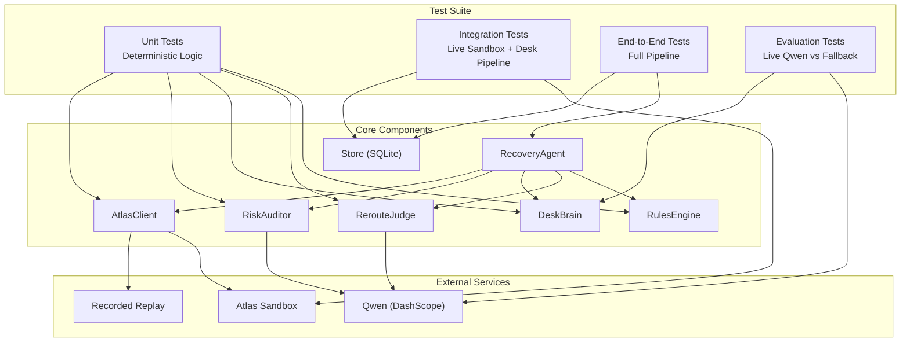
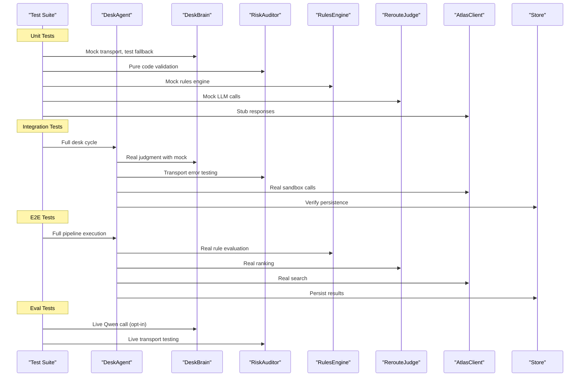
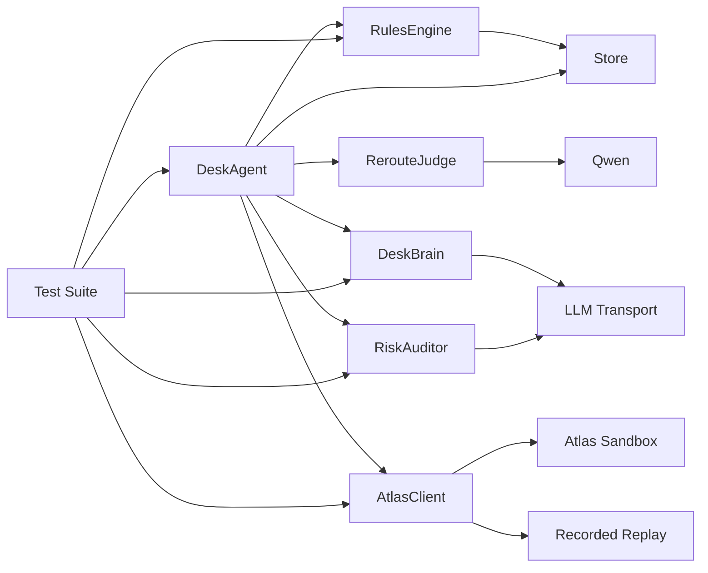

# Testing Strategy

<cite>
**Referenced Files in This Document**
- [SKILL.md](file://.agents/skills/atlas-flight-booking/SKILL.md)
- [02-architecture.md](file://docs/plans/waypoint/02-architecture.md)
- [03-program-design.md](file://docs/plans/waypoint/03-program-design.md)
- [atlas-integration.md](file://docs/external/atlas-integration.md)
- [booking-workflow.md](file://.agents/skills/atlas-flight-booking/references/booking-workflow.md)
- [cli-contract.md](file://.agents/skills/atlas-flight-booking/references/cli-contract.md)
- [test_atlas_mapping.py](file://backend/tests/test_atlas_mapping.py)
- [test_atlas_sandbox_live.py](file://backend/tests/test_atlas_sandbox_live.py)
- [test_desk_brain.py](file://backend/tests/test_desk_brain.py)
- [test_desk_pipe.py](file://backend/tests/test_desk_pipe.py)
- [test_injection_containment.py](file://backend/tests/test_injection_containment.py)
- [test_recorded_determinism.py](file://backend/tests/test_recorded_determinism.py)
- [test_recorded_mode.py](file://backend/tests/test_recorded_mode.py)
- [test_auditor.py](file://backend/tests/test_auditor.py)
- [test_brain_eval.py](file://backend/tests/evals/test_brain_eval.py)
- [brain_cases.py](file://backend/tests/evals/brain_cases.py)
- [client.py](file://backend/app/atlas/client.py)
- [recorded.py](file://backend/app/atlas/recorded.py)
- [loop.py](file://backend/app/agent/loop.py)
- [brain.py](file://backend/app/agent/brain.py)
- [auditor.py](file://backend/app/agent/auditor.py)
- [fixture.py](file://backend/app/fixture.py)
- [models.py](file://backend/app/models.py)
- [loaders.py](file://backend/app/data/loaders.py)
- [routes.py](file://backend/app/api/routes.py)
- [provenance.py](file://backend/app/provenance.py)
- [build_replay_manifest.py](file://backend/scripts/build_replay_manifest.py)
- [prewarm.py](file://backend/scripts/prewarm.py)
- [pytest.ini](file://backend/pytest.ini)
</cite>

## Update Summary
**Changes Made**
- Added comprehensive brain evaluation harnesses with opt-in live Qwen testing against deterministic fallback
- Enhanced injection containment tests covering byte-identity verification, fake envelope text attacks, and hostile shape matrix validation
- Expanded recorded-mode determinism verification with byte-identical cycle comparison and late subscriber parity testing
- Added 103+ new tests covering auditor functionality including pure-code fallback validation, transport error degradation, and plain challenge generation
- Updated test infrastructure with pytest markers for live and eval test isolation
- Enhanced replay manifest building and provenance tracking for recorded mode operations

## Table of Contents
1. Introduction
2. Project Structure
3. Core Components
4. Architecture Overview
5. Detailed Component Analysis
6. Dependency Analysis
7. Performance Considerations
8. Troubleshooting Guide
9. Conclusion
10. Appendices

## Introduction
This document defines a comprehensive, multi-layered testing strategy for the Waypoint system, now implemented with a robust four-tier testing architecture that includes advanced desk operations testing, brain evaluation harnesses, injection containment validation, and recorded-mode determinism verification. The testing suite covers:

- **Unit Tests**: Deterministic tests for offer mapping, datetime parsing, DeskBrain judgment logic, auditor functionality, and core business logic
- **Integration Tests**: Live sandbox testing against Atlas Flight Booking service plus comprehensive desk pipeline validation with injection containment
- **End-to-End Tests**: Complete recovery pipeline validation from trip disruption through recovery confirmation, including desk operations and recorded-mode replay
- **Evaluation Tests**: Opt-in live Qwen testing against deterministic fallback with structural band validation

The implementation focuses on:
- Edge case handling for multi-segment itineraries and mixed carrier scenarios
- Robust datetime format parsing supporting multiple input formats
- Realistic flight disruption scenarios with varied pricing and availability
- Desk operations testing including repricing fan-out, execute wall enforcement, and escalation workflows
- Injection containment validation ensuring compromised AI outputs cannot bypass safety controls
- Recorded-mode determinism verification guaranteeing byte-identical replay behavior
- Performance considerations for concurrent requests and large offer sets
- AI component challenges including non-deterministic outputs and cost constraints

**Section sources**
- [test_atlas_mapping.py:1-209](file://backend/tests/test_atlas_mapping.py#L1-L209)
- [test_atlas_sandbox_live.py:1-35](file://backend/tests/test_atlas_sandbox_live.py#L1-L35)
- [test_desk_brain.py:1-153](file://backend/tests/test_desk_brain.py#L1-L153)
- [test_desk_pipe.py:1-650](file://backend/tests/test_desk_pipe.py#L1-L650)
- [test_injection_containment.py:1-537](file://backend/tests/test_injection_containment.py#L1-L537)
- [test_recorded_determinism.py:1-249](file://backend/tests/test_recorded_determinism.py#L1-L249)
- [test_auditor.py:1-299](file://backend/tests/test_auditor.py#L1-L299)
- [test_brain_eval.py:1-195](file://backend/tests/evals/test_brain_eval.py#L1-L195)

## Project Structure
Waypoint's testing architecture follows a clear separation of concerns across four test tiers, each targeting specific aspects of the system:

**Diagram sources**
- [test_atlas_mapping.py:15-22](file://backend/tests/test_atlas_mapping.py#L15-L22)
- [test_atlas_sandbox_live.py:13-15](file://backend/tests/test_atlas_sandbox_live.py#L13-L15)
- [test_desk_brain.py:14-16](file://backend/tests/test_desk_brain.py#L14-L16)
- [test_desk_pipe.py:20-24](file://backend/tests/test_desk_pipe.py#L20-24)
- [test_injection_containment.py:31-45](file://backend/tests/test_injection_containment.py#L31-L45)
- [test_recorded_determinism.py:33-41](file://backend/tests/test_recorded_determinism.py#L33-L41)
- [test_auditor.py:17-26](file://backend/tests/test_auditor.py#L17-L26)
- [test_brain_eval.py:36-40](file://backend/tests/evals/test_brain_eval.py#L36-L40)

**Section sources**
- [test_atlas_mapping.py:1-209](file://backend/tests/test_atlas_mapping.py#L1-L209)
- [test_atlas_sandbox_live.py:1-35](file://backend/tests/test_atlas_sandbox_live.py#L1-L35)
- [test_desk_brain.py:1-153](file://backend/tests/test_desk_brain.py#L1-L153)
- [test_desk_pipe.py:1-650](file://backend/tests/test_desk_pipe.py#L1-L650)
- [test_injection_containment.py:1-537](file://backend/tests/test_injection_containment.py#L1-L537)
- [test_recorded_determinism.py:1-249](file://backend/tests/test_recorded_determinism.py#L1-L249)
- [test_auditor.py:1-299](file://backend/tests/test_auditor.py#L1-L299)
- [test_brain_eval.py:1-195](file://backend/tests/evals/test_brain_eval.py#L1-L195)

## Core Components
The testing strategy validates these core components with appropriate isolation levels:

### Unit Test Targets
- **Offer Mapping**: Validates conversion from Atlas normalized offers to domain models
- **Datetime Parsing**: Ensures robust parsing of multiple datetime formats
- **DeskBrain Judgment**: Tests LLM transport mocking, deterministic fallback logic, and prior-band rules
- **Risk Auditor**: Validates pure-code fallback generation, transport error degradation, and plain challenge creation
- **Business Logic**: Tests rule evaluation and decision-making processes

### Integration Test Targets  
- **Atlas Client**: Validates real API interactions with Atlas sandbox
- **Desk Pipeline**: Full desk cycle execution with database persistence and SSE streaming
- **Injection Containment**: Verifies compromised AI outputs cannot bypass safety controls
- **Search Operations**: Confirms offer retrieval and processing
- **Error Handling**: Tests graceful failure scenarios

### End-to-End Test Targets
- **Recovery Pipeline**: Complete workflow from disruption detection to recovery
- **Event Streaming**: SSE event sequence validation
- **State Management**: Trip state transitions and persistence
- **Recorded Mode**: Byte-identical replay verification and late subscriber parity

### Evaluation Test Targets
- **Live Qwen Testing**: Opt-in testing against real Qwen service with cost controls
- **Structural Band Validation**: Verifies AI outputs fall within expected action bands
- **Fallback Agreement**: Measures agreement rate between live and deterministic responses
- **Execute Wall Overrule**: Validates safety controls override unsafe AI recommendations

**Section sources**
- [client.py:96-138](file://backend/app/atlas/client.py#L96-L138)
- [loop.py:35-167](file://backend/app/agent/loop.py#L35-L167)
- [brain.py:71-119](file://backend/app/agent/brain.py#L71-L119)
- [auditor.py:17-26](file://backend/tests/test_auditor.py#L17-L26)
- [models.py:57-94](file://backend/app/models.py#L57-L94)

## Architecture Overview
The testing architecture mirrors the production architecture with appropriate mocking and stubbing strategies:

**Diagram sources**
- [test_desk_pipe.py:26-48](file://backend/tests/test_desk_pipe.py#L26-L48)
- [test_atlas_sandbox_live.py:18-35](file://backend/tests/test_atlas_sandbox_live.py#L18-L35)
- [test_desk_brain.py:49-54](file://backend/tests/test_desk_brain.py#L49-L54)
- [test_auditor.py:143-172](file://backend/tests/test_auditor.py#L143-L172)
- [test_brain_eval.py:105-145](file://backend/tests/evals/test_brain_eval.py#L105-L145)
- [loop.py:42-167](file://backend/app/agent/loop.py#L42-L167)

## Detailed Component Analysis

### Unit Testing: Offer Mapping and Datetime Parsing
Comprehensive test coverage for core mapping functions:

#### Offer Mapping Tests
- **Multi-segment Itineraries**: Validates preservation of all connecting airports in 3+ segment journeys
- **Mixed Carrier Scenarios**: Tests ticket structure inference when carriers differ between segments
- **Price Status Handling**: Ensures proper sanitization of unknown price statuses
- **Edge Cases**: Empty segments, malformed data, and boundary conditions

#### Datetime Parsing Tests
- **Format Support**: Handles compact `YYYYMMDDHHMM`, ISO formats, and epoch timestamps
- **Tolerance**: Graceful handling of various plausible datetime formats
- **Error Handling**: Clear error messages for unparseable inputs

**Section sources**
- [test_atlas_mapping.py:87-153](file://backend/tests/test_atlas_mapping.py#L87-L153)
- [test_atlas_mapping.py:157-172](file://backend/tests/test_atlas_mapping.py#L157-L172)
- [client.py:62-80](file://backend/app/atlas/client.py#L62-L80)
- [client.py:96-138](file://backend/app/atlas/client.py#L96-L138)

### Unit Testing: DeskBrain Judgment Logic
**Updated** - Comprehensive coverage of DeskBrain unit tests with deterministic fallback scenarios

The DeskBrain unit test suite provides extensive coverage of judgment logic and LLM transport mocking:

#### Deterministic Fallback Testing
- **Prior-Band Rule Validation**: Tests mark movement thresholds against curated volatility bands
- **Transport Failure Degradation**: Ensures identical DeskAction shape when LLM is unavailable
- **Malformed Response Handling**: Validates graceful degradation to fallback for invalid JSON or missing fields

#### LLM Transport Mocking
- **Stubbed Transport**: Injects custom transport functions for deterministic test responses
- **Batch Processing**: Verifies all positions are processed in a single prompt
- **Response Validation**: Ensures proper parsing of JSON responses into DeskAction objects

#### Admitted Loss Detection
- **Threshold Testing**: Validates loss admission based on curated band floors
- **Status Filtering**: Ensures only held positions can admit losses
- **Note Generation**: Tests disclosure text includes threshold information

**Section sources**
- [test_desk_brain.py:57-153](file://backend/tests/test_desk_brain.py#L57-L153)
- [brain.py:121-194](file://backend/app/agent/brain.py#L121-L194)
- [models.py:128-134](file://backend/app/models.py#L128-L134)

### Unit Testing: Risk Auditor Functionality
**New** - Comprehensive auditor testing with pure-code fallback validation

The Risk Auditor test suite validates the complete auditor functionality:

#### Pure-Code Fallback Validation
- **Worst Delta Position Identification**: Tests accurate identification of worst performing positions
- **Breach Count Quoting**: Validates code-computed breach counts are quoted correctly
- **Deterministic Output**: Ensures same inputs always produce same output lines
- **Empty Blotter Handling**: Tests graceful handling of empty position lists

#### Transport Error Degradation
- **Runtime Error Handling**: Validates fallback activation on transport failures
- **Timeout Protection**: Ensures slow transports don't hang the system
- **Garbage Output Handling**: Tests various malformed response formats
- **Type Safety**: Validates non-string replies degrade gracefully

#### Plain Challenge Generation
- **Over-Cap Detection**: Tests identification of mandate authority violations
- **Waived Trade Exemption**: Validates human-approved trades are exempt from challenges
- **Sign-Aware Messaging**: Tests different messaging for gains vs losses
- **Clean Run Detection**: Identifies when no policy breaches exist

**Section sources**
- [test_auditor.py:110-138](file://backend/tests/test_auditor.py#L110-L138)
- [test_auditor.py:174-234](file://backend/tests/test_auditor.py#L174-L234)
- [test_auditor.py:248-299](file://backend/tests/test_auditor.py#L248-L299)
- [auditor.py:17-26](file://backend/tests/test_auditor.py#L17-L26)

### Unit Testing: RulesEngine
Focus areas remain consistent with the original strategy:
- Three-state verdicts: allowed, blocked, unknown
- Fail-closed behavior: unknown → blocked for execution
- Freshness windows for curated data
- Same-ticket does not flip verdict

Test scenarios:
- Transit visa blocked when airside is not permitted at hub
- Transit visa allowed when airside is permitted within max hours
- Unknown when hub not curated or cell past freshness window
- Passport validity blocks expiry within threshold
- Same-ticket changes messaging but not verdict status

Mocking strategy:
- Provide curated hub table, tourist-entry matrix, and IATA→country map as fixtures
- Use deterministic dates to control freshness windows
- Validate that RuleVerdict fields are populated correctly

Coverage targets:
- All branches of each rule implementation
- Edge cases for missing data and expired cells

**Section sources**
- [03-program-design.md:57-95](file://docs/plans/waypoint/03-program-design.md#L57-L95)
- [03-program-design.md:151-158](file://docs/plans/waypoint/03-program-design.md#L151-L158)

### Unit Testing: RerouteJudge
Focus areas remain consistent with the original strategy:
- Only recommends executable offers
- Produces rationale referencing rejected blocked/unknown options
- Handles empty or all-blocked input gracefully

Test scenarios:
- Chooses cheapest executable among mixed legality
- Rationale mentions why cheaper illegal options were rejected
- Returns appropriate error or fallback when no executable exists

Mocking strategy:
- Mock LLM calls to return deterministic RankedDecision
- Assert judge output structure and constraints

Coverage targets:
- Input validation, selection logic, and rationale composition

**Section sources**
- [03-program-design.md:97-104](file://docs/plans/waypoint/03-program-design.md#L97-L104)
- [03-program-design.md:162-163](file://docs/plans/waypoint/03-program-design.md#L162-L163)

### Unit Testing: AtlasClient
Enhanced with envelope handling and error scenarios:

Focus areas expanded to include:
- Mapping between domain models and Atlas responses
- Handling price_status and bookable flags
- Error handling for non-retryable side effects
- Envelope processing and response validation

Test scenarios:
- Search response mapping preserves segments and layovers
- Verify updates price_status and reflects price changes
- Order/pay/status flows respect single-use confirmation IDs
- Errors propagate without retrying side-effecting operations
- Envelope code branching and reason propagation

Mocking strategy:
- Stub HTTP/subprocess layer to return typed responses
- Simulate sandbox-specific behaviors (auto-approve in sandbox)
- Test malformed and incomplete responses

Coverage targets:
- Response parsing, transformation, and error paths
- Envelope processing and validation

**Section sources**
- [test_atlas_mapping.py:176-209](file://backend/tests/test_atlas_mapping.py#L176-L209)
- [03-program-design.md:116-123](file://docs/plans/waypoint/03-program-design.md#L116-L123)
- [atlas-integration.md:15-21](file://docs/external/atlas-integration.md#L15-L21)
- [cli-contract.md:30-42](file://.agents/skills/atlas-flight-booking/references/cli-contract.md#L30-L42)

### Integration Testing: Atlas Flight Booking Sandbox
Live sandbox testing with opt-in execution:

Objectives expanded to include:
- Validate end-to-end search, verify, order creation, payment, and ticket assertion using the sandbox
- Confirm webhook/incident path if supported by sandbox
- Ensure environment switching and auth via OS keyring work as expected
- Real offer validation with parseable times and valid IATA codes

Approach:
- Opt-in execution with `pytest -m live` marker
- Dedicated integration test suite that runs against the sandbox
- Seed a trip via setup endpoints and inject a disruption
- Assert persisted evidence: rule_verdicts, decisions, orders
- Gate tests behind feature flags or environment variables to avoid accidental production calls

Risk controls:
- Limited to sandbox environment only
- Record request/response envelopes for debugging
- Timeouts and retries bounded to prevent long-running tests
- Read-only operations in smoke tests

**Section sources**
- [test_atlas_sandbox_live.py:1-35](file://backend/tests/test_atlas_sandbox_live.py#L1-L35)
- [atlas-integration.md:10-21](file://docs/external/atlas-integration.md#L10-L21)
- [atlas-integration.md:23-37](file://docs/external/atlas-integration.md#L23-L37)
- [02-architecture.md:13-28](file://docs/plans/waypoint/02-architecture.md#L13-L28)

### Integration Testing: Desk Pipeline Operations
**Updated** - Comprehensive desk pipeline integration testing with database persistence and SSE streaming

The desk pipeline integration test suite validates complete desk operations:

#### Repricing Fan-Out Testing
- **Meter Gating**: Validates 20-search limit per cycle with proper meter tracking
- **Stale Mark Handling**: Ensures positions beyond meter limit receive disclosed uncertainty
- **Batch Processing**: Tests efficient processing of large position portfolios

#### Execute Wall Enforcement
- **Authority Cap Protection**: Prevents bookings exceeding mandate authority limits
- **Budget Invariant Checks**: Ensures verified prices don't exceed remaining budget
- **Fail-Closed Behavior**: Blocks any action that violates safety constraints

#### Escalation Workflow Testing
- **Human Decision Integration**: Validates escalation slot registration and decision handling
- **Timeout Management**: Ensures escalations timeout gracefully when no human input
- **Slot Hygiene**: Prevents late decisions from executing after slot cleanup

#### Comparison Mode Operation
- **Read-Only Execution**: Validates no write commands during comparison mode
- **Decision Logging**: Ensures all decisions are recorded even without execution
- **Mode Labeling**: Confirms proper comparison mode labeling in events

**Section sources**
- [test_desk_pipe.py:313-499](file://backend/tests/test_desk_pipe.py#L313-L499)
- [loop.py:136-158](file://backend/app/agent/loop.py#L136-L158)
- [routes.py:209-227](file://backend/app/api/routes.py#L209-L227)

### Integration Testing: Injection Containment
**New** - Comprehensive injection containment testing ensuring compromised AI outputs cannot bypass safety controls

The injection containment test suite validates security boundaries:

#### Byte-Identity Verification
- **Attack Simulation**: Tests fully compromised model returning aggressive picks
- **Output Identity**: Ensures clean and injected cycles produce identical wall-owned outputs
- **Ledger Integrity**: Validates blotter entries are identical regardless of AI compromise
- **Write Path Protection**: Confirms no unauthorized writes occur from injected prompts

#### Fake Envelope Text Attacks
- **Narrative Spoofing**: Tests fake success messages embedded in rationales
- **Command Injection**: Validates prose cannot trigger actual booking operations
- **Mode Independence**: Tests both comparison and live modes for attack resistance

#### Hostile Shape Matrix
- **Invalid Action Kinds**: Tests rejection of fabricated action types
- **Duplicate Position IDs**: Validates prevention of double execution attempts
- **Missing Position Coverage**: Ensures partial coverage doesn't bypass validation
- **Wrapper Tolerance**: Tests legitimate JSON wrapping while maintaining security

**Section sources**
- [test_injection_containment.py:145-250](file://backend/tests/test_injection_containment.py#L145-L250)
- [test_injection_containment.py:258-319](file://backend/tests/test_injection_containment.py#L258-L319)
- [test_injection_containment.py:440-467](file://backend/tests/test_injection_containment.py#L440-L467)

### Integration Testing: Recorded Mode Determinism
**New** - Comprehensive recorded mode testing ensuring byte-identical replay behavior

The recorded mode test suite validates deterministic replay:

#### Byte-Identical Cycle Verification
- **Dual Cycle Comparison**: Runs two complete cycles and verifies byte-identical outputs
- **Volatile Field Normalization**: Properly handles desk UUIDs and timestamp variations
- **SSE Event Parity**: Ensures streaming events are identical across runs
- **Blotter Tie-Out**: Validates ledger entries match exactly between cycles

#### Late Subscriber Parity
- **Stream Buffering**: Tests late subscribers receive complete buffered replay
- **Event Sequence**: Validates event ordering and completeness for late connections
- **Normalization Consistency**: Ensures late subscriber data matches direct emission

#### Subprocess Isolation
- **Zero Spawn Guarantee**: Verifies recorded mode never spawns external processes
- **Process Trap**: Uses monkeypatching to detect any subprocess attempts
- **Pure Replay**: Confirms all operations use recorded data only

**Section sources**
- [test_recorded_determinism.py:153-184](file://backend/tests/test_recorded_determinism.py#L153-L184)
- [test_recorded_determinism.py:186-205](file://backend/tests/test_recorded_determinism.py#L186-L205)
- [test_recorded_determinism.py:207-249](file://backend/tests/test_recorded_determinism.py#L207-L249)

### Integration Testing: Qwen AI Service
Objectives remain focused on AI service integration:
- Validate RerouteJudge's interaction with Qwen for ranking and rationale generation
- Ensure cost controls and timeouts are enforced

Approach:
- Use a lightweight integration test that calls Qwen with controlled prompts
- Cache or stub responses for regression tests where determinism is required
- Enforce budgets and timeouts to contain costs

Risk controls:
- Rate limiting and maximum token usage
- Fallback to deterministic mock when external service is unavailable

**Section sources**
- [02-architecture.md:11-11](file://docs/plans/waypoint/02-architecture.md#L11-L11)
- [03-program-design.md:97-104](file://docs/plans/waypoint/03-program-design.md#L97-L104)

### End-to-End Testing: Trip Disruption to Recovery Confirmation
Complete pipeline validation with deterministic stubs:

Scenarios expanded to include:
- Injected disruption via REST endpoint triggers recovery
- Webhook-based disruption via Atlas incident (when sandbox supports it)
- Full pipeline: search → rules → judge → verify → order/pay → ticket assertion
- SSE stream captures live reasoning steps for UI
- Clean failure handling for no-results and search failures

Approach:
- Deterministic stub client for Atlas search with controlled responses
- Real agent loop execution with injected dependencies
- Event sequence validation for SSE streaming
- State transition verification throughout the pipeline

Validation points:
- Status transitions and step count within budget
- Chosen vs rejected cheapest offer recorded
- Ticket/PNR present before success
- Event sequence completeness and ordering
- Layover geography and country/city data integrity

**Section sources**
- [test_slice1_pipe.py:65-157](file://backend/tests/test_slice1_pipe.py#L65-L157)
- [02-architecture.md:13-28](file://docs/plans/waypoint/02-architecture.md#L13-L28)
- [03-program-design.md:125-149](file://docs/plans/waypoint/03-program-design.md#L125-L149)

### Evaluation Testing: Brain Evaluation Harness
**New** - Opt-in live Qwen testing against deterministic fallback with structural validation

The brain evaluation harness provides comprehensive AI testing:

#### Structural Band Validation
- **Expected Action Bands**: Defines frozensets of legal actions for each scenario
- **In-Band Membership**: Reports whether AI outputs fall within expected ranges
- **Boundary Testing**: Covers exact band edges and edge cases
- **Scenario Coverage**: Tests above-band spikes, in-band holds, below-floor losses, stale marks, over-cap books, budget-starved books, meter-exhausted scenarios, and escalation-worthy situations

#### Live vs Fallback Comparison
- **Agreement Rate Measurement**: Tracks how often live Qwen agrees with deterministic fallback
- **Wall Overrule Detection**: Identifies when execute wall overrides AI recommendations
- **Cost Control**: Opt-in execution with explicit DASHSCOPE_API_KEY requirement
- **Report-Only Assertions**: Results are reported, never asserted, to avoid CI failures

#### Execute Wall Reproduction
- **Faithful Implementation**: Reproduces inline wall checks from DeskAgent.run
- **Cap/Budget Re-check**: Validates authority cap and budget constraints
- **Escalation Routing**: Tests proper routing of unsafe picks to human beat

**Section sources**
- [test_brain_eval.py:105-145](file://backend/tests/evals/test_brain_eval.py#L105-L145)
- [test_brain_eval.py:148-195](file://backend/tests/evals/test_brain_eval.py#L148-L195)
- [brain_cases.py:81-174](file://backend/tests/evals/brain_cases.py#L81-L174)

### Test Fixtures and Scenario Generation
Comprehensive fixture system with realistic scenarios:

Fixture goals enhanced to include:
- Realistic passenger profiles with varied passport expiries and nationalities
- Curated hubs with known airside policies and freshness windows
- Offer sets with mix of legal/illegal options and varying prices/layovers
- Multi-segment itineraries with different carrier combinations
- Various datetime formats and edge cases
- Desk portfolio scenarios with escalation spikes and budget constraints
- Brain evaluation scenarios covering all edge cases and boundary conditions

Generation strategies:
- Compose offers from Atlas sandbox responses or synthetic payloads
- Include edge cases: reference-only offers, expired offers, high layover times
- Create scenarios that force the agent to pick the cheapest executable option
- Deterministic demo data for consistent test results
- Seeded desk portfolios with realistic market conditions
- Structured brain evaluation cases with defined action bands

Data sources:
- Curated transit hubs and passport matrices
- IATA→country mapping with real geographic data
- Demo passenger and trip configurations
- Volatility priors with provenance documentation
- Brain evaluation case definitions with structural expectations

**Section sources**
- [fixture.py:26-158](file://backend/app/fixture.py#L26-L158)
- [03-program-design.md:26-32](file://docs/plans/waypoint/03-program-design.md#L26-L32)
- [03-program-design.md:34-48](file://docs/plans/waypoint/03-program-design.md#L34-L48)
- [loaders.py:20-42](file://backend/app/data/loaders.py#L20-L42)
- [brain_cases.py:81-174](file://backend/tests/evals/brain_cases.py#L81-L174)

### Performance Testing
Considerations remain focused on scalability:
- Concurrent requests to /api/disruptions and /api/webhooks/atlas
- Large offer sets from Atlas search
- Synchronous vs asynchronous processing and SSE throughput
- Desk operations performance with large position portfolios
- Recorded mode replay performance with large datasets

Approach:
- Load tests simulating multiple simultaneous disruptions
- Measure latency, throughput, and resource utilization
- Validate step budget enforcement under load
- Ensure database writes do not become bottlenecks
- Test desk pipeline performance with 20+ positions
- Verify recorded mode replay speed and memory usage

Metrics:
- Request latency percentiles
- Error rates
- Memory/CPU usage
- SSE event delivery latency
- Desk cycle completion time
- Recorded replay performance metrics

**Section sources**
- [02-architecture.md:13-28](file://docs/plans/waypoint/02-architecture.md#L13-L28)
- [03-program-design.md:125-149](file://docs/plans/waypoint/03-program-design.md#L125-L149)

### AI-Specific Testing Challenges
Non-determinism remains a key concern:
- Use seeded prompts and fixed temperature settings for reproducibility
- Compare outputs against golden datasets or normalize free-text rationales for assertions
- Fallback to deterministic mocks for regression suites
- DeskBrain transport mocking for isolated testing
- Brain evaluation harness for live Qwen testing with cost controls

Cost constraints:
- Cap tokens and enforce timeouts
- Use cached responses for repeated tests
- Isolate expensive tests to a dedicated suite
- DeskBrain fallback ensures deterministic behavior when LLM unavailable
- Opt-in evaluation tests with explicit API key requirements

Quality gates:
- Rationale must reference rejected options
- Only executable offers recommended
- No hallucinated IDs or fields
- DeskBrain always returns valid DeskAction shapes
- Structural band validation for AI outputs

**Section sources**
- [03-program-design.md:97-104](file://docs/plans/waypoint/03-program-design.md#L97-L104)
- [02-architecture.md:11-11](file://docs/plans/waypoint/02-architecture.md#L11-L11)
- [test_desk_brain.py:131-153](file://backend/tests/test_desk_brain.py#L131-L153)
- [test_brain_eval.py:42-51](file://backend/tests/evals/test_brain_eval.py#L42-L51)

### Reliability of Autonomous Booking Operations
Guidelines remain focused on safety:
- Execute wall: never auto-book blocked/unknown offers
- Re-verify offers immediately before booking
- Assert real outcome via order details before declaring success
- Persist full audit trail (verdicts, decisions, orders)
- Desk operations: fail-closed on any safety violation
- Injection containment: compromised AI outputs cannot bypass safety controls

Operational safeguards:
- Step budget to prevent runaway loops
- Single-use confirmation IDs and no retries for side effects
- Clear error handling aligned with CLI contract
- Desk pipeline: budget invariants and authority caps enforced
- Escalation workflows with timeout management
- Recorded mode: deterministic replay with provenance tracking

**Section sources**
- [03-program-design.md:151-171](file://docs/plans/waypoint/03-program-design.md#L151-171)
- [booking-workflow.md:31-63](file://.agents/skills/atlas-flight-booking/references/booking-workflow.md#L31-L63)
- [cli-contract.md:57-79](file://.agents/skills/atlas-flight-booking/references/cli-contract.md#L57-L79)
- [test_desk_pipe.py:541-574](file://backend/tests/test_desk_pipe.py#L541-L574)
- [test_injection_containment.py:145-250](file://backend/tests/test_injection_containment.py#L145-L250)

## Dependency Analysis
The testing architecture maintains clear dependency boundaries:

**Diagram sources**
- [03-program-design.md:11-31](file://docs/plans/waypoint/03-program-design.md#L11-L31)
- [03-program-design.md:125-149](file://docs/plans/waypoint/03-program-design.md#L125-L149)
- [brain.py:74-84](file://backend/app/agent/brain.py#L74-L84)
- [auditor.py:17-26](file://backend/tests/test_auditor.py#L17-L26)
- [recorded.py:90-228](file://backend/app/atlas/recorded.py#L90-L228)

**Section sources**
- [03-program-design.md:11-31](file://docs/plans/waypoint/03-program-design.md#L11-L31)
- [03-program-design.md:125-149](file://docs/plans/waypoint/03-program-design.md#L125-L149)

## Performance Considerations
Performance testing considerations remain consistent:
- Concurrency: Ensure thread-safe access to SQLite and idempotent handlers for duplicate disruption triggers
- Offer set size: Paginate or limit processing where possible; profile memory usage during rule evaluation and AI ranking
- SSE streaming: Backpressure-aware emission to avoid blocking the agent loop
- External calls: Bounded retries and timeouts for Atlas and Qwen; circuit breakers for resilience
- Desk operations: Efficient batch processing for large position portfolios
- Recorded mode: Optimized replay performance with cursor management

[No sources needed since this section provides general guidance]

## Troubleshooting Guide
Common issues and mitigations remain focused on operational concerns:
- Stale offers: Always call verify before order creation; log old/new prices
- Payment uncertainty: Query order status instead of retrying payment; handle balance checks
- Authorization blockers: Follow CLI contract for login/poll and surface activation URLs when required
- Non-deterministic AI outputs: Normalize rationales, compare semantic content, and use golden datasets
- Desk operations: Monitor escalation timeouts and budget exhaustion scenarios
- Injection attacks: Verify execute wall enforcement and validate AI output shapes
- Recorded mode issues: Check manifest integrity and ensure proper replay cursors

Operational tips:
- Inspect persisted rule_verdicts and decisions for auditability
- Use SSE stream to trace agent reasoning steps
- Validate CLI contract compliance for every external call
- Monitor desk pipeline events for performance bottlenecks
- Use brain evaluation harness for AI quality monitoring
- Leverage recorded mode for deterministic debugging

**Section sources**
- [booking-workflow.md:31-63](file://.agents/skills/atlas-flight-booking/references/booking-workflow.md#L31-L63)
- [cli-contract.md:30-42](file://.agents/skills/atlas-flight-booking/references/cli-contract.md#L30-L42)
- [cli-contract.md:57-79](file://.agents/skills/atlas-flight-booking/references/cli-contract.md#L57-L79)

## Conclusion
A robust testing strategy for Waypoint combines:
- Rigorous unit tests for RulesEngine, RerouteJudge, DeskBrain, RiskAuditor, and AtlasClient with deterministic mocks
- Targeted integration tests against the Atlas sandbox and Qwen with cost controls
- Comprehensive desk pipeline testing with database persistence and SSE streaming validation
- Injection containment testing ensuring compromised AI outputs cannot bypass safety controls
- Recorded mode determinism verification guaranteeing byte-identical replay behavior
- E2E tests validating complete disruption-to-recovery workflows with SSE observability
- Opt-in brain evaluation harness for live Qwen testing with structural band validation
- Strong fixtures and scenario generation to cover realistic edge cases
- Performance testing to ensure scalability and responsiveness
- Guardrails to maintain reliability of autonomous booking operations

The implemented four-tier testing architecture provides comprehensive coverage from low-level unit tests through end-to-end pipeline validation, ensuring correctness, safety, and compliance across all layers while maintaining the two-gate model, agent loop guards, CLI contract requirements, and injection containment guarantees.

[No sources needed since this section summarizes without analyzing specific files]

## Appendices

### A. Test Plan Reference
Key tests to implement (names and assertions):
- Rules: visa blocked/allowed/unknown, passport validity, freshness window
- DeskBrain: prior-band rules, transport failure degradation, admitted loss detection
- RiskAuditor: pure-code fallback, transport error degradation, plain challenge generation
- Agent: execute wall, picks cheapest executable, gives up when none, reverifies, asserts ticket, respects step budget
- Injection Containment: byte-identity verification, fake envelope text attacks, hostile shape matrix
- Recorded Mode: byte-identical cycles, late subscriber parity, subprocess isolation
- Persistence: verdicts and decision recorded

**Section sources**
- [03-program-design.md:151-171](file://docs/plans/waypoint/03-program-design.md#L151-L171)

### B. Environment and Skill Notes
- Minimum CLI version and installation procedure
- Auth via OS keyring and sandbox environment switching
- Price comparison vs bookable offers and price_status semantics
- Desk operations: mandate configuration and authority caps
- Brain evaluation: opt-in testing with DASHSCOPE_API_KEY requirement
- Recorded mode: manifest building and provenance tracking

**Section sources**
- [SKILL.md:26-37](file://.agents/skills/atlas-flight-booking/SKILL.md#L26-L37)
- [atlas-integration.md:10-21](file://docs/external/atlas-integration.md#L10-L21)
- [pytest.ini:1-8](file://backend/pytest.ini#L1-L8)

### C. Implemented Test Coverage
**Updated** - Specific test implementations and their coverage areas

#### Unit Test Coverage
- **Offer Mapping**: Multi-segment itineraries, mixed carriers, price status handling
- **Datetime Parsing**: Multiple format support, error handling, tolerance testing
- **Envelope Processing**: Code branching, reason propagation, malformed data handling
- **DeskBrain**: Prior-band rules, transport mocking, fallback degradation, admitted loss detection
- **RiskAuditor**: Pure-code fallback validation, transport error degradation, plain challenge generation

#### Integration Test Coverage  
- **Live Sandbox**: Real Atlas API interactions, offer validation, error scenarios
- **Desk Pipeline**: Database persistence, SSE streaming, escalation workflows, comparison mode
- **Injection Containment**: Byte-identity verification, fake envelope text attacks, hostile shape matrix
- **Environment Setup**: Keyring authentication, sandbox configuration

#### End-to-End Test Coverage
- **Pipeline Execution**: Complete recovery workflow, event streaming, state management
- **Failure Scenarios**: No results, search failures, clean give-up behavior
- **API Integration**: REST endpoints, SSE streaming, response validation
- **Recorded Mode**: Byte-identical replay, late subscriber parity, subprocess isolation

#### Evaluation Test Coverage
- **Brain Evaluation**: Live Qwen testing, structural band validation, fallback agreement measurement
- **Cost Controls**: Opt-in execution, API key requirements, report-only assertions
- **Execute Wall Reproduction**: Faithful implementation of safety checks

**Section sources**
- [test_atlas_mapping.py:1-209](file://backend/tests/test_atlas_mapping.py#L1-L209)
- [test_atlas_sandbox_live.py:1-35](file://backend/tests/test_atlas_sandbox_live.py#L1-L35)
- [test_desk_brain.py:1-153](file://backend/tests/test_desk_brain.py#L1-L153)
- [test_desk_pipe.py:1-650](file://backend/tests/test_desk_pipe.py#L1-L650)
- [test_injection_containment.py:1-537](file://backend/tests/test_injection_containment.py#L1-L537)
- [test_recorded_determinism.py:1-249](file://backend/tests/test_recorded_determinism.py#L1-L249)
- [test_auditor.py:1-299](file://backend/tests/test_auditor.py#L1-L299)
- [test_brain_eval.py:1-195](file://backend/tests/evals/test_brain_eval.py#L1-L195)